# 개체 관계도 (ERD)

**SRS v1.0** 및 **코드 분석** 결과를 바탕으로 설계된 동네마켓 플랫폼의 논리적 데이터 모델입니다.

## 범례 (Legend)
- **PK**: 기본 키 (Primary Key)
- **FK**: 외래 키 (Foreign Key)
- **1:1, 1:N**: 관계 (Relationships)

```mermaid
erDiagram

    %% ---------------------------------------------------------
    %% 사용자 및 인증 모듈 (USER & AUTH)
    %% ---------------------------------------------------------
    User {
        BIGINT user_id PK "사용자 ID"
        VARCHAR email "이메일 (고유값)"
        VARCHAR password "비밀번호 (암호화)"
        VARCHAR name "이름"
        VARCHAR phone "전화번호"
        ENUM role "역할: CUSTOMER(고객), STORE(점주), RIDER(라이더), ADMIN(관리자)"
        ENUM status "상태: ACTIVE, SUSPENDED 등"
        DATETIME created_at "가입일"
    }

    Address {
        BIGINT address_id PK "주소 ID"
        BIGINT user_id FK "사용자 ID"
        VARCHAR address_line1 "기본 주소"
        VARCHAR address_line2 "상세 주소"
        DECIMAL latitude "위도"
        DECIMAL longitude "경도"
        BOOLEAN is_default "기본 배송지 여부"
    }

    SocialLogin {
        BIGINT social_id PK "소셜 ID"
        BIGINT user_id FK "사용자 ID"
        ENUM provider "제공자: KAKAO, NAVER 등"
    }

    User ||--o{ Address : "보유한다 (1:N)"
    User ||--o{ SocialLogin : "연동된다 (1:N)"

    %% ---------------------------------------------------------
    %% 마트 및 상품 모듈 (STORE & PRODUCT)
    %% ---------------------------------------------------------
    Store {
        BIGINT store_id PK "마트 ID"
        BIGINT owner_id FK "점주 ID (User FK)"
        VARCHAR store_name "마트명"
        VARCHAR business_number "사업자번호"
        DECIMAL delivery_radius_km "배달 반경 (km)"
        INT min_order_amount "최소 주문 금액"
        ENUM status "상태: 승인대기, 운영중 등"
        BOOLEAN is_open "영업중 여부"
    }

    StoreBusinessHours {
        BIGINT hours_id PK "영업시간 ID"
        BIGINT store_id FK "마트 ID"
        TINYINT day_of_week "요일 (0=일요일)"
        TIME open_time "오픈 시간"
        TIME close_time "마감 시간"
    }

    Category {
        BIGINT category_id PK "카테고리 ID"
        BIGINT parent_id FK "상위 카테고리 ID"
        VARCHAR category_name "카테고리명"
        INT depth "계층 깊이"
    }

    Product {
        BIGINT product_id PK "상품 ID"
        BIGINT store_id FK "마트 ID"
        BIGINT category_id FK "카테고리 ID"
        VARCHAR product_name "상품명"
        INT price "가격"
        INT stock "재고"
        BOOLEAN is_active "판매 상태"
    }

    ProductImage {
        BIGINT image_id PK "이미지 ID"
        BIGINT product_id FK "상품 ID"
        VARCHAR image_url "이미지 URL"
        BOOLEAN is_main "대표 이미지 여부"
    }

    User ||--|| Store : "운영한다 (1:1)"
    Store ||--o{ StoreBusinessHours : "가진다 (1:N)"
    Store ||--o{ Product : "판매한다 (1:N)"
    Category ||--o{ Product : "분류한다 (1:N)"
    Category ||--o{ Category : "상위 카테고리 포함 (1:N)"
    Product ||--o{ ProductImage : "가진다 (1:N)"

    %% ---------------------------------------------------------
    %% 주문 및 결제 모듈 (ORDER & PAYMENT)
    %% ---------------------------------------------------------
    Order {
        BIGINT order_id PK "주문 ID"
        VARCHAR order_number "주문번호 (고유값)"
        BIGINT user_id FK "주문자 ID"
        BIGINT store_id FK "마트 ID"
        ENUM status "상태: 대기, 접수, 배달중, 완료"
        INT total_amount "총 결제금액"
        DATETIME ordered_at "주문일시"
    }

    OrderItem {
        BIGINT item_id PK "주문상품 ID"
        BIGINT order_id FK "주문 ID"
        BIGINT product_id FK "상품 ID"
        INT quantity "수량"
        INT price_snapshot "구매 당시 가격"
    }

    Cart {
        BIGINT cart_id PK "장바구니 ID"
        BIGINT user_id FK "사용자 ID"
        BIGINT product_id FK "상품 ID"
        INT quantity "수량"
    }

    Payment {
        BIGINT payment_id PK "결제 ID"
        BIGINT order_id FK "주문 ID"
        ENUM method "수단: 카드, 간편결제"
        ENUM status "상태: 완료, 취소"
        INT amount "결제 금액"
    }

    User ||--o{ Order : "주문한다 (1:N)"
    Store ||--o{ Order : "접수한다 (1:N)"
    Order ||--o{ OrderItem : "포함한다 (1:N)"
    Product ||--o{ OrderItem : "주문된다 (1:N)"
    User ||--o{ Cart : "담는다 (1:N)"
    Order ||--|| Payment : "결제된다 (1:1)"

    %% ---------------------------------------------------------
    %% 배달 및 라이더 모듈 (DELIVERY & RIDER)
    %% ---------------------------------------------------------
    Rider {
        BIGINT rider_id PK "라이더 ID"
        BIGINT user_id FK "사용자 ID"
        BOOLEAN id_verified "신분증 인증 여부"
        ENUM vehicle_type "운송 수단"
        ENUM status "상태: 대기, 운행중"
        GEOMETRY delivery_area "배달 가능 지역"
    }

    Delivery {
        BIGINT delivery_id PK "배달 ID"
        BIGINT order_id FK "주문 ID"
        BIGINT rider_id FK "라이더 ID"
        ENUM status "상태: 요청, 픽업, 배달완료"
        DATETIME delivered_at "배달 완료일시"
    }

    RiderLocation {
        BIGINT location_id PK "위치 로그 ID"
        BIGINT rider_id FK "라이더 ID"
        DECIMAL latitude "위도"
        DECIMAL longitude "경도"
        DATETIME recorded_at "기록일시"
    }

    User ||--|| Rider : "활동한다 (1:1)"
    Rider ||--o{ Delivery : "배달한다 (1:N)"
    Order ||--|| Delivery : "배달된다 (1:1)"
    Rider ||--o{ RiderLocation : "위치 기록 (1:N)"

    %% ---------------------------------------------------------
    %% 구독 모듈 (SUBSCRIPTION)
    %% ---------------------------------------------------------
    Subscription {
        BIGINT subscription_id PK "구독 ID"
        BIGINT user_id FK "사용자 ID"
        BIGINT store_id FK "마트 ID"
        ENUM cycle "주기: 주간, 월간"
        DATE next_delivery_date "다음 배송일"
        ENUM status "상태: 활성, 일시정지"
    }

    SubscriptionItem {
        BIGINT sub_item_id PK "구독상품 ID"
        BIGINT subscription_id FK "구독 ID"
        BIGINT product_id FK "상품 ID"
        INT quantity "수량"
    }

    User ||--o{ Subscription : "구독한다 (1:N)"
    Subscription ||--o{ SubscriptionItem : "포함한다 (1:N)"
    Store ||--o{ Subscription : "제공한다 (1:N)"

    %% ---------------------------------------------------------
    %% 리뷰 및 고객지원 모듈 (REVIEW & SUPPORT)
    %% ---------------------------------------------------------
    Review {
        BIGINT review_id PK "리뷰 ID"
        BIGINT order_id FK "주문 ID"
        BIGINT user_id FK "작성자 ID"
        BIGINT store_id FK "마트 ID"
        INT rating "평점"
        TEXT content "내용"
    }

    Inquiry {
        BIGINT inquiry_id PK "문의 ID"
        BIGINT user_id FK "사용자 ID"
        ENUM category "카테고리"
        TEXT content "질문"
        TEXT answer "답변"
        ENUM status "상태: 대기, 완료"
    }

    Notification {
        BIGINT notif_id PK "알림 ID"
        BIGINT user_id FK "사용자 ID"
        VARCHAR title "제목"
        BOOLEAN is_read "읽음 여부"
    }

    Order ||--|| Review : "평가된다 (1:1)"
    User ||--o{ Inquiry : "문의한다 (1:N)"
    User ||--o{ Notification : "수신한다 (1:N)"

    %% ---------------------------------------------------------
    %% 관리자 및 시스템 모듈 (ADMIN & SYSTEM)
    %% ---------------------------------------------------------
    Banner {
        BIGINT banner_id PK "배너 ID"
        VARCHAR title "제목"
        VARCHAR image_url "이미지 경로"
        VARCHAR target_url "링크 경로"
        BOOLEAN is_active "활성화 여부"
    }

    Notice {
        BIGINT notice_id PK "공지사항 ID"
        VARCHAR title "제목"
        TEXT content "내용"
        DATETIME posted_at "게시일"
    }

    Report {
        BIGINT report_id PK "신고 ID"
        BIGINT reporter_id FK "신고자 ID"
        ENUM target_type "대상 유형"
        BIGINT target_id "대상 ID"
        ENUM reason "사유"
        ENUM status "처리 상태"
    }
```

## 테이블 요약 (Table Summary)

1.  **사용자 모듈 (User Module)**: 계정, 인증, 주소 관리.
2.  **마트 모듈 (Store Module)**: 마트 정보, 영업 시간, 상품 카테고리 및 목록.
3.  **주문 모듈 (Order Module)**: 핵심 거래 데이터 (주문, 주문상세, 결제).
4.  **라이더 모듈 (Rider Module)**: 배달원 프로필, 배달 업무, 실시간 위치 추적.
5.  **구독 모듈 (Subscription Module)**: 정기 배송 구독 신청 및 상품 관리.
6.  **고객지원 모듈 (Support Module)**: 리뷰, 1:1 문의, 사용자 알림.
7.  **시스템/관리자 (System/Admin)**: CMS 콘텐츠 (배너, 공지) 및 모니터링 (신고 관리).
