# 동네마켓 라이더앱 Flutter 개발 계획서 v2.0

| 항목 | 내용 |
|------|------|
| **문서 버전** | v2.0 |
| **작성일** | 2026-01-30 |
| **작성자 역할** | Senior Flutter / Mobile Developer |
| **플랫폼** | iOS + Android (Flutter 크로스플랫폼) |
| **개발 환경** | macOS (Apple Silicon) |
| **스프린트** | 3 스프린트 × 1주 (총 3주) |
| **기반 문서** | 동네마켓_backlog_v4.1, API_명세서_v4.0, ERD_v4.1 |

---

## 1. 프로젝트 개요

### 1.1 목적

동네마켓 배달원(라이더) 전용 모바일 앱. 배달 요청 수신, 실시간 GPS 위치 전송, 배달 파이프라인 관리, 정산 확인까지 라이더의 전체 업무 사이클을 지원한다.

### 1.2 왜 Flutter인가

| 기준 | Flutter | React Native | Native (Swift+Kotlin) |
|------|---------|--------------|----------------------|
| 코드 공유율 | **~95%** | ~85% | 0% |
| GPS/지도 성능 | Skia 직접 렌더링으로 **네이티브급** | Bridge 오버헤드 | 최상 |
| WebSocket 지원 | `stomp_dart_client` + `web_socket_channel` | 가능 | 가능 |
| 빌드 속도 (Hot Reload) | **<1초** | 2~3초 | 10초+ |
| 개발자 1명 생산성 | **iOS+Android 동시 커버** | 동일 | 2배 인력 필요 |
| 카메라/파일 접근 | `image_picker` 안정 | 동일 | 최상 |
| 앱 크기 | ~15MB (release) | ~20MB | ~10MB |

**결론**: 라이더앱은 GPS + WebSocket + 카메라가 핵심이며, Flutter는 이 세 가지 모두 안정적인 플러그인 생태계를 갖추고 있음. 1명의 개발자가 양 플랫폼을 동시 배포 가능.

### 1.3 핵심 기능 요약

| 기능 | 관련 US | 우선순위 |
|------|---------|---------|
| 라이더 등록 (KYC 서류) | US-R01 | P1 |
| 운행 ON/OFF | US-R02 | P1 |
| 배달 수락 (동시 3건 제한) | US-R03 | P1 |
| 픽업 완료 | US-R04 | P1 |
| 배송 시작 | US-R05 | P1 |
| GPS 실시간 위치 전송 | US-R06 | P1 |
| 배송 완료 (사진 인증) | US-R07 | P1 |
| 배달 이력 조회 | US-R08 | P3 |
| 정산 확인 | US-R09 | P2 |

### 1.4 기술 스택

```
┌─────────────────────────────────────────────────┐
│                  Flutter App                     │
├─────────────────────────────────────────────────┤
│  UI Layer        │ Material 3 + Custom Widgets  │
│  상태관리         │ Riverpod 2.x                 │
│  라우팅           │ GoRouter 14.x                │
│  API 통신         │ Dio 5.x + Retrofit 4.x       │
│  WebSocket        │ stomp_dart_client 2.x        │
│  지도             │ google_maps_flutter 2.x       │
│  GPS              │ geolocator 13.x              │
│  카메라            │ image_picker 1.x             │
│  로컬 저장소       │ flutter_secure_storage 9.x   │
│  푸시 알림         │ firebase_messaging 15.x      │
│  DI               │ riverpod (자체 DI)            │
│  코드 생성         │ freezed + json_serializable   │
│  테스트            │ flutter_test + mockito        │
├─────────────────────────────────────────────────┤
│  Backend API      │ Spring Boot 3.x (기존 서버)   │
│  실시간 통신       │ STOMP over WebSocket          │
│  파일 저장         │ AWS S3 (Presigned URL)        │
│  푸시 서버         │ Firebase Cloud Messaging      │
└─────────────────────────────────────────────────┘
```

---

## 2. 개발 환경 세팅 (macOS)

### 2.1 필수 소프트웨어 설치

```bash
# 1. Homebrew (패키지 매니저)
/bin/bash -c "$(curl -fsSL https://raw.githubusercontent.com/Homebrew/install/HEAD/install.sh)"

# 2. Flutter SDK 설치
brew install --cask flutter

# 3. Flutter 버전 확인
flutter --version
# Flutter 3.27.x • channel stable • Dart 3.6.x

# 4. Xcode 설치 (App Store → Xcode 16.x)
# 설치 후 라이선스 동의
sudo xcodebuild -license accept
# CocoaPods 설치
sudo gem install cocoapods

# 5. Android Studio 설치
brew install --cask android-studio
# Android Studio → Preferences → SDK Manager
#   → SDK Platforms: Android 14 (API 34) 체크
#   → SDK Tools: Android SDK Build-Tools, Command-line Tools 체크

# 6. 환경 변수 설정 (~/.zshrc)
export ANDROID_HOME=$HOME/Library/Android/sdk
export PATH=$PATH:$ANDROID_HOME/emulator
export PATH=$PATH:$ANDROID_HOME/platform-tools

# 7. Flutter Doctor 실행 (모든 항목 ✓ 확인)
flutter doctor -v
```

### 2.2 필수 체크 항목

```
[✓] Flutter (Channel stable, 3.27.x)
[✓] Android toolchain - develop for Android devices (API 34)
[✓] Xcode - develop for iOS and macOS (Xcode 16.x)
[✓] Chrome - develop for the web
[✓] Android Studio (2024.x)
[✓] VS Code (1.9x) or IntelliJ IDEA
[✓] Connected device (1 available) or Simulator
```

### 2.3 프로젝트 생성

```bash
# 프로젝트 생성
flutter create --org com.dongnaemarket --project-name rider_app rider_app
cd rider_app

# iOS/Android 플랫폼 확인
flutter devices

# iOS 시뮬레이터 실행
open -a Simulator
flutter run

# Android 에뮬레이터 실행
flutter emulators --launch Pixel_7_API_34
flutter run -d emulator-5554
```

### 2.4 IDE 추천 설정

**VS Code Extensions:**
- Dart
- Flutter
- Flutter Riverpod Snippets
- Error Lens
- GitLens

**Android Studio Plugins:**
- Flutter
- Dart
- Flutter Riverpod Snippets

---

## 3. 아키텍처 설계

### 3.1 전체 아키텍처 (Clean Architecture)

```
┌──────────────────────────────────────────────────┐
│                 Presentation Layer                │
│  ┌────────────┐  ┌────────────┐  ┌────────────┐ │
│  │   Screens  │  │  Widgets   │  │ Providers  │ │
│  │ (Pages)    │  │ (UI 조각)   │  │ (Riverpod) │ │
│  └─────┬──────┘  └─────┬──────┘  └─────┬──────┘ │
│        │               │               │         │
├────────┼───────────────┼───────────────┼─────────┤
│        │        Domain Layer            │         │
│  ┌─────▼──────┐  ┌────────────┐  ┌─────▼──────┐ │
│  │  UseCases  │  │  Entities  │  │ Repository │ │
│  │ (비즈니스)  │  │  (모델)     │  │ (인터페이스)│ │
│  └─────┬──────┘  └────────────┘  └─────┬──────┘ │
│        │                               │         │
├────────┼───────────────────────────────┼─────────┤
│        │          Data Layer           │         │
│  ┌─────▼──────┐  ┌────────────┐  ┌─────▼──────┐ │
│  │   Remote   │  │   Local    │  │ Repository │ │
│  │ DataSource │  │ DataSource │  │   Impl     │ │
│  │  (API/WS)  │  │  (Secure)  │  │            │ │
│  └────────────┘  └────────────┘  └────────────┘ │
└──────────────────────────────────────────────────┘
```

### 3.2 상태관리: Riverpod 2.x

Riverpod 선택 이유:
- **컴파일 타임 안전성**: Provider를 찾지 못하면 컴파일 에러 (BLoC보다 안전)
- **테스트 용이**: ProviderContainer로 격리 테스트
- **코드 생성**: `@riverpod` 어노테이션으로 보일러플레이트 최소화
- **Flutter 의존성 없음**: 순수 Dart 레이어에서도 사용 가능

```dart
// 예시: 배달 상태 Provider
@riverpod
class ActiveDeliveries extends _$ActiveDeliveries {
  @override
  Future<List<Delivery>> build() async {
    return ref.read(deliveryRepositoryProvider).getActiveDeliveries();
  }

  Future<void> acceptDelivery(int deliveryId) async {
    state = const AsyncLoading();
    state = await AsyncValue.guard(() =>
      ref.read(deliveryRepositoryProvider).acceptDelivery(deliveryId)
    );
  }
}

// 예시: 운행 상태 Provider
@riverpod
class OperationStatus extends _$OperationStatus {
  @override
  RiderStatus build() => RiderStatus.offline;

  Future<void> toggle() async {
    final newStatus = state == RiderStatus.online
        ? RiderStatus.offline
        : RiderStatus.online;
    await ref.read(riderRepositoryProvider).updateStatus(newStatus);
    state = newStatus;
  }
}
```

### 3.3 API 통신 설계

```dart
// Dio 인터셉터 구조
Dio dio = Dio(BaseOptions(
  baseUrl: 'https://api.dongnaemarket.com/api/v1',
  connectTimeout: Duration(seconds: 10),
  receiveTimeout: Duration(seconds: 10),
));

// 인터셉터 체인
dio.interceptors.addAll([
  AuthInterceptor(tokenStorage),     // JWT 토큰 자동 주입
  RefreshInterceptor(authService),   // 401 시 토큰 갱신
  LogInterceptor(requestBody: true), // 개발 모드 로깅
  RetryInterceptor(retries: 3),      // 네트워크 재시도
]);

// Retrofit 인터페이스
@RestApi()
abstract class RiderApiService {
  factory RiderApiService(Dio dio) = _RiderApiService;

  @GET('/rider/dashboard')
  Future<DashboardResponse> getDashboard();

  @POST('/rider/deliveries/{id}/accept')
  Future<DeliveryResponse> acceptDelivery(@Path('id') int deliveryId);

  @PATCH('/rider/deliveries/{id}/status')
  Future<DeliveryResponse> updateDeliveryStatus(
    @Path('id') int deliveryId,
    @Body() StatusUpdateRequest request,
  );

  @POST('/rider/deliveries/{id}/complete')
  @MultiPart()
  Future<DeliveryResponse> completeDelivery(
    @Path('id') int deliveryId,
    @Part() File photo,
    @Part() String? note,
  );

  @PATCH('/rider/status')
  Future<StatusResponse> updateOperationStatus(
    @Body() OperationStatusRequest request,
  );

  @GET('/rider/settlements')
  Future<SettlementListResponse> getSettlements(
    @Query('page') int page,
    @Query('size') int size,
  );

  @GET('/rider/history')
  Future<HistoryListResponse> getHistory(
    @Query('period') String period,
    @Query('page') int page,
  );
}
```

### 3.4 WebSocket 설계 (STOMP)

```dart
class RiderWebSocketService {
  late StompClient _client;
  final String _wsUrl = 'wss://api.dongnaemarket.com/ws';

  void connect(String accessToken) {
    _client = StompClient(
      config: StompConfig.sockJS(
        url: _wsUrl,
        stompConnectHeaders: {'Authorization': 'Bearer $accessToken'},
        onConnect: _onConnect,
        onWebSocketError: _onError,
        onDisconnect: _onDisconnect,
        heartbeatIncoming: Duration(seconds: 10),
        heartbeatOutgoing: Duration(seconds: 10),
        reconnectDelay: Duration(seconds: 5),
      ),
    );
    _client.activate();
  }

  void _onConnect(StompFrame frame) {
    // 1. 신규 배달 요청 수신 구독
    _client.subscribe(
      destination: '/topic/rider/deliveries/new',
      callback: (frame) => _handleNewDeliveryRequest(frame),
    );

    // 2. 배달 상태 변경 알림 구독
    _client.subscribe(
      destination: '/user/queue/delivery/status',
      callback: (frame) => _handleStatusUpdate(frame),
    );
  }

  // GPS 위치 전송 (3~5초 간격)
  void sendLocation(double lat, double lng, int? deliveryId) {
    _client.send(
      destination: '/app/rider/location',
      body: jsonEncode({
        'latitude': lat,
        'longitude': lng,
        'deliveryId': deliveryId,
        'timestamp': DateTime.now().toIso8601String(),
      }),
    );
  }

  void disconnect() => _client.deactivate();
}
```

### 3.5 GPS 위치 추적 설계

```dart
class LocationTrackingService {
  StreamSubscription<Position>? _positionStream;
  final RiderWebSocketService _wsService;

  // 배송 시작 시 GPS 스트림 활성화
  void startTracking(int deliveryId) {
    _positionStream = Geolocator.getPositionStream(
      locationSettings: AndroidSettings(
        accuracy: LocationAccuracy.high,
        distanceFilter: 10,           // 10m 이동 시마다
        intervalDuration: Duration(seconds: 3),  // 최소 3초 간격
        foregroundNotificationConfig: ForegroundNotificationConfig(
          notificationText: '동네마켓 배달 중...',
          notificationTitle: '위치 추적 활성',
          enableWakeLock: true,
        ),
      ),
    ).listen((Position position) {
      _wsService.sendLocation(
        position.latitude,
        position.longitude,
        deliveryId,
      );
    });
  }

  // 배송 완료 시 GPS 스트림 해제
  void stopTracking() {
    _positionStream?.cancel();
    _positionStream = null;
  }
}
```

---

## 4. 데이터 모델 설계

### 4.1 핵심 엔티티 (Freezed)

```dart
// === 라이더 ===
@freezed
class Rider with _$Rider {
  const factory Rider({
    required int id,
    required String name,
    required String phone,
    required RiderStatus operationStatus,
    required RiderApprovalStatus approvalStatus,
    required String bankName,
    required String bankAccountNumber,
    required double todayEarnings,
    required int todayDeliveries,
  }) = _Rider;

  factory Rider.fromJson(Map<String, dynamic> json) => _$RiderFromJson(json);
}

enum RiderStatus { online, offline }
enum RiderApprovalStatus { pending, approved, rejected }

// === 배달 ===
@freezed
class Delivery with _$Delivery {
  const factory Delivery({
    required int id,
    required int storeOrderId,
    required String storeName,
    required String storeAddress,
    required String storePhone,
    required String deliveryAddress,
    required String recipientName,
    required String recipientPhone,
    required DeliveryStatus status,
    required int deliveryFee,
    required int riderEarning,
    required String productSummary,
    String? estimatedArrival,
    DateTime? acceptedAt,
    DateTime? pickedUpAt,
    DateTime? deliveredAt,
  }) = _Delivery;

  factory Delivery.fromJson(Map<String, dynamic> json) =>
      _$DeliveryFromJson(json);
}

enum DeliveryStatus {
  requested,   // 배달 요청 (수락 대기)
  accepted,    // 수락됨
  pickedUp,    // 픽업 완료
  delivering,  // 배송 중
  delivered,   // 배송 완료
  cancelled,   // 취소
}

// === 정산 ===
@freezed
class Settlement with _$Settlement {
  const factory Settlement({
    required int id,
    required String period,
    required int totalAmount,
    required int deliveryCount,
    required SettlementStatus status,
    String? bankAccount,
    DateTime? completedAt,
  }) = _Settlement;

  factory Settlement.fromJson(Map<String, dynamic> json) =>
      _$SettlementFromJson(json);
}

enum SettlementStatus { pending, completed, failed }

// === 배달 요청 (WebSocket) ===
@freezed
class DeliveryRequest with _$DeliveryRequest {
  const factory DeliveryRequest({
    required int deliveryId,
    required String storeName,
    required double distance,
    required int deliveryFee,
    required int riderEarning,
    required String estimatedTime,
    required String productSummary,
    required DateTime requestedAt,
  }) = _DeliveryRequest;

  factory DeliveryRequest.fromJson(Map<String, dynamic> json) =>
      _$DeliveryRequestFromJson(json);
}
```

---

## 5. 화면(Screen) 설계

### 5.1 화면 플로우

```
┌─────────┐     ┌─────────┐     ┌──────────────┐
│ Splash  │────▶│  Login  │────▶│ Registration │ (미승인 시)
│ Screen  │     │ Screen  │     │   Screen     │
└─────────┘     └────┬────┘     └──────┬───────┘
                     │                 │
                     │  (승인 완료)      │ (심사 중/완료)
                     ▼                 ▼
              ┌──────────────────────────────┐
              │      Main Shell (BottomNav)   │
              ├──────┬───────┬───────┬───────┤
              │ 홈   │ 이력  │ 정산  │ 내정보 │
              │(Tab) │(Tab)  │(Tab)  │(Tab)  │
              └──┬───┴───────┴───┬───┴───────┘
                 │               │
                 ▼               ▼
          ┌─────────────┐ ┌──────────┐
          │ Delivery    │ │Settlement│
          │ Detail      │ │ Detail   │
          │ Screen      │ │ Screen   │
          └──────┬──────┘ └──────────┘
                 │
                 ▼
          ┌─────────────┐
          │ Photo       │
          │ Capture     │
          │ Screen      │
          └─────────────┘
```

### 5.2 화면별 상세

#### 5.2.1 스플래시 화면 (SplashScreen)
- 앱 로고 + 로딩 애니메이션
- JWT 토큰 유효성 검사 → 자동 로그인 or 로그인 화면 이동
- 최소 1.5초 표시

#### 5.2.2 로그인 화면 (LoginScreen)
- 이메일/비밀번호 입력
- 소셜 로그인 (카카오, 네이버, 구글)
- "라이더 파트너 등록" 링크

#### 5.2.3 라이더 등록 화면 (RegistrationScreen)
- **Step 1**: 기본 정보 (이름, 연락처, 활동 지역)
- **Step 2**: 서류 업로드 (신분증 사진, 통장사본)
- **Step 3**: 정산 계좌 정보 (은행명, 예금주, 계좌번호)
- **심사 대기**: "영업일 1~2일 소요" 안내
- 상태: NONE → PENDING → APPROVED

#### 5.2.4 홈 탭 (HomeTab) - 대시보드
```
┌─────────────────────────────┐
│  🟢 운행 중          [OFF]  │ ← 운행 토글
├─────────────────────────────┤
│  오늘의 수익                │
│  ₩48,500   배달 12건       │
├─────────────────────────────┤
│  📦 진행 중인 배달 (2/3)    │
│  ┌─────────────────────┐   │
│  │ 행복마트 → 역삼동     │   │ ← 카드 형태, 탭하면 상세
│  │ [●●●○] 배송 중       │   │
│  │ 예상 도착: 11:15      │   │
│  └─────────────────────┘   │
│  ┌─────────────────────┐   │
│  │ 신선마트 → 삼성동     │   │
│  │ [●●○○] 픽업 대기     │   │
│  └─────────────────────┘   │
├─────────────────────────────┤
│  🔔 새 배달 요청            │
│  ┌─────────────────────┐   │
│  │ 동네슈퍼  1.2km      │   │
│  │ 배달비 ₩3,500        │   │
│  │ [수락]    [거절]      │   │
│  └─────────────────────┘   │
└─────────────────────────────┘
```

#### 5.2.5 배달 상세 화면 (DeliveryDetailScreen)
```
┌─────────────────────────────┐
│  ← 뒤로   배달 상세          │
├─────────────────────────────┤
│  ┌─────────────────────┐   │
│  │    Google Maps       │   │ ← 마트→배송지 경로 표시
│  │    (라이더 위치 핀)   │   │
│  └─────────────────────┘   │
├─────────────────────────────┤
│  진행 상태                   │
│  [✓수락] → [✓픽업] → [배송] → [완료]  │
├─────────────────────────────┤
│  🏪 행복한 마트              │
│  서울시 강남구 테헤란로 100   │
│  📞 02-1234-5678            │
├─────────────────────────────┤
│  📍 배송지                   │
│  테헤란로 123, 아파트 202호   │
│  📞 010-****-5678           │
├─────────────────────────────┤
│  📦 상품: 유기농 사과 외 1건  │
│  💰 배달비: ₩3,500          │
├─────────────────────────────┤
│     [ 📸 배송 완료 ]         │ ← 현재 단계에 맞는 액션 버튼
│     [ 💬 메시지 보내기 ]      │
└─────────────────────────────┘
```

#### 5.2.6 이력 탭 (HistoryTab)
- 기간 필터: 오늘 / 1주 / 한달
- 리스트: 주문번호, 마트명, 배송지, 시간, 금액
- 확장 시: 상품 내역, 고객명 (마스킹)
- 신고 버튼 (마트/고객 대상)

#### 5.2.7 정산 탭 (SettlementTab)
- 이번 주 정산 예정 금액
- 정산일: 매주 수요일
- 정산 계좌 표시 (마스킹)
- 과거 정산 이력 리스트 (기간, 금액, 상태)

#### 5.2.8 내정보 탭 (ProfileTab)
- 인증 상태 배지 (인증됨 / 심사 중)
- 운송 수단 관리 (도보/자전거/오토바이/승용차)
- 앱 버전 정보
- 로그아웃

---

## 6. 프로젝트 폴더 구조

```
rider_app/
├── android/                          # Android 네이티브 설정
│   └── app/
│       └── build.gradle              # minSdkVersion 23, targetSdk 34
├── ios/                              # iOS 네이티브 설정
│   ├── Runner/
│   │   ├── Info.plist                # 카메라, 위치 권한 설명
│   │   └── AppDelegate.swift         # FCM, 백그라운드 위치
│   └── Podfile                       # CocoaPods 의존성
├── lib/
│   ├── main.dart                     # 앱 엔트리포인트
│   ├── app.dart                      # MaterialApp + GoRouter
│   │
│   ├── core/                         # 공통 모듈
│   │   ├── constants/
│   │   │   ├── app_colors.dart       # 디자인 토큰 (primary: #10b981)
│   │   │   ├── app_text_styles.dart  # Pretendard 폰트 스타일
│   │   │   └── api_endpoints.dart    # API URL 상수
│   │   ├── network/
│   │   │   ├── dio_client.dart       # Dio 인스턴스 + 인터셉터
│   │   │   ├── auth_interceptor.dart # JWT 주입
│   │   │   └── api_exceptions.dart   # 에러 핸들링
│   │   ├── websocket/
│   │   │   └── stomp_service.dart    # STOMP WebSocket 서비스
│   │   ├── services/
│   │   │   ├── location_service.dart # GPS 위치 추적
│   │   │   ├── notification_service.dart # FCM 푸시 알림
│   │   │   └── storage_service.dart  # SecureStorage (JWT)
│   │   ├── router/
│   │   │   └── app_router.dart       # GoRouter 라우트 정의
│   │   └── utils/
│   │       ├── formatters.dart       # 금액, 날짜 포맷
│   │       └── validators.dart       # 입력 검증
│   │
│   ├── features/                     # 기능별 모듈
│   │   ├── auth/                     # 인증
│   │   │   ├── data/
│   │   │   │   ├── auth_api_service.dart
│   │   │   │   └── auth_repository_impl.dart
│   │   │   ├── domain/
│   │   │   │   ├── entities/
│   │   │   │   │   └── auth_token.dart
│   │   │   │   └── repositories/
│   │   │   │       └── auth_repository.dart
│   │   │   └── presentation/
│   │   │       ├── screens/
│   │   │       │   ├── splash_screen.dart
│   │   │       │   └── login_screen.dart
│   │   │       ├── providers/
│   │   │       │   └── auth_provider.dart
│   │   │       └── widgets/
│   │   │           └── social_login_buttons.dart
│   │   │
│   │   ├── registration/            # 라이더 등록
│   │   │   ├── data/
│   │   │   │   └── registration_api_service.dart
│   │   │   ├── domain/
│   │   │   │   └── entities/
│   │   │   │       └── registration_form.dart
│   │   │   └── presentation/
│   │   │       ├── screens/
│   │   │       │   ├── registration_screen.dart
│   │   │       │   └── pending_screen.dart
│   │   │       └── providers/
│   │   │           └── registration_provider.dart
│   │   │
│   │   ├── dashboard/               # 홈 대시보드
│   │   │   ├── data/
│   │   │   │   └── dashboard_api_service.dart
│   │   │   ├── domain/
│   │   │   │   └── entities/
│   │   │   │       └── dashboard_data.dart
│   │   │   └── presentation/
│   │   │       ├── screens/
│   │   │       │   └── home_tab.dart
│   │   │       ├── providers/
│   │   │       │   └── dashboard_provider.dart
│   │   │       └── widgets/
│   │   │           ├── operation_toggle.dart
│   │   │           ├── earnings_card.dart
│   │   │           ├── active_delivery_card.dart
│   │   │           └── delivery_request_card.dart
│   │   │
│   │   ├── delivery/                # 배달 관리
│   │   │   ├── data/
│   │   │   │   └── delivery_api_service.dart
│   │   │   ├── domain/
│   │   │   │   └── entities/
│   │   │   │       ├── delivery.dart
│   │   │   │       └── delivery_request.dart
│   │   │   └── presentation/
│   │   │       ├── screens/
│   │   │       │   ├── delivery_detail_screen.dart
│   │   │       │   └── photo_capture_screen.dart
│   │   │       ├── providers/
│   │   │       │   ├── delivery_provider.dart
│   │   │       │   └── location_tracking_provider.dart
│   │   │       └── widgets/
│   │   │           ├── delivery_progress_bar.dart
│   │   │           ├── delivery_map.dart
│   │   │           ├── action_button.dart
│   │   │           └── message_template_sheet.dart
│   │   │
│   │   ├── history/                 # 배달 이력
│   │   │   ├── data/
│   │   │   │   └── history_api_service.dart
│   │   │   └── presentation/
│   │   │       ├── screens/
│   │   │       │   └── history_tab.dart
│   │   │       ├── providers/
│   │   │       │   └── history_provider.dart
│   │   │       └── widgets/
│   │   │           └── history_item_card.dart
│   │   │
│   │   ├── settlement/              # 정산
│   │   │   ├── data/
│   │   │   │   └── settlement_api_service.dart
│   │   │   └── presentation/
│   │   │       ├── screens/
│   │   │       │   └── settlement_tab.dart
│   │   │       ├── providers/
│   │   │       │   └── settlement_provider.dart
│   │   │       └── widgets/
│   │   │           ├── weekly_summary_card.dart
│   │   │           └── settlement_history_item.dart
│   │   │
│   │   └── profile/                 # 내 정보
│   │       └── presentation/
│   │           ├── screens/
│   │           │   └── profile_tab.dart
│   │           └── widgets/
│   │               └── vehicle_management.dart
│   │
│   └── shared/                      # 공유 위젯/유틸
│       ├── widgets/
│       │   ├── app_bar.dart
│       │   ├── bottom_nav.dart
│       │   ├── loading_overlay.dart
│       │   ├── error_dialog.dart
│       │   └── status_badge.dart
│       └── models/
│           ├── api_response.dart
│           └── pagination.dart
│
├── test/                            # 테스트
│   ├── unit/
│   ├── widget/
│   └── integration/
│
├── assets/
│   ├── images/                      # 로고, 아이콘
│   ├── fonts/                       # Pretendard
│   └── animations/                  # Lottie 파일
│
├── pubspec.yaml                     # 의존성 정의
├── analysis_options.yaml            # Lint 규칙
├── .env.dev                         # 개발 환경변수
├── .env.prod                        # 프로덕션 환경변수
└── README.md
```

---

## 7. 의존성 목록 (pubspec.yaml)

```yaml
name: rider_app
description: 동네마켓 라이더 전용 앱
publish_to: 'none'
version: 1.0.0+1

environment:
  sdk: '>=3.6.0 <4.0.0'

dependencies:
  flutter:
    sdk: flutter

  # 상태관리
  flutter_riverpod: ^2.6.1
  riverpod_annotation: ^2.6.1

  # 라우팅
  go_router: ^14.8.0

  # 네트워크
  dio: ^5.7.0
  retrofit: ^4.4.1
  json_annotation: ^4.9.0
  connectivity_plus: ^6.1.1

  # WebSocket (STOMP)
  stomp_dart_client: ^2.1.0
  web_socket_channel: ^3.0.1

  # 지도 & 위치
  google_maps_flutter: ^2.10.0
  geolocator: ^13.0.2
  geocoding: ^3.0.0

  # 카메라 & 파일
  image_picker: ^1.1.2
  image_cropper: ^8.0.2
  path_provider: ^2.1.5

  # 저장소
  flutter_secure_storage: ^9.2.3
  shared_preferences: ^2.3.4

  # 푸시 알림
  firebase_core: ^3.9.0
  firebase_messaging: ^15.1.6
  flutter_local_notifications: ^18.0.1

  # UI 컴포넌트
  cached_network_image: ^3.4.1
  shimmer: ^3.0.0
  lottie: ^3.2.0
  flutter_svg: ^2.0.16
  intl: ^0.19.0
  url_launcher: ^6.3.1

  # 유틸
  freezed_annotation: ^2.4.4
  equatable: ^2.0.7
  logger: ^2.5.0
  permission_handler: ^11.3.1
  flutter_dotenv: ^5.2.1

dev_dependencies:
  flutter_test:
    sdk: flutter

  # 코드 생성
  build_runner: ^2.4.13
  freezed: ^2.5.7
  json_serializable: ^6.8.0
  retrofit_generator: ^9.1.5
  riverpod_generator: ^2.6.2

  # 린트
  flutter_lints: ^5.0.0

  # 테스트
  mockito: ^5.4.5
  build_runner: ^2.4.13

  # 앱 아이콘 & 스플래시
  flutter_launcher_icons: ^0.14.2
  flutter_native_splash: ^2.4.3

flutter:
  uses-material-design: true
  assets:
    - assets/images/
    - assets/fonts/
    - assets/animations/
    - .env.dev
    - .env.prod

  fonts:
    - family: Pretendard
      fonts:
        - asset: assets/fonts/Pretendard-Regular.otf
          weight: 400
        - asset: assets/fonts/Pretendard-Medium.otf
          weight: 500
        - asset: assets/fonts/Pretendard-SemiBold.otf
          weight: 600
        - asset: assets/fonts/Pretendard-Bold.otf
          weight: 700
```

---

## 8. 스프린트 계획 (3주)

### 8.1 전체 로드맵

```mermaid
gantt
    title 동네마켓 라이더앱 개발 로드맵 (3주)
    dateFormat  YYYY-MM-DD
    axisFormat  %m/%d

    section Sprint 1
    프로젝트 세팅+인증+등록+대시보드  :s1, 2026-02-03, 7d

    section Sprint 2
    배달 파이프라인+GPS+지도+카메라   :s2, after s1, 7d

    section Sprint 3
    정산+이력+푸시+배포              :s3, after s2, 7d
```



---

### 8.2 Sprint 1 (Week 1) - 기반 구축 + 인증 + 등록 + 대시보드

> **목표**: 앱 기본 골격 완성. 라이더가 로그인하고 대시보드를 볼 수 있는 상태.

| Day | 작업 내용 | 산출물 |
|-----|----------|--------|
| **D1** | 프로젝트 생성, 폴더 구조 설정, 의존성 설치, Firebase 프로젝트 연결, 환경변수(.env) 설정, 디자인 토큰(색상/폰트) 정의 | 빌드 가능한 빈 앱 |
| **D2** | Dio 클라이언트 + Auth 인터셉터, JWT 토큰 저장(SecureStorage), GoRouter 라우팅 설정, 스플래시 화면 (자동 로그인 분기) | 네트워크 레이어 |
| **D3** | 로그인 화면 (이메일/PW), 소셜 로그인 (카카오/네이버/구글 OAuth), 토큰 갱신 로직, 로그아웃 | 로그인 완료 |
| **D4** | 라이더 등록 화면 (3-Step Form), 신분증/통장사본 사진 업로드 (image_picker → Presigned URL → S3), 심사 대기 화면 | 등록 플로우 완료 |
| **D5** | BottomNavigationBar 쉘 (4탭), 홈 탭 대시보드 UI (오늘 수익, 완료 건수), 운행 ON/OFF 토글 (API 연동) | 대시보드 기본 |
| **D6** | 대시보드 데이터 Riverpod Provider 연결, 진행 중 배달 카드 UI (더미 데이터), Pull-to-Refresh | Provider 연동 |
| **D7** | Sprint 1 통합 테스트, 버그 수정, 코드 리뷰, iOS/Android 양 플랫폼 빌드 확인 | Sprint 1 완료 |

**Sprint 1 완료 기준 (DoD):**
- [x] 앱 실행 → 스플래시 → 로그인 → 대시보드 플로우 동작
- [x] 라이더 등록 → 심사 대기 화면 전환
- [x] 운행 ON/OFF 토글 API 연동
- [x] iOS Simulator + Android Emulator 양쪽 빌드 성공

---

### 8.3 Sprint 2 (Week 2) - 배달 핵심 파이프라인

> **목표**: 배달 수락 → 픽업 → 배송(GPS) → 완료(사진) 전체 파이프라인 동작.

| Day | 작업 내용 | 산출물 |
|-----|----------|--------|
| **D1** | WebSocket(STOMP) 연결 서비스, 신규 배달 요청 수신 구독, 배달 요청 알림 카드 UI (수락/거절 버튼) | WebSocket 기반 배달 수신 |
| **D2** | 배달 수락 API 연동 (동시 3건 제한 검증), 배달 상세 화면 UI (마트 정보, 배송지, 상품 목록), 배달 진행 상태바 (4단계) | 배달 수락 완료 |
| **D3** | Google Maps 통합 (마트→배송지 경로), 라이더 현재 위치 마커, 지도 위 경로 Polyline, 네비게이션 연동 (외부 앱) | 지도 연동 |
| **D4** | GPS 위치 추적 서비스 (geolocator), 백그라운드 위치 전송 (Android Foreground Service), WebSocket으로 3~5초 간격 위치 전송 | 실시간 GPS 전송 |
| **D5** | 배달 상태 진행 버튼 (픽업완료 → 배송시작 → 배송완료), 배송 완료 시 카메라 촬영 화면, 사진 업로드 (Presigned URL → S3), 완료 확인 다이얼로그 (적립 금액 표시) | 배달 파이프라인 완료 |
| **D6** | 메시지 템플릿 Bottom Sheet (정형 메시지 4종), iOS 위치 권한 설정 (Info.plist), Android 위치 권한 설정 (AndroidManifest.xml), 권한 거부 시 안내 다이얼로그 | 부가 기능 |
| **D7** | Sprint 2 E2E 테스트 (배달 전체 사이클), 위치 전송 성능 테스트, 양 플랫폼 빌드 확인, 버그 수정 | Sprint 2 완료 |

**Sprint 2 완료 기준 (DoD):**
- [x] WebSocket으로 배달 요청 실시간 수신
- [x] 배달 수락 → 픽업 → 배송 → 완료(사진) 전체 사이클 동작
- [x] GPS 위치 3~5초 간격 WebSocket 전송
- [x] Google Maps에 경로 표시 + 라이더 위치 실시간 업데이트
- [x] 백그라운드 위치 전송 (Android Foreground Notification)

---

### 8.4 Sprint 3 (Week 3) - 정산 + 이력 + 푸시 + 배포

> **목표**: 나머지 기능 완성 + 양 스토어 배포 준비.

| Day | 작업 내용 | 산출물 |
|-----|----------|--------|
| **D1** | 정산 탭 UI (이번 주 예정 금액, 정산 계좌, 이력 리스트), 정산 API 연동 (주간 정산, 과거 이력 페이지네이션) | 정산 기능 |
| **D2** | 배달 이력 탭 UI (기간 필터, 리스트, 확장 상세), 이력 API 연동 (오늘/주/월 필터, 페이지네이션), 영수증 보기, 신고 기능 | 이력 기능 |
| **D3** | 내 정보 탭 (인증 상태, 운송 수단 CRUD), FCM 푸시 알림 연동 (신규 배달 요청, 정산 완료 알림), 알림 권한 요청 플로우 | 프로필 + 푸시 |
| **D4** | 앱 아이콘 생성 (flutter_launcher_icons), 스플래시 화면 커스텀 (flutter_native_splash), Android 앱 서명 (keystore 생성), iOS 인증서/프로비저닝 프로필 설정 | 배포 준비 |
| **D5** | `flutter build appbundle` (Android AAB), Google Play Console 내부 테스트 트랙 업로드, `flutter build ipa` (iOS), App Store Connect TestFlight 업로드 | 스토어 업로드 |
| **D6** | 스토어 등록 정보 작성 (스크린샷, 설명, 개인정보처리방침), Google Play 프로덕션 심사 제출, App Store 심사 제출 | 심사 제출 |
| **D7** | 최종 QA (양 플랫폼), 크래시 모니터링 설정 (Firebase Crashlytics), 성능 프로파일링, 릴리즈 노트 작성 | Sprint 3 완료 |

**Sprint 3 완료 기준 (DoD):**
- [x] 정산 확인 + 이력 조회 동작
- [x] FCM 푸시 알림 수신 (배달 요청, 정산 완료)
- [x] Google Play Console 내부 테스트 업로드 완료
- [x] App Store Connect TestFlight 업로드 완료
- [x] 스토어 심사 제출 완료

---

## 9. 비용 산출

### 9.1 초기 비용 (1회성)

| 항목 | 비용 | 비고 |
|------|------|------|
| **Apple Developer Program** | $99/년 (~₩135,000) | iOS 앱 배포 필수, 매년 갱신 |
| **Google Play Console** | $25 (~₩34,000) | 1회 결제, 영구 사용 |
| **Firebase Blaze 플랜 전환** | $0 (종량제) | Spark(무료) → Blaze(종량제) 전환 필요 |
| **앱 아이콘/스플래시 디자인** | ₩0 (자체 제작) | Flutter 플러그인으로 자동 생성 |
| **인증서 (SSL)** | ₩0 | Let's Encrypt 무료 또는 AWS ACM |
| **Android Keystore** | ₩0 | `keytool`로 자체 생성 |
| | | |
| **초기 비용 합계** | **~₩169,000** | |

### 9.2 월간 운영 비용 (예상)

| 항목 | 무료 한도 | 예상 사용량 | 월 비용 | 비고 |
|------|----------|-----------|--------|------|
| **Firebase Cloud Messaging** | 무제한 | - | **₩0** | 푸시 알림 무료 |
| **Firebase Crashlytics** | 무제한 | - | **₩0** | 크래시 리포팅 무료 |
| **Firebase Analytics** | 무제한 | - | **₩0** | 기본 분석 무료 |
| **Google Maps API** | 월 $200 크레딧 | ~50,000 로드 | **₩0** | 크레딧 내 커버 (라이더 앱 단독) |
| **AWS S3 (사진 저장)** | - | ~10GB/월 | **~₩300** | 배달 완료 사진, KYC 서류 |
| **AWS CloudFront** | - | ~50GB 전송 | **~₩5,000** | 이미지 CDN |
| **백엔드 서버** | - | - | **기존 인프라** | 동네마켓 메인 서버 공유 |
| | | | | |
| **월간 운영 합계** | | | **~₩5,300** | 초기 트래픽 기준 |

### 9.3 스케일업 시 비용 (라이더 500명+ 기준)

| 항목 | 예상 비용/월 | 비고 |
|------|------------|------|
| Google Maps API | ~₩50,000 | 월 200,000+ 로드 시 초과분 |
| AWS S3 | ~₩3,000 | 사진 100GB+ |
| FCM | ₩0 | 여전히 무료 |
| **스케일업 합계** | **~₩53,000/월** | |

### 9.4 연간 총 비용 요약

| 구분 | 1년차 | 2년차~ |
|------|-------|--------|
| Apple Developer (연간) | ₩135,000 | ₩135,000 |
| Google Play (1회) | ₩34,000 | ₩0 |
| 월 운영비 × 12 | ₩63,600 | ₩63,600 |
| **연간 합계** | **~₩232,600** | **~₩198,600** |

> 개발 인건비 제외 순수 인프라/라이선스 비용. 실제 트래픽에 따라 Google Maps API 비용이 주요 변수.

---

## 10. 앱 배포 가이드

### 10.1 Android 배포

```bash
# 1. 릴리즈 키스토어 생성 (최초 1회)
keytool -genkey -v \
  -keystore ~/rider-app-release.jks \
  -keyalg RSA -keysize 2048 -validity 10000 \
  -alias rider-app

# 2. android/key.properties 생성
storePassword=<비밀번호>
keyPassword=<비밀번호>
keyAlias=rider-app
storeFile=/Users/<username>/rider-app-release.jks

# 3. android/app/build.gradle 서명 설정 추가
# (signingConfigs.release 블록 추가)

# 4. AAB (Android App Bundle) 빌드
flutter build appbundle --release

# 5. 산출물 위치
# build/app/outputs/bundle/release/app-release.aab

# 6. Google Play Console 업로드
# → 내부 테스트 트랙 → 프로덕션 트랙
```

**Google Play Console 체크리스트:**
- [x] 앱 이름: 동네마켓 라이더
- [x] 패키지명: com.dongnaemarket.rider
- [x] 스크린샷: 폰 2장 + 태블릿 1장 (각 최소)
- [x] 기능 그래픽: 1024×500px
- [x] 개인정보처리방침 URL
- [x] 타겟 연령: 만 18세 이상
- [x] 콘텐츠 등급 설문
- [x] 데이터 보안 양식 (위치, 카메라 사용 고지)

### 10.2 iOS 배포

```bash
# 1. Apple Developer 계정에서 설정
# → Certificates, Identifiers & Profiles
# → App ID: com.dongnaemarket.rider
# → Distribution Certificate 생성
# → Provisioning Profile (App Store) 생성

# 2. Xcode에서 서명 설정
# Runner.xcworkspace → Signing & Capabilities
# → Team: Apple Developer 계정 선택
# → Bundle Identifier: com.dongnaemarket.rider

# 3. IPA 빌드
flutter build ipa --release

# 4. App Store Connect 업로드
# Xcode → Product → Archive → Distribute App → App Store Connect

# 또는 CLI로:
xcrun altool --upload-app \
  --type ios \
  --file build/ios/ipa/rider_app.ipa \
  --apiKey <API_KEY> \
  --apiIssuer <ISSUER_ID>
```

**App Store Connect 체크리스트:**
- [x] 앱 이름: 동네마켓 라이더
- [x] 번들 ID: com.dongnaemarket.rider
- [x] 스크린샷: iPhone 6.7" + 6.1" + iPad 필요
- [x] 앱 설명 (한국어)
- [x] 개인정보처리방침 URL
- [x] 앱 카테고리: 비즈니스
- [x] 연령 등급: 4+
- [x] Info.plist 권한 설명:
  - `NSLocationWhenInUseUsageDescription`: 배달 경로 안내를 위해 위치 정보를 사용합니다.
  - `NSLocationAlwaysAndWhenInUseUsageDescription`: 배송 중 실시간 위치 전송을 위해 백그라운드 위치를 사용합니다.
  - `NSCameraUsageDescription`: 배달 완료 인증 사진 촬영에 카메라를 사용합니다.
  - `NSPhotoLibraryUsageDescription`: 서류 업로드를 위해 사진 라이브러리에 접근합니다.

### 10.3 CI/CD (GitHub Actions)

```yaml
# .github/workflows/release.yml
name: Build & Deploy

on:
  push:
    tags:
      - 'v*'

jobs:
  build-android:
    runs-on: ubuntu-latest
    steps:
      - uses: actions/checkout@v4
      - uses: subosito/flutter-action@v2
        with:
          flutter-version: '3.27.x'
      - run: flutter pub get
      - run: flutter build appbundle --release
      - uses: r0adkll/upload-google-play@v1
        with:
          serviceAccountJsonPlainText: ${{ secrets.PLAY_SERVICE_ACCOUNT }}
          packageName: com.dongnaemarket.rider
          releaseFiles: build/app/outputs/bundle/release/app-release.aab
          track: internal

  build-ios:
    runs-on: macos-latest
    steps:
      - uses: actions/checkout@v4
      - uses: subosito/flutter-action@v2
        with:
          flutter-version: '3.27.x'
      - run: flutter pub get
      - run: flutter build ipa --release --export-options-plist=ios/ExportOptions.plist
      - uses: apple-actions/upload-testflight-build@v1
        with:
          app-path: build/ios/ipa/rider_app.ipa
          issuer-id: ${{ secrets.APP_STORE_ISSUER_ID }}
          api-key-id: ${{ secrets.APP_STORE_API_KEY_ID }}
          api-private-key: ${{ secrets.APP_STORE_API_PRIVATE_KEY }}
```

---

## 11. 플랫폼별 네이티브 설정

### 11.1 Android (AndroidManifest.xml)

```xml
<!-- 권한 -->
<uses-permission android:name="android.permission.INTERNET" />
<uses-permission android:name="android.permission.ACCESS_FINE_LOCATION" />
<uses-permission android:name="android.permission.ACCESS_COARSE_LOCATION" />
<uses-permission android:name="android.permission.ACCESS_BACKGROUND_LOCATION" />
<uses-permission android:name="android.permission.CAMERA" />
<uses-permission android:name="android.permission.FOREGROUND_SERVICE" />
<uses-permission android:name="android.permission.FOREGROUND_SERVICE_LOCATION" />
<uses-permission android:name="android.permission.POST_NOTIFICATIONS" />
<uses-permission android:name="android.permission.VIBRATE" />

<!-- Google Maps API Key -->
<meta-data
    android:name="com.google.android.geo.API_KEY"
    android:value="${GOOGLE_MAPS_API_KEY}" />
```

### 11.2 iOS (Info.plist)

```xml
<!-- 위치 권한 -->
<key>NSLocationWhenInUseUsageDescription</key>
<string>배달 경로 안내를 위해 위치 정보를 사용합니다.</string>
<key>NSLocationAlwaysAndWhenInUseUsageDescription</key>
<string>배송 중 실시간 위치 전송을 위해 백그라운드 위치를 사용합니다.</string>

<!-- 카메라 권한 -->
<key>NSCameraUsageDescription</key>
<string>배달 완료 인증 사진 촬영에 카메라를 사용합니다.</string>

<!-- 사진 라이브러리 -->
<key>NSPhotoLibraryUsageDescription</key>
<string>서류 업로드를 위해 사진 라이브러리에 접근합니다.</string>

<!-- 백그라운드 모드 -->
<key>UIBackgroundModes</key>
<array>
    <string>location</string>
    <string>fetch</string>
    <string>remote-notification</string>
</array>

<!-- Google Maps API Key -->
<key>GoogleMapsAPIKey</key>
<string>$(GOOGLE_MAPS_API_KEY)</string>
```

---

## 12. 기술 리스크 및 대응 방안

| 리스크 | 영향도 | 대응 방안 |
|--------|--------|----------|
| **백그라운드 GPS 전송 제한 (iOS)** | **높음** | `UIBackgroundModes: location` + Significant Location Changes API로 fallback. 배터리 절약 모드 감지 시 전송 간격 10초로 조정. |
| **WebSocket 연결 끊김** | **높음** | STOMP heartbeat (10초) + 자동 재연결 (5초 딜레이). 연결 끊김 시 REST API fallback으로 배달 상태 폴링. |
| **Google Maps API 비용 초과** | **중간** | 월 $200 무료 크레딧 모니터링. 캐싱 적용 (동일 경로 재요청 방지). Naver Maps로 대체 가능하도록 Map 인터페이스 추상화. |
| **앱 스토어 심사 거절 (위치 권한)** | **중간** | Info.plist 권한 설명 명확하게 작성. 위치 권한 요청 시점을 배달 시작 시로 지연 (앱 최초 실행 시 요청하지 않음). |
| **배터리 소모 (GPS 고빈도)** | **중간** | 배송 중에만 고빈도(3초), 대기 중은 저빈도(30초). `distanceFilter: 10m`으로 정지 상태 전송 방지. |
| **사진 업로드 실패 (네트워크)** | **낮음** | 로컬에 임시 저장 후 재시도 큐. Presigned URL 만료 시 재발급. 압축(80% quality, max 1024px) 적용. |
| **Dart/Flutter 버전 호환성** | **낮음** | Flutter stable 채널 고정. `pubspec.lock` 커밋. CI에서 동일 Flutter 버전 사용. |

---

## 13. API 엔드포인트 매핑

### 13.1 REST API

| 화면 | HTTP | 엔드포인트 | 설명 |
|------|------|-----------|------|
| 로그인 | POST | `/auth/login` | 이메일/PW 로그인 |
| 로그인 | POST | `/auth/social` | 소셜 로그인 (카카오/네이버/구글) |
| 로그인 | POST | `/auth/refresh` | JWT 토큰 갱신 |
| 등록 | POST | `/rider/register` | 라이더 파트너 등록 |
| 대시보드 | GET | `/rider/dashboard` | 대시보드 데이터 |
| 대시보드 | PATCH | `/rider/status` | 운행 ON/OFF |
| 배달 | GET | `/rider/deliveries/available` | 주변 배달 요청 |
| 배달 | POST | `/rider/deliveries/{id}/accept` | 배달 수락 |
| 배달 | PATCH | `/rider/deliveries/{id}/status` | 상태 변경 (픽업/배송) |
| 배달 | POST | `/rider/deliveries/{id}/complete` | 배송 완료 (사진) |
| 배달 | POST | `/rider/location` | GPS 위치 전송 (REST fallback) |
| 이력 | GET | `/rider/history` | 배달 이력 |
| 이력 | GET | `/rider/earnings` | 수익 조회 |
| 정산 | GET | `/rider/settlements` | 정산 내역 |
| 프로필 | GET | `/rider/vehicles` | 운송수단 목록 |
| 프로필 | POST | `/rider/vehicles` | 운송수단 등록 |
| 프로필 | DELETE | `/rider/vehicles/{id}` | 운송수단 삭제 |

### 13.2 WebSocket (STOMP)

| 방향 | Destination | 설명 |
|------|------------|------|
| **Subscribe** | `/topic/rider/deliveries/new` | 신규 배달 요청 수신 |
| **Subscribe** | `/user/queue/delivery/status` | 배달 상태 변경 알림 |
| **Send** | `/app/rider/location` | GPS 위치 전송 (3~5초) |

---

## 14. 테스트 전략

### 14.1 테스트 피라미드

```
        ╱╲
       ╱E2E╲          ← 2~3개 (핵심 플로우)
      ╱──────╲
     ╱ Widget ╲        ← 10~15개 (주요 화면)
    ╱──────────╲
   ╱    Unit    ╲      ← 30~50개 (Provider, UseCase, Model)
  ╱──────────────╲
```

### 14.2 핵심 테스트 케이스

| 유형 | 테스트 내용 |
|------|-----------|
| **Unit** | Delivery 상태 머신 전이 검증 (ACCEPTED→PICKED_UP→DELIVERING→DELIVERED) |
| **Unit** | 동시 배달 3건 제한 비즈니스 규칙 |
| **Unit** | JWT 토큰 만료/갱신 로직 |
| **Unit** | 정산 금액 계산 정확성 |
| **Widget** | 운행 토글 ON/OFF UI 상태 변화 |
| **Widget** | 배달 요청 카드 수락/거절 버튼 동작 |
| **Widget** | 배달 진행 상태바 단계별 표시 |
| **E2E** | 로그인 → 대시보드 → 배달 수락 → 완료 전체 사이클 |
| **E2E** | 라이더 등록 → 심사 대기 → 승인 후 대시보드 진입 |

---

*본 문서는 동네마켓 PRD v4.0, ERD v4.1, API 명세서 v4.0, Backlog v4.1을 기반으로 작성되었습니다.*
