# 동네마켓 ERD 문서

> **버전**: v4.1
> **DBMS**: PostgreSQL 16 + PostGIS 3.4
> **최종 수정일**: 2026-01-29
> **설명**: 동네마켓 플랫폼의 ERD 다이어그램, 주요 엔티티 설명, 엔티티 상세 정의를 통합한 문서입니다.

---

## 1. ERD 다이어그램

```mermaid
erDiagram

    %% ===== 3.1 사용자 모듈 =====
    users {
        bigint id PK
        varchar email
        varchar name
        varchar phone
        user_status status
        boolean terms_agreed
        boolean privacy_agreed
        timestamptz created_at
        timestamptz deleted_at
    }
    roles {
        bigint id PK
        varchar role_name
    }
    user_roles {
        bigint id PK
        bigint user_id FK
        bigint role_id FK
        timestamptz created_at
    }
    addresses {
        bigint id PK
        bigint user_id FK
        varchar address_name
        varchar address_line1
        geography location
        boolean is_default
        timestamptz created_at
    }
    social_logins {
        bigint id PK
        bigint user_id FK
        social_provider provider
        varchar provider_user_id
        timestamptz connected_at
        timestamptz deleted_at
    }

    %% ===== 3.2 마트 모듈 =====
    stores {
        bigint id PK
        bigint owner_id FK "UNIQUE"
        varchar store_name
        varchar business_number
        store_status status
        store_active_status is_active
        geography location
        numeric commission_rate
        timestamptz deleted_at
    }
    store_business_hours {
        bigint id PK
        bigint store_id FK
        smallint day_of_week
        time open_time
        time close_time
        boolean is_closed
    }

    %% ===== 3.3 상품 모듈 =====
    categories {
        bigint id PK
        varchar category_name
        varchar icon_url
        timestamptz created_at
    }
    products {
        bigint id PK
        bigint store_id FK
        bigint category_id FK
        varchar product_name
        numeric price
        numeric sale_price
        integer stock
        boolean is_active
    }

    %% ===== 3.4 주문 모듈 =====
    orders {
        bigint id PK
        varchar order_number
        bigint user_id FK
        order_type order_type
        order_status status
        numeric total_product_price
        numeric total_delivery_fee
        numeric final_price
        geography delivery_location
        timestamptz ordered_at
    }
    store_orders {
        bigint id PK
        bigint order_id FK
        bigint store_id FK
        order_type order_type
        store_order_status status
        numeric store_product_price
        numeric delivery_fee
        numeric final_price
    }
    order_products {
        bigint id PK
        bigint store_order_id FK
        bigint product_id FK
        varchar product_name_snapshot
        numeric price_snapshot
        integer quantity
    }
    carts {
        bigint id PK
        bigint user_id FK "UNIQUE"
        timestamptz created_at
        timestamptz updated_at
    }
    cart_products {
        bigint id PK
        bigint cart_id FK
        bigint product_id FK
        bigint store_id FK
        integer quantity
    }

    %% ===== 3.5 결제 모듈 =====
    payments {
        bigint id PK
        bigint order_id FK "UNIQUE"
        payment_method_type payment_method
        payment_status payment_status
        numeric amount
        varchar pg_transaction_id
    }
    payment_refunds {
        bigint id PK
        bigint payment_id FK
        bigint store_order_id FK
        numeric refund_amount
        varchar refund_reason
        timestamptz refunded_at
    }
    payment_methods {
        bigint id PK
        bigint user_id FK
        payment_method_type method_type
        varchar card_company
        varchar card_number_masked
        boolean is_default
    }

    %% ===== 3.6 배달 모듈 =====
    riders {
        bigint id PK
        bigint user_id FK "UNIQUE"
        rider_operation_status operation_status
        rider_approval_status status
        boolean id_card_verified
    }
    deliveries {
        bigint id PK
        bigint store_order_id FK "UNIQUE"
        bigint rider_id FK
        delivery_status status
        numeric delivery_fee
        numeric rider_earning
        numeric distance_km
    }
    rider_locations {
        bigint id PK
        bigint rider_id FK
        bigint delivery_id FK "NULL"
        geography location
        boolean is_current
        timestamptz recorded_at
    }
    delivery_photos {
        bigint id PK
        bigint delivery_id FK
        varchar photo_url
        timestamptz created_at
        timestamptz expires_at
    }

    %% ===== 3.7 구독 모듈 =====
    subscription_products {
        bigint id PK
        bigint store_id FK
        varchar subscription_product_name
        numeric price
        integer total_delivery_count
        subscription_product_status status
    }
    subscription_product_items {
        bigint id PK
        bigint subscription_product_id FK
        bigint product_id FK
        integer quantity
    }
    subscriptions {
        bigint id PK
        bigint user_id FK
        bigint store_id FK
        bigint subscription_product_id FK
        bigint address_id FK
        bigint payment_method_id FK
        subscription_status status
        date next_payment_date
        numeric total_amount
    }
    subscription_day_of_week {
        bigint subscription_id PK "FK"
        smallint day_of_week PK
        timestamptz created_at
    }
    subscription_history {
        bigint id PK
        bigint subscription_id FK
        integer cycle_count
        date scheduled_date
        sub_history_status status
        bigint store_order_id FK "NULL"
    }

    %% ===== 3.8 리뷰 모듈 =====
    reviews {
        bigint id PK
        bigint store_order_id FK "UNIQUE"
        bigint user_id FK
        smallint rating
        varchar content
        boolean is_visible
    }

    %% ===== 3.9 정산 모듈 =====
    settlements {
        bigint id PK
        settlement_target_type target_type
        bigint target_id
        date settlement_period_start
        date settlement_period_end
        numeric total_sales
        numeric platform_fee
        numeric settlement_amount
        settlement_status status
    }
    settlement_details {
        bigint id PK
        bigint settlement_id FK
        bigint store_order_id FK
        numeric amount
        numeric fee
        numeric net_amount
    }

    %% ===== 3.10 승인 관리 모듈 =====
    approvals {
        bigint id PK
        bigint user_id FK
        approval_applicant_type applicant_type
        approval_status status
        bigint approved_by FK "NULL"
        timestamptz approved_at
    }
    approval_documents {
        bigint id PK
        applicant_type applicant_type
        bigint approval_id FK
        document_type document_type
        varchar document_url
    }

    %% ===== 3.11 기타 모듈 =====
    notifications {
        bigint id PK
        bigint user_id FK
        varchar title
        notification_ref_type reference_type
        boolean is_read
    }
    notification_broadcasts {
        bigint id PK
        varchar title
        text content
        broadcast_ref_type reference_type
    }
    reports {
        bigint id PK
        bigint store_order_id FK "NULL"
        bigint reporter_id FK
        bigint target_id FK
        report_target_type reporter_type
        report_target_type target_type
        report_status status
    }
    inquiries {
        bigint id PK
        bigint user_id FK
        inquiry_category category
        varchar title
        text content
        inquiry_status status
        bigint answered_by FK "NULL"
    }
    notices {
        bigint id PK
        varchar title
        text content
        bigint author_id FK
        boolean is_pinned
        content_status status
    }
    banners {
        bigint id PK
        varchar title
        varchar image_url
        varchar link_url
        integer display_order
        content_status status
    }
    promotions {
        bigint id PK
        varchar title
        varchar banner_image_url
        date start_date
        date end_date
        promotion_status status
    }
    promotion_products {
        bigint id PK
        bigint promotion_id FK
        bigint product_id FK
        integer sort_order
    }

    %% ===== Relationships =====

    %% 사용자 모듈
    users ||--o{ user_roles : "has"
    roles ||--o{ user_roles : "assigned to"
    users ||--o{ addresses : "has"
    users ||--o{ social_logins : "has"

    %% 마트 모듈
    users ||--|| stores : "owns"
    stores ||--o{ store_business_hours : "has"

    %% 상품 모듈
    stores ||--o{ products : "sells"
    categories ||--o{ products : "contains"

    %% 주문 모듈
    users ||--o{ orders : "places"
    orders ||--o{ store_orders : "contains"
    stores ||--o{ store_orders : "receives"
    store_orders ||--o{ order_products : "contains"
    products ||--o{ order_products : "included in"
    users ||--|| carts : "has"
    carts ||--o{ cart_products : "contains"
    products ||--o{ cart_products : "added to"
    stores ||--o{ cart_products : "sourced from"

    %% 결제 모듈
    orders ||--|| payments : "paid via"
    payments ||--o{ payment_refunds : "refunded by"
    store_orders ||--o{ payment_refunds : "refunded for"
    users ||--o{ payment_methods : "has"

    %% 배달 모듈
    users ||--|| riders : "registered as"
    store_orders ||--|| deliveries : "delivered by"
    riders ||--o{ deliveries : "handles"
    riders ||--o{ rider_locations : "tracked at"
    deliveries ||--o{ rider_locations : "tracked during"
    deliveries ||--o{ delivery_photos : "documented by"

    %% 구독 모듈
    stores ||--o{ subscription_products : "offers"
    subscription_products ||--o{ subscription_product_items : "includes"
    products ||--o{ subscription_product_items : "part of"
    users ||--o{ subscriptions : "subscribes"
    stores ||--o{ subscriptions : "provides"
    subscription_products ||--o{ subscriptions : "based on"
    addresses ||--o{ subscriptions : "delivered to"
    payment_methods ||--o{ subscriptions : "charged via"
    subscriptions ||--o{ subscription_day_of_week : "scheduled on"
    subscriptions ||--o{ subscription_history : "has"
    store_orders ||--o{ subscription_history : "fulfilled by"

    %% 리뷰 모듈
    store_orders ||--|| reviews : "reviewed in"
    users ||--o{ reviews : "writes"

    %% 정산 모듈
    settlements ||--o{ settlement_details : "contains"
    store_orders ||--o{ settlement_details : "settled in"

    %% 승인 관리 모듈
    users ||--o{ approvals : "requests"
    users ||--o{ approvals : "approved by"
    approvals ||--o{ approval_documents : "has"

    %% 기타 모듈
    users ||--o{ notifications : "receives"
    store_orders ||--o{ reports : "reported for"
    users ||--o{ reports : "reports"
    users ||--o{ reports : "reported"
    users ||--o{ inquiries : "submits"
    users ||--o{ inquiries : "answers"
    users ||--o{ notices : "authors"
    promotions ||--o{ promotion_products : "includes"
    products ||--o{ promotion_products : "promoted in"
```



---

## 2. 주요 엔티티 설명

### 1. 모듈별 핵심 테이블 요약

#### 3.1 사용자 모듈 — `roles`, `user_roles`, `users`, `addresses`, `social_logins`

`users` 테이블은 플랫폼의 모든 사용자(고객, 마트 점주, 배달원, 관리자)를 통합 관리하며 Soft Delete(`deleted_at`) 방식으로 탈퇴를 처리한다. 역할(role)은 `roles` 테이블로 별도 분리하고, N:M 중간 테이블인 `user_roles`를 통해 1명의 유저가 고객이면서 배달원인 경우처럼 복수 역할을 가질 수 있다. `addresses`는 사용자별 다수의 배송지를 관리하며, PostGIS `GEOGRAPHY(POINT, 4326)` 타입으로 좌표를 저장하여 `ST_DWithin()` 기반 주변 마트 검색에 활용된다. `social_logins`는 카카오 등 소셜 로그인 연동 정보를 저장한다.

#### 3.2 마트 모듈 — `stores`, `store_business_hours`

`stores`는 입점 마트 정보를 관리하며, `owner_id`를 통해 `users`와 1:1로 연결된다. 사업자등록번호(`business_number`)는 UNIQUE 제약으로 중복 등록을 방지하고, 마트 상태는 승인 워크플로우(PENDING → APPROVED → SUSPENDED)를 따른다. PostGIS `location` 컬럼과 GIST 인덱스를 통해 `ST_DWithin(location, :point, :radius_m)`으로 고객 위치 기반 주변 마트 검색을 지원한다. `store_business_hours`는 요일별 영업시간을 별도로 관리하여 유연한 운영 스케줄을 지원한다.

#### 3.3 상품 모듈 — `categories`, `products`

`products`는 `stores`(N:1)와 `categories`(N:1) 양쪽에 소속되어 마트별·카테고리별 상품 조회가 가능하다. 정상가(`price`)와 할인가(`sale_price`)를 분리 관리하며, 재고(`stock`) 필드를 통해 품절 여부를 실시간으로 판단한다. `categories`는 11개 식료품 카테고리를 정의하여 고객의 탐색 경험을 구조화한다. 상품명 검색은 `pg_trgm` 확장의 GIN 인덱스(`gin_trgm_ops`)를 통해 한국어 유사/부분 검색을 지원한다.

#### 3.4 주문 모듈 — `orders`, `store_orders`, `order_products`, `carts`, `cart_products`

`orders`는 고객의 전체 주문을 대표하고, `store_orders`를 통해 마트별로 분리(1:N)하여 멀티 마트 주문을 지원한다. `order_products`는 주문 시점의 가격을 스냅샷으로 저장하여 이후 상품 가격 변동에 영향받지 않도록 한다. 장바구니(`carts`, `cart_products`)는 마트별로 분리되어 각 마트의 최소 주문금액 및 배달비 계산이 독립적으로 이루어진다. `orders.delivery_location`은 PostGIS GEOGRAPHY 타입으로 배송지 좌표를 저장한다.

#### 3.5 결제 모듈 — `payments`, `payment_refunds`, `payment_methods`

`orders`와 `payments`는 1:1 관계로 하나의 주문에 하나의 결제가 대응된다. `payment_refunds`는 부분환불을 지원하여 멀티 마트 주문에서 특정 마트 주문만 취소할 때 해당 금액만 환불 처리할 수 있다. `payment_methods`는 사용자의 결제 수단(카드, 간편결제 등)과 빌링키를 저장하여 구독 자동결제 등 반복 결제에 활용한다.

#### 3.6 배달 모듈 — `riders`, `deliveries`, `rider_locations`, `delivery_photos`

`deliveries`는 `store_orders`와 1:1로 연결되어 마트별 주문 단위로 배달을 관리한다. `rider_locations`는 3~5초 간격으로 배달원의 실시간 위치를 PostGIS `GEOGRAPHY(POINT, 4326)`로 기록하며, `ST_DWithin()`과 `ST_Distance()`를 활용하여 가까운 배달원 검색 및 배달 거리 산출을 지원한다. `riders` 테이블은 배달원의 활동 상태 및 동시 배달 가능 건수(최대 3건)를 관리하고, `delivery_photos`는 배달 완료 시 증빙 사진을 저장한다(24시간 후 자동 삭제).

#### 3.7 구독 모듈 — `subscription_products`, `subscription_product_items`, `subscriptions`, `subscription_day_of_week`, `subscription_history`

`subscription_products`는 여러 일반 상품(`products`)을 묶어 구독 상품을 정의하며, `subscription_product_items`가 그 구성 목록을 관리한다. `subscriptions`는 고객의 구독 신청 정보를 담고, `subscription_day_of_week`로 배달 요일을 지정하며, `subscription_history`를 통해 스케줄별 자동 주문 생성과 건너뛰기 기능을 지원한다. 구독 주기에 따라 `orders` → `store_orders`가 자동 생성되어 일반 주문과 동일한 흐름으로 처리된다.

#### 3.8 리뷰 모듈 — `reviews`

`reviews`는 `store_orders` 단위로 1개의 리뷰만 작성할 수 있도록 제한한다. 평점은 1~5점 범위이며, 배달 완료 후 7일 이내에만 작성·수정·삭제가 가능하다. 리뷰 데이터는 마트의 평균 평점 계산과 고객의 구매 결정에 핵심적으로 활용된다.

#### 3.9 정산 모듈 — `settlements`, `settlement_details`

마트는 월 단위, 배달원은 주 단위로 정산이 이루어지며, `settlements`가 정산 대상과 기간을 관리한다. 다형성 FK(`target_type` + `target_id`)를 사용하여 마트와 배달원 정산을 하나의 테이블 구조로 통합 처리한다. `settlement_details`는 개별 `store_orders` 건에 대한 수수료, 배달비 등 세부 정산 항목을 기록한다.

#### 3.10 승인 관리 모듈 — `approval_documents`, `approvals`

`approval_documents`는 마트 또는 배달원 가입 시 제출하는 사업자등록증, 신분증 등의 서류를 관리한다. `approvals`는 관리자의 승인/반려/보류 판정 이력을 기록하며, 마트(`stores`) 및 배달원(`riders`)의 상태 전환과 연동된다. 이를 통해 플랫폼의 품질 관리 및 신뢰성 확보를 위한 심사 프로세스를 체계적으로 운영한다.

#### 3.11 기타 모듈 — `notifications`, `notification_broadcasts`, `reports`, `inquiries`, `notices`, `banners`, `promotions`, `promotion_products`

`notifications`는 주문 상태 변경, 배달 도착 등 개별 사용자 알림을, `notification_broadcasts`는 전체 공지 성격의 대량 알림을 처리한다. `inquiries`는 1:1 문의 및 첨부파일을 관리하고, `reports`는 사용자 신고 접수를 담당한다. `notices`, `banners`, `promotions`(`promotion_products` 포함)는 플랫폼 운영에 필요한 공지사항, 배너 광고, 프로모션 캠페인을 각각 관리한다.

---

### 2. 핵심 데이터 흐름

#### 1) 주문 흐름

고객이 상품을 담으면 마트별로 분리된 장바구니(`carts` → `cart_products`)에 저장된다. 주문 확정 시 전체 주문(`orders`)이 생성되고, 마트별 하위 주문(`store_orders`)으로 분리된 뒤, 각 상품의 주문 시점 가격이 `order_products`에 스냅샷으로 기록된다. 마지막으로 `payments`에 결제가 처리되면 마트에 주문이 접수된다.

#### 2) 배달 흐름

마트가 상품 준비를 완료하면 `store_orders` 상태가 READY로 전환되고, 배달원이 배정되면서 `deliveries` 레코드가 생성된다. 배달 중에는 `rider_locations`에 3~5초 간격으로 PostGIS 좌표가 기록되어 고객이 실시간 추적할 수 있다. 배달 완료 시 `delivery_photos`에 증빙 사진이 업로드되고, `store_orders` 상태가 DELIVERED로 변경된다. 배달 거리는 `ST_Distance(store.location, order.delivery_location)`으로 산출한다.

#### 3) 구독 흐름

마트가 `subscription_products`에 구독 상품을 등록하면 고객은 이를 기반으로 `subscriptions`를 신청한다. 지정된 요일(`subscription_day_of_week`)에 따라 `subscription_history`에 스케줄이 생성되고, 해당 시점에 `orders` → `store_orders`가 자동으로 만들어져 일반 주문과 동일한 결제·배달 흐름을 탄다. 고객은 특정 회차를 건너뛰기(SKIP) 처리할 수 있다.

#### 4) 정산 흐름

`store_orders`가 DELIVERED 상태로 완료되면 정산 대상이 된다. `settlement_details`에 개별 주문 건의 수수료·배달비·정산 금액이 계산·기록되고, 정산 주기(마트: 월, 배달원: 주)에 따라 `settlements`에 집계되어 최종 지급 처리된다.

---

### 3. 엔티티 수 요약표

| 모듈 | 테이블 수 | 주요 테이블 |
| --- | --- | --- |
| 3.1 사용자 모듈 | 5 | `users`, `roles`, `user_roles`, `addresses`, `social_logins` |
| 3.2 마트 모듈 | 2 | `stores`, `store_business_hours` |
| 3.3 상품 모듈 | 2 | `categories`, `products` |
| 3.4 주문 모듈 | 5 | `orders`, `store_orders`, `order_products`, `carts`, `cart_products` |
| 3.5 결제 모듈 | 3 | `payments`, `payment_refunds`, `payment_methods` |
| 3.6 배달 모듈 | 4 | `riders`, `deliveries`, `rider_locations`, `delivery_photos` |
| 3.7 구독 모듈 | 5 | `subscription_products`, `subscriptions`, `subscription_day_of_week`, `subscription_product_items`, `subscription_history` |
| 3.8 리뷰 모듈 | 1 | `reviews` |
| 3.9 정산 모듈 | 2 | `settlements`, `settlement_details` |
| 3.10 승인 관리 모듈 | 2 | `approval_documents`, `approvals` |
| 3.11 기타 모듈 | 8 | `notifications`, `notification_broadcasts`, `reports`, `inquiries`, `notices`, `banners`, `promotions`, `promotion_products` |
| **합계** | **39** | PostgreSQL 16 + PostGIS 3.4 |

> 참고: v4.0 대비 `subscription_items`(미상세화) 및 `inquiry_attachments`(inquiries.file_url로 통합) 제거. 기타 모듈 8개 테이블 포함.

---

## 3. 엔티티 상세 정의 (v4.1)

> PostgreSQL 16 + PostGIS 3.4 기준 | 작성일: 2026-01-29

### 변경 이력

| 버전 | 변경 내용 |
| --- | --- |
| v3.3 | `users.role` ENUM 컬럼을 `roles` 테이블로 분리, `users.role_id` FK 참조로 변경 |
| v3.4 | users ↔︎ roles 다대다(N:M) 관계로 변경: `users.role_id` 삭제, `user_roles` 중간 테이블 추가 |
| v4.0 | `roles` 테이블 경량화(description/timestamps 제거), `stores` 정산 필드 NOT NULL 전환, `store_order`→`store_orders`·`cart`→`carts` 복수형 변경, `store_orders.status`에서 PREPARING 제거, `subscription_products.delivery_count_of_week` 추가, `subscription_items` 상세 정의 제거, `approval_documents` 구조 리팩토링, `orders` 주소/요청 VARCHAR 축소 |
| v4.1 | **DBMS 전환: MySQL 8.0 → PostgreSQL 16 + PostGIS 3.4**. `DATETIME`→`TIMESTAMPTZ`, `TINYINT(1)`→`BOOLEAN`, `AUTO_INCREMENT`→`GENERATED ALWAYS AS IDENTITY`, 인라인 `ENUM`→커스텀 타입(`CREATE TYPE`), 위경도 컬럼→`GEOGRAPHY(POINT,4326)` + GIST 인덱스, `FULLTEXT`→`GIN(pg_trgm)`, `ON UPDATE CURRENT_TIMESTAMP`→`set_updated_at()` 트리거. 검증보고서 반영: `rider_approval_status` ENUM 추가, FK 인덱스 6건 추가, ON DELETE 정책 명시, 구독 모듈 테이블 순서 재정렬 |

---

### 사전 정의

#### 필수 확장 (Extensions)

```sql
CREATE EXTENSION IF NOT EXISTS postgis;        -- 공간 데이터 (PostGIS 3.4)
CREATE EXTENSION IF NOT EXISTS pg_trgm;        -- 트라이그램 유사 검색
```

#### ENUM 타입 정의

```sql
-- 사용자 모듈
CREATE TYPE user_status        AS ENUM ('ACTIVE','INACTIVE','SUSPENDED','PENDING');
CREATE TYPE social_provider    AS ENUM ('KAKAO','NAVER','GOOGLE','APPLE');

-- 마트 모듈
CREATE TYPE store_status       AS ENUM ('PENDING','APPROVED','REJECTED','SUSPENDED');
CREATE TYPE store_active_status AS ENUM ('ACTIVE','INACTIVE','CLOSED');

-- 주문 모듈
CREATE TYPE order_type         AS ENUM ('REGULAR','SUBSCRIPTION');
CREATE TYPE order_status       AS ENUM ('PENDING','PAID','PARTIAL_CANCELLED','CANCELLED','COMPLETED');
CREATE TYPE store_order_status AS ENUM ('PENDING','ACCEPTED','READY','PICKED_UP','DELIVERING','DELIVERED','CANCELLED','REJECTED');

-- 결제 모듈
CREATE TYPE payment_method_type AS ENUM ('CARD','KAKAO_PAY','NAVER_PAY','TOSS_PAY');
CREATE TYPE payment_status     AS ENUM ('PENDING','COMPLETED','FAILED','CANCELLED','PARTIAL_REFUNDED','REFUNDED');

-- 배달 모듈
CREATE TYPE rider_operation_status AS ENUM ('OFFLINE','ONLINE');
CREATE TYPE rider_approval_status  AS ENUM ('PENDING','APPROVED','REJECTED','SUSPENDED');
CREATE TYPE delivery_status    AS ENUM ('REQUESTED','ACCEPTED','PICKED_UP','DELIVERING','DELIVERED','CANCELLED');

-- 구독 모듈
CREATE TYPE subscription_product_status AS ENUM ('ACTIVE','INACTIVE');
CREATE TYPE subscription_status AS ENUM ('ACTIVE','PAUSED','CANCELLATION_PENDING','CANCELLED');
CREATE TYPE sub_history_status AS ENUM ('SCHEDULED','ORDERED','SKIPPED','COMPLETED');

-- 정산 모듈
CREATE TYPE settlement_target_type AS ENUM ('STORE','RIDER');
CREATE TYPE settlement_status  AS ENUM ('PENDING','COMPLETED','FAILED');

-- 승인 모듈
-- NOTE: applicant_type은 approval_documents에서, approval_applicant_type은 approvals에서 사용.
-- 값 차이: STORE vs MART. 향후 통합 권장.
CREATE TYPE applicant_type     AS ENUM ('STORE','RIDER');
CREATE TYPE approval_applicant_type AS ENUM ('MART','RIDER');
CREATE TYPE approval_status    AS ENUM ('PENDING','APPROVED','REJECTED','HELD');
CREATE TYPE document_type      AS ENUM ('BUSINESS_LICENSE','BUSINESS_REPORT','BANK_PASSBOOK','ID_CARD');

-- 기타 모듈
CREATE TYPE notification_ref_type  AS ENUM ('RIDER','STORE','CUSTOMER','ORDER','DELIVERY','PROMOTION');
CREATE TYPE broadcast_ref_type     AS ENUM ('RIDER','STORE','CUSTOMER','ALL');
CREATE TYPE report_target_type     AS ENUM ('STORE','RIDER','CUSTOMER');
CREATE TYPE report_status          AS ENUM ('PENDING','RESOLVED');
CREATE TYPE inquiry_category       AS ENUM ('ORDER_PAYMENT','CANCELLATION_REFUND','DELIVERY','SERVICE','OTHER');
CREATE TYPE inquiry_status         AS ENUM ('PENDING','ANSWERED');
CREATE TYPE content_status         AS ENUM ('ACTIVE','INACTIVE');
CREATE TYPE promotion_status       AS ENUM ('ACTIVE','ENDED');
```

#### 공통 트리거 함수

```sql
-- updated_at 자동 갱신 (MySQL의 ON UPDATE CURRENT_TIMESTAMP 대체)
CREATE OR REPLACE FUNCTION set_updated_at()
RETURNS TRIGGER AS $$
BEGIN
  NEW.updated_at = NOW();
  RETURN NEW;
END;
$$ LANGUAGE plpgsql;
```

> 아래 각 테이블에서 `updated_at` 컬럼이 있는 경우, 다음 트리거를 적용합니다:
> ```sql
> CREATE TRIGGER trg_{table}_updated_at
>   BEFORE UPDATE ON {table}
>   FOR EACH ROW EXECUTE FUNCTION set_updated_at();
> ```

---

### 엔티티 상세 설명

---

## 3.1 사용자 모듈

### roles (역할)

**목적**: 사용자 역할 유형 관리 (고객, 마트 사장, 배달원, 관리자)

**주요 필드**:

| 컬럼명 | 타입 | 제약조건 | 설명 | 예시 |
| --- | --- | --- | --- | --- |
| id | BIGINT | PK, GENERATED ALWAYS AS IDENTITY | 역할 고유 식별자 | 1 |
| role_name | VARCHAR(30) | NOT NULL, UNIQUE | 역할명 | CUSTOMER |

**초기 데이터**:

| id | role_name | description |
| --- | --- | --- |
| 1 | CUSTOMER | 일반 고객 |
| 2 | STORE_OWNER | 마트 사장님 |
| 3 | RIDER | 배달원 |
| 4 | ADMIN | 관리자 |

**비즈니스 규칙**:
- 역할명은 시스템 전체에서 유일 (UNIQUE 제약)
- 초기 4개 역할은 시스템 시드 데이터로 생성

**인덱스**:

| 인덱스명 | 컬럼 | 유형 | 설명 |
| --- | --- | --- | --- |
| uq_roles_role_name | role_name | UNIQUE | 역할명 유일 |

---

### user_roles (사용자 역할 매핑)

**목적**: 사용자와 역할 간 다대다(N:M) 관계 매핑 (1명의 사용자가 여러 역할 보유 가능)

**주요 필드**:

| 컬럼명 | 타입 | 제약조건 | 설명 | 예시 |
| --- | --- | --- | --- | --- |
| id | BIGINT | PK, GENERATED ALWAYS AS IDENTITY | 사용자 역할 매핑 ID | 1 |
| user_id | BIGINT | FK → users (ON DELETE CASCADE), NOT NULL | 사용자 ID | 1 |
| role_id | BIGINT | FK → roles (ON DELETE RESTRICT), NOT NULL | 역할 ID | 1 |
| created_at | TIMESTAMPTZ | NOT NULL, DEFAULT NOW() | 등록일시 | 2026-01-15 10:30:00+09 |
| updated_at | TIMESTAMPTZ | NOT NULL, DEFAULT NOW() | 수정일시 | 2026-01-15 10:30:00+09 |

**트리거**: `trg_user_roles_updated_at`

**비즈니스 규칙**:
- 동일 사용자에게 동일 역할 중복 부여 불가 (user_id + role_id UNIQUE)
- 1명의 사용자는 여러 역할 보유 가능 (예: CUSTOMER + STORE_OWNER)
- 회원가입 시 기본 역할(CUSTOMER) 자동 부여

**인덱스**:

| 인덱스명 | 컬럼 | 유형 | 설명 |
| --- | --- | --- | --- |
| uq_user_roles_user_role | (user_id, role_id) | UNIQUE | 사용자+역할 중복 방지 |
| idx_user_roles_user | user_id | INDEX | 사용자별 역할 조회 |
| idx_user_roles_role | role_id | INDEX | 역할별 사용자 조회 |

---

### users (사용자)

**목적**: 시스템 전체 사용자 계정 관리 (고객, 마트 사장, 배달원, 관리자)

**주요 필드**:

| 컬럼명 | 타입 | 제약조건 | 설명 | 예시 |
| --- | --- | --- | --- | --- |
| id | BIGINT | PK, GENERATED ALWAYS AS IDENTITY | 사용자 고유 식별자 | 1 |
| email | VARCHAR(255) | NOT NULL, UNIQUE | 이메일 주소 (로그인 ID) | user@example.com |
| password | VARCHAR(255) | NOT NULL | BCrypt 해시 비밀번호 | $2b$10$abcdef… |
| name | VARCHAR(50) | NOT NULL | 사용자 이름 | 김서연 |
| phone | VARCHAR(20) | NOT NULL, UNIQUE | 휴대폰 번호 (인증 필요) | 010-1234-5678 |
| status | user_status | NOT NULL, DEFAULT 'ACTIVE' | 계정 상태 | ACTIVE |
| terms_agreed | BOOLEAN | NOT NULL, DEFAULT FALSE | 이용약관 동의 여부 | TRUE |
| privacy_agreed | BOOLEAN | NOT NULL, DEFAULT FALSE | 개인정보처리방침 동의 여부 | TRUE |
| terms_agreed_at | TIMESTAMPTZ | NULL | 약관 동의 일시 | 2026-01-15 10:30:00+09 |
| privacy_agreed_at | TIMESTAMPTZ | NULL | 개인정보 동의 일시 | 2026-01-15 10:30:00+09 |
| created_at | TIMESTAMPTZ | NOT NULL, DEFAULT NOW() | 등록일시 | 2026-01-15 10:30:00+09 |
| updated_at | TIMESTAMPTZ | NOT NULL, DEFAULT NOW() | 수정일시 | 2026-01-15 10:30:00+09 |
| deleted_at | TIMESTAMPTZ | NULL | 탈퇴일시 (Soft Delete) | NULL |

**트리거**: `trg_users_updated_at`

**비즈니스 규칙**:
- **BR-U01**: 이메일과 휴대폰 번호는 시스템 전체에서 유일 (UNIQUE 제약)
- 회원가입 시 휴대폰 인증 필수 (최대 5회 인증번호 발송)
- Soft Delete 지원 (`deleted_at` NULL 체크)
- 이용약관 및 개인정보처리방침 동의 필수

**인덱스**:

| 인덱스명 | 컬럼 | 유형 | 설명 |
| --- | --- | --- | --- |
| idx_users_email | email | UNIQUE | 이메일 로그인 조회 |
| idx_users_phone | phone | UNIQUE | 전화번호 중복 체크 |
| idx_users_status | status | INDEX | 계정 상태별 조회 |
| idx_users_deleted_at | deleted_at | INDEX | Soft Delete 필터 |

---

### addresses (배송 주소)

**목적**: 고객의 배송 주소 관리 (최대 5개)

**주요 필드**:

| 컬럼명 | 타입 | 제약조건 | 설명 | 예시 |
| --- | --- | --- | --- | --- |
| id | BIGINT | PK, GENERATED ALWAYS AS IDENTITY | 주소 고유 식별자 | 1 |
| user_id | BIGINT | FK → users (ON DELETE CASCADE), NOT NULL | 사용자 ID | 1 |
| contact | VARCHAR(20) | NOT NULL | 배송지 연락처 | 010-1234-5678 |
| address_name | VARCHAR(50) | NOT NULL | 주소 별칭 | 집 |
| postal_code | VARCHAR(10) | NOT NULL | 우편번호 | 06234 |
| address_line1 | VARCHAR(255) | NOT NULL | 기본 주소 (도로명/지번) | 서울시 강남구 테헤란로 123 |
| address_line2 | VARCHAR(255) | NULL | 상세 주소 (동/호수) | 101동 1501호 |
| location | GEOGRAPHY(POINT, 4326) | NULL | 위치 좌표 (경도, 위도) | ST_MakePoint(127.0396857, 37.5012743) |
| is_default | BOOLEAN | NOT NULL, DEFAULT FALSE | 기본 배송지 여부 | TRUE |
| created_at | TIMESTAMPTZ | NOT NULL, DEFAULT NOW() | 등록일시 | 2026-01-15 10:30:00+09 |
| updated_at | TIMESTAMPTZ | NOT NULL, DEFAULT NOW() | 수정일시 | 2026-01-15 10:30:00+09 |

**트리거**: `trg_addresses_updated_at`

**비즈니스 규칙**:
- **BR-U02**: 고객당 최대 5개 배송 주소 (애플리케이션 레벨 검증)
- **BR-U03**: 기본 배송지 1개 (`is_default` 플래그)
- 주소 중복 방지 (동일 사용자 + 동일 주소)
- **PostGIS**: `ST_MakePoint(longitude, latitude)::GEOGRAPHY` 로 좌표 저장

**인덱스**:

| 인덱스명 | 컬럼 | 유형 | 설명 |
| --- | --- | --- | --- |
| idx_addresses_user_id | user_id | INDEX | 사용자별 주소 조회 |
| idx_addresses_user_default | (user_id, is_default) | INDEX | 기본 배송지 조회 |
| uq_addresses_user_address | (user_id, address_line1, address_line2) | UNIQUE | 주소 중복 방지 |
| uq_addresses_user_name | (user_id, address_name) | UNIQUE | 별칭 중복 방지 |
| idx_addresses_location | location | GIST | 공간 검색 |

---

### social_logins (소셜 로그인)

**목적**: 소셜 계정 연동 정보 관리 (Kakao, Naver, Google, Apple)

**주요 필드**:

| 컬럼명 | 타입 | 제약조건 | 설명 | 예시 |
| --- | --- | --- | --- | --- |
| id | BIGINT | PK, GENERATED ALWAYS AS IDENTITY | 소셜 로그인 ID | 1 |
| user_id | BIGINT | FK → users (ON DELETE CASCADE), NOT NULL | 사용자 ID | 1 |
| provider | social_provider | NOT NULL | 소셜 제공자 | KAKAO |
| provider_user_id | VARCHAR(255) | NOT NULL | 제공자 측 사용자 ID | 1234567890 |
| connected_at | TIMESTAMPTZ | NOT NULL | 연동일시 | 2026-01-15 10:30:00+09 |
| created_at | TIMESTAMPTZ | NOT NULL, DEFAULT NOW() | 등록일시 | 2026-01-15 10:30:00+09 |
| updated_at | TIMESTAMPTZ | NOT NULL, DEFAULT NOW() | 수정일시 | 2026-01-15 10:30:00+09 |
| deleted_at | TIMESTAMPTZ | NULL | 삭제일시 | NULL |

**트리거**: `trg_social_logins_updated_at`

**비즈니스 규칙**:
- 동일 제공자의 동일 사용자 ID는 유일 (provider + provider_user_id UNIQUE)
- 토큰은 암호화하여 저장

**인덱스**:

| 인덱스명 | 컬럼 | 유형 | 설명 |
| --- | --- | --- | --- |
| idx_social_logins_user_id | user_id | INDEX | 사용자별 소셜 계정 조회 |
| uq_social_provider_user | (provider, provider_user_id) | UNIQUE | 제공자+사용자ID 유일 |

---

## 3.2 마트 모듈

### stores (마트)

**목적**: 로컬 마트 정보 및 운영 상태 관리

**주요 필드**:

| 컬럼명 | 타입 | 제약조건 | 설명 | 예시 |
| --- | --- | --- | --- | --- |
| id | BIGINT | PK, GENERATED ALWAYS AS IDENTITY | 마트 고유 식별자 | 1 |
| owner_id | BIGINT | FK → users (ON DELETE RESTRICT), NOT NULL, UNIQUE | 마트 사장님 ID (1:1) | 5 |
| store_name | VARCHAR(100) | NOT NULL | 마트 상호명 | 싱싱 야채 센터 |
| business_number | VARCHAR(12) | NOT NULL, UNIQUE | 사업자등록번호 (10자리) | 123-45-67890 |
| representative_name | VARCHAR(50) | NOT NULL | 대표자명 | 홍길동 |
| representative_phone | VARCHAR(20) | NOT NULL | 대표자 연락처 | 010-9999-8888 |
| phone | VARCHAR(20) | NULL | 마트 연락처 | 02-1234-5678 |
| telecom_sales_report_number | VARCHAR(50) | NULL | 통신판매업 신고번호 | 2026-서울강남-0001 |
| description | TEXT | NULL | 마트 소개 | 신선한 야채를 매일 공급합니다 |
| address_line1 | VARCHAR(255) | NOT NULL | 기본 주소 | 서울시 강남구 테헤란로 123 |
| address_line2 | VARCHAR(255) | NULL | 상세 주소 | 1층 |
| postal_code | VARCHAR(10) | NOT NULL | 우편번호 | 06234 |
| location | GEOGRAPHY(POINT, 4326) | NULL | 마트 위치 좌표 | ST_MakePoint(127.0396857, 37.5012743) |
| settlement_bank_name | VARCHAR(50) | NOT NULL | 정산 은행명 | 국민은행 |
| settlement_bank_account | VARCHAR(255) | NOT NULL | 정산 계좌번호 (암호화) | ENC(1234567890) |
| settlement_account_holder | VARCHAR(50) | NOT NULL | 정산 예금주 | 홍길동 |
| store_image | VARCHAR(500) | NULL | 마트사진 URL(대표 이미지) | https://cdn.example.com/store1.jpg |
| review_count | INTEGER | NOT NULL, DEFAULT 0 | 리뷰 수 | 128 |
| status | store_status | NOT NULL, DEFAULT 'PENDING' | 마트 승인 상태 | APPROVED |
| is_delivery_available | BOOLEAN | NOT NULL, DEFAULT FALSE | 현재 배달 가능 여부 | TRUE |
| is_active | store_active_status | NOT NULL, DEFAULT 'INACTIVE' | 마트 영업 상태 | ACTIVE |
| commission_rate | NUMERIC(5,2) | NOT NULL, DEFAULT 5.00 | 마트 수수료율 (%) | 5.00 |
| deleted_at | TIMESTAMPTZ | NULL | 삭제일시(소프트 delete) | NULL |
| created_at | TIMESTAMPTZ | NOT NULL, DEFAULT NOW() | 등록일시 | 2026-01-10 09:00:00+09 |
| updated_at | TIMESTAMPTZ | NOT NULL, DEFAULT NOW() | 수정일시 | 2026-01-15 10:30:00+09 |

**트리거**: `trg_stores_updated_at`

**비즈니스 규칙**:
- **BR-S01**: 사업자등록번호 유일성 (UNIQUE 제약)
- 1명의 사용자는 1개의 마트만 소유 (`owner_id` UNIQUE)
- 마트 승인 전까지 `status='PENDING'`
- 정산 계좌번호는 암호화 저장
- **PostGIS**: 주변 마트 검색 시 `ST_DWithin(location, :point, :radius_m)` 사용

**인덱스**:

| 인덱스명 | 컬럼 | 유형 | 설명 |
| --- | --- | --- | --- |
| uq_stores_owner_id | owner_id | UNIQUE | 사장님 1:1 제약 |
| uq_stores_business_number | business_number | UNIQUE | 사업자번호 유일 |
| idx_stores_status_active | (status, is_active) | INDEX | 승인+영업 상태 조회 |
| idx_stores_location | location | GIST | 주변 마트 공간 검색 |

---

### store_business_hours (영업시간)

**목적**: 마트의 요일별 영업시간 관리

**주요 필드**:

| 컬럼명 | 타입 | 제약조건 | 설명 | 예시 |
| --- | --- | --- | --- | --- |
| id | BIGINT | PK, GENERATED ALWAYS AS IDENTITY | 영업시간 ID | 1 |
| store_id | BIGINT | FK → stores (ON DELETE CASCADE), NOT NULL | 마트 ID | 1 |
| day_of_week | SMALLINT | NOT NULL, CHECK (day_of_week BETWEEN 0 AND 6) | 요일 (0=일 ~ 6=토) | 1 |
| open_time | TIME | NULL | 오픈 시간 | 09:00:00 |
| close_time | TIME | NULL | 마감 시간 | 22:00:00 |
| is_closed | BOOLEAN | NOT NULL, DEFAULT FALSE | 휴무 여부 | FALSE |
| created_at | TIMESTAMPTZ | NOT NULL, DEFAULT NOW() | 등록일시 | 2026-01-10 09:00:00+09 |
| updated_at | TIMESTAMPTZ | NOT NULL, DEFAULT NOW() | 수정일시 | 2026-01-15 10:30:00+09 |

**트리거**: `trg_store_business_hours_updated_at`

**비즈니스 규칙**:
- 마트별로 요일당 1개의 영업시간 (store_id + day_of_week UNIQUE)
- `close_time > open_time` (CHECK 제약)
- 휴무일에는 `is_closed=TRUE`

**인덱스**:

| 인덱스명 | 컬럼 | 유형 | 설명 |
| --- | --- | --- | --- |
| uq_business_hours_store_day | (store_id, day_of_week) | UNIQUE | 마트+요일 유일 |

---

## 3.3 상품 모듈

### categories (카테고리)

**목적**: 상품 분류 계층 구조 관리

**주요 필드**:

| 컬럼명 | 타입 | 제약조건 | 설명 | 예시 |
| --- | --- | --- | --- | --- |
| id | BIGINT | PK, GENERATED ALWAYS AS IDENTITY | 카테고리 ID | 1 |
| category_name | VARCHAR(50) | NOT NULL | 카테고리명 | 과일/채소 |
| icon_url | VARCHAR(500) | NULL | 아이콘 이미지 URL | https://cdn.example.com/icons/fruit.png |
| created_at | TIMESTAMPTZ | NOT NULL, DEFAULT NOW() | 등록일시 | 2026-01-01 00:00:00+09 |
| updated_at | TIMESTAMPTZ | NOT NULL, DEFAULT NOW() | 수정일시 | 2026-01-01 00:00:00+09 |

**트리거**: `trg_categories_updated_at`

**인덱스**:

| 인덱스명 | 컬럼 | 유형 | 설명 |
| --- | --- | --- | --- |
| uq_categories_name | category_name | UNIQUE | 카테고리명 유일 |

---

### products (상품)

**목적**: 마트별 판매 상품 정보 관리

**주요 필드**:

| 컬럼명 | 타입 | 제약조건 | 설명 | 예시 |
| --- | --- | --- | --- | --- |
| id | BIGINT | PK, GENERATED ALWAYS AS IDENTITY | 상품 ID | 1 |
| store_id | BIGINT | FK → stores (ON DELETE RESTRICT), NOT NULL | 마트 ID | 1 |
| category_id | BIGINT | FK → categories (ON DELETE RESTRICT), NOT NULL | 카테고리 ID | 3 |
| product_name | VARCHAR(200) | NOT NULL | 상품명 | 유기농 방울토마토 500g |
| description | TEXT | NULL | 상품 설명 | 당도 높은 국내산 방울토마토 |
| price | NUMERIC(12,2) | NOT NULL, CHECK (price > 0) | 정가 | 5900.00 |
| sale_price | NUMERIC(12,2) | NULL | 할인가 | 4900.00 |
| discount_rate | NUMERIC(5,2) | NULL | 할인율 (%) | 16.95 |
| stock | INTEGER | NOT NULL, DEFAULT 0 | 재고 수량 | 50 |
| unit | VARCHAR(30) | NULL | 판매 단위 | 500g |
| origin | VARCHAR(100) | NULL | 원산지 | 국내산(경남 진주) |
| is_active | BOOLEAN | NOT NULL, DEFAULT TRUE | 상품 노출 여부 | TRUE |
| order_count | INTEGER | NOT NULL, DEFAULT 0 | 주문수 | 234 |
| product_image_url | VARCHAR(500) | NULL | 상품 이미지 URL | https://cdn.example.com/prod1.jpg |
| created_at | TIMESTAMPTZ | NOT NULL, DEFAULT NOW() | 등록일시 | 2026-01-10 09:00:00+09 |
| updated_at | TIMESTAMPTZ | NOT NULL, DEFAULT NOW() | 수정일시 | 2026-01-15 10:30:00+09 |

**트리거**: `trg_products_updated_at`

**비즈니스 규칙**:
- **BR-S04**: 가격 > 0 (CHECK 제약)
- **BR-S06**: 재고 0 = 품절 (애플리케이션 레벨)

**인덱스**:

| 인덱스명 | 컬럼 | 유형 | 설명 |
| --- | --- | --- | --- |
| idx_products_store_category | (store_id, category_id) | INDEX | 마트+카테고리별 상품 조회 |
| idx_products_store_active | (store_id, is_active) | INDEX | 마트별 노출 상품 조회 |
| idx_products_name_trgm | product_name | GIN (gin_trgm_ops) | 상품명 유사/부분 검색 |

---

## 3.4 주문 모듈

### orders (주문)

**목적**: 고객의 주문 정보 및 주문 상태 관리

**주요 필드**:

| 컬럼명 | 타입 | 제약조건 | 설명 | 예시 |
| --- | --- | --- | --- | --- |
| id | BIGINT | PK, GENERATED ALWAYS AS IDENTITY | 주문 ID | 1 |
| order_number | VARCHAR(30) | NOT NULL, UNIQUE | 주문번호 | ORD-20260127-001 |
| user_id | BIGINT | FK → users (ON DELETE RESTRICT), NOT NULL | 고객 ID | 1 |
| order_type | order_type | NOT NULL, DEFAULT 'REGULAR' | 주문 타입 | REGULAR |
| status | order_status | NOT NULL, DEFAULT 'PENDING' | 주문 상태 | PAID |
| total_product_price | NUMERIC(12,2) | NOT NULL | 총 주문 금액 | 25800.00 |
| total_delivery_fee | NUMERIC(12,2) | NOT NULL, DEFAULT 0 | 총 배달비 | 3000.00 |
| final_price | NUMERIC(12,2) | NOT NULL | 최종 결제 금액 | 28800.00 |
| delivery_address | VARCHAR(255) | NOT NULL | 배송 주소 | 서울시 강남구 테헤란로 123 101동 1501호 |
| delivery_location | GEOGRAPHY(POINT, 4326) | NULL | 배송지 좌표 | ST_MakePoint(127.0396857, 37.5012743) |
| delivery_request | VARCHAR(255) | NULL | 배송 요청사항 | 문 앞에 놓아주세요 |
| ordered_at | TIMESTAMPTZ | NOT NULL | 주문일시 | 2026-01-27 14:30:00+09 |
| created_at | TIMESTAMPTZ | NOT NULL, DEFAULT NOW() | 등록일시 | 2026-01-27 14:30:00+09 |
| updated_at | TIMESTAMPTZ | NOT NULL, DEFAULT NOW() | 수정일시 | 2026-01-27 14:30:00+09 |

**트리거**: `trg_orders_updated_at`

**비즈니스 규칙**:
- **BR-O01**: 취소는 ACCEPTED 전까지만 가능
- **BR-O03**: final_price = total_product_price + total_delivery_fee
- 구독 주문은 자동 생성 (`order_type=SUBSCRIPTION`)

**인덱스**:

| 인덱스명 | 컬럼 | 유형 | 설명 |
| --- | --- | --- | --- |
| uq_orders_number | order_number | UNIQUE | 주문번호 유일 |
| idx_orders_user_status | (user_id, status) | INDEX | 고객별 주문 상태 조회 |
| idx_orders_ordered_at | ordered_at | INDEX | 주문일시 정렬 |
| idx_orders_delivery_location | delivery_location | GIST | 배송지 공간 검색 |

---

### store_orders (마트별 주문)

**목적**: 주문을 마트 단위로 분리하여 마트별 처리 상태 관리

**주요 필드**:

| 컬럼명 | 타입 | 제약조건 | 설명 | 예시 |
| --- | --- | --- | --- | --- |
| id | BIGINT | PK, GENERATED ALWAYS AS IDENTITY | 마트별 주문 ID | 1 |
| order_id | BIGINT | FK → orders (ON DELETE RESTRICT), NOT NULL | 주문 ID | 1 |
| store_id | BIGINT | FK → stores (ON DELETE RESTRICT), NOT NULL | 매장 ID | 3 |
| order_type | order_type | NOT NULL, DEFAULT 'REGULAR' | 주문 타입 | REGULAR |
| prep_time | INTEGER | NULL | 준비시간 (분) | 15 |
| status | store_order_status | NOT NULL, DEFAULT 'PENDING' | 마트 주문 상태 | ACCEPTED |
| store_product_price | NUMERIC(12,2) | NOT NULL | 구매 상품 합계 금액 | 15800.00 |
| delivery_fee | NUMERIC(12,2) | NOT NULL, DEFAULT 0 | 배달비 | 3000.00 |
| final_price | NUMERIC(12,2) | NOT NULL | 최종 결제 금액 | 18800.00 |
| accepted_at | TIMESTAMPTZ | NULL | 주문 접수 일시 | 2026-01-27 14:32:00+09 |
| prepared_at | TIMESTAMPTZ | NULL | 준비 완료 일시 | 2026-01-27 14:47:00+09 |
| picked_up_at | TIMESTAMPTZ | NULL | 픽업 완료 일시 | 2026-01-27 14:55:00+09 |
| delivered_at | TIMESTAMPTZ | NULL | 배달 완료 일시 | 2026-01-27 15:10:00+09 |
| cancelled_at | TIMESTAMPTZ | NULL | 취소 발생 일시 | NULL |
| cancel_reason | VARCHAR(500) | NULL | 취소 사유 | NULL |
| created_at | TIMESTAMPTZ | NOT NULL, DEFAULT NOW() | 등록일시 | 2026-01-27 14:30:00+09 |
| updated_at | TIMESTAMPTZ | NOT NULL, DEFAULT NOW() | 수정일시 | 2026-01-27 14:47:00+09 |

**트리거**: `trg_store_orders_updated_at`

**인덱스**:

| 인덱스명 | 컬럼 | 유형 | 설명 |
| --- | --- | --- | --- |
| idx_store_order_order_id | order_id | INDEX | 주문별 마트주문 조회 |
| idx_store_order_store_status | (store_id, status) | INDEX | 마트별 주문 상태 조회 |

---

### order_products (주문 상품)

**목적**: 주문에 포함된 상품 목록 및 가격 스냅샷

**주요 필드**:

| 컬럼명 | 타입 | 제약조건 | 설명 | 예시 |
| --- | --- | --- | --- | --- |
| id | BIGINT | PK, GENERATED ALWAYS AS IDENTITY | 주문 상품 ID | 1 |
| store_order_id | BIGINT | FK → store_orders (ON DELETE RESTRICT), NOT NULL | 마트별 주문 ID | 1 |
| product_id | BIGINT | FK → products (ON DELETE RESTRICT), NOT NULL | 상품 ID | 10 |
| product_name_snapshot | VARCHAR(200) | NOT NULL | 결제 당시 상품명 | 유기농 방울토마토 500g |
| price_snapshot | NUMERIC(12,2) | NOT NULL | 결제 당시 가격 | 4900.00 |
| quantity | INTEGER | NOT NULL, CHECK (quantity >= 1) | 결제 수량 | 2 |
| created_at | TIMESTAMPTZ | NOT NULL, DEFAULT NOW() | 등록일시 | 2026-01-27 14:30:00+09 |
| updated_at | TIMESTAMPTZ | NOT NULL, DEFAULT NOW() | 수정일시 | 2026-01-27 14:30:00+09 |

**트리거**: `trg_order_products_updated_at`

**비즈니스 규칙**:
- **BR-O06**: 주문 시점 상품 정보 스냅샷 저장
- `quantity >= 1` (CHECK 제약)

**인덱스**:

| 인덱스명 | 컬럼 | 유형 | 설명 |
| --- | --- | --- | --- |
| idx_order_products_store_order | store_order_id | INDEX | 마트주문별 상품 조회 |
| idx_order_products_product | product_id | INDEX | 상품별 주문 이력 |

---

### carts (장바구니)

**목적**: 고객의 장바구니 관리 (마트별 분리)

**주요 필드**:

| 컬럼명 | 타입 | 제약조건 | 설명 | 예시 |
| --- | --- | --- | --- | --- |
| id | BIGINT | PK, GENERATED ALWAYS AS IDENTITY | 장바구니 ID | 1 |
| user_id | BIGINT | FK → users (ON DELETE CASCADE), NOT NULL, UNIQUE | 고객 ID (1:1) | 1 |
| created_at | TIMESTAMPTZ | NOT NULL, DEFAULT NOW() | 등록일시 | 2026-01-27 13:00:00+09 |
| updated_at | TIMESTAMPTZ | NOT NULL, DEFAULT NOW() | 수정일시 | 2026-01-27 14:00:00+09 |

**트리거**: `trg_carts_updated_at`

**비즈니스 규칙**:
- 장바구니는 마트별로 분리 (한 번에 여러 마트 주문 가능)
- 고객 1인당 1개의 장바구니 (`user_id` UNIQUE)

**인덱스**:

| 인덱스명 | 컬럼 | 유형 | 설명 |
| --- | --- | --- | --- |
| uq_cart_user | user_id | UNIQUE | 고객 1:1 장바구니 |

---

### cart_products (장바구니 상품)

**목적**: 장바구니에 담긴 상품 목록

**주요 필드**:

| 컬럼명 | 타입 | 제약조건 | 설명 | 예시 |
| --- | --- | --- | --- | --- |
| id | BIGINT | PK, GENERATED ALWAYS AS IDENTITY | 장바구니 상품 ID | 1 |
| cart_id | BIGINT | FK → carts (ON DELETE CASCADE), NOT NULL | 장바구니 ID | 1 |
| product_id | BIGINT | FK → products (ON DELETE RESTRICT), NOT NULL | 상품 ID | 10 |
| store_id | BIGINT | FK → stores (ON DELETE RESTRICT), NOT NULL | 마트 ID | 3 |
| quantity | INTEGER | NOT NULL, CHECK (quantity >= 1) | 수량 | 2 |
| created_at | TIMESTAMPTZ | NOT NULL, DEFAULT NOW() | 등록일시 | 2026-01-27 13:00:00+09 |
| updated_at | TIMESTAMPTZ | NOT NULL, DEFAULT NOW() | 수정일시 | 2026-01-27 14:00:00+09 |

**트리거**: `trg_cart_products_updated_at`

**비즈니스 규칙**:
- `quantity >= 1` (CHECK 제약)

**인덱스**:

| 인덱스명 | 컬럼 | 유형 | 설명 |
| --- | --- | --- | --- |
| idx_cart_products_cart | cart_id | INDEX | 장바구니별 상품 조회 |
| uq_cart_products_cart_product | (cart_id, product_id) | UNIQUE | 장바구니+상품 중복 방지 |
| idx_cart_products_store | store_id | INDEX | 마트별 장바구니 조회 |

---

## 3.5 결제 모듈

### payments (결제)

**목적**: 주문에 대한 결제 정보 관리 (PG 연동)

**주요 필드**:

| 컬럼명 | 타입 | 제약조건 | 설명 | 예시 |
| --- | --- | --- | --- | --- |
| id | BIGINT | PK, GENERATED ALWAYS AS IDENTITY | 결제 ID | 1 |
| order_id | BIGINT | FK → orders (ON DELETE RESTRICT), NOT NULL, UNIQUE | 주문 ID (1:1) | 1 |
| payment_method | payment_method_type | NOT NULL | 결제 수단 | CARD |
| payment_status | payment_status | NOT NULL, DEFAULT 'PENDING' | 결제 상태 | COMPLETED |
| amount | NUMERIC(12,2) | NOT NULL | 결제 금액 | 28800.00 |
| pg_provider | VARCHAR(50) | NULL | PG사 | tosspayments |
| pg_transaction_id | VARCHAR(100) | NULL | PG 거래 ID | txn_20260127_abc123 |
| card_company | VARCHAR(50) | NULL | 카드사 | 삼성카드 |
| card_number_masked | VARCHAR(30) | NULL | 마스킹된 카드번호 | 1234-****-****-5678 |
| receipt_url | VARCHAR(500) | NULL | 영수증 URL | https://pg.example.com/receipt/abc |
| paid_at | TIMESTAMPTZ | NULL | 결제 완료일시 | 2026-01-27 14:30:05+09 |
| created_at | TIMESTAMPTZ | NOT NULL, DEFAULT NOW() | 등록일시 | 2026-01-27 14:30:00+09 |
| updated_at | TIMESTAMPTZ | NOT NULL, DEFAULT NOW() | 수정일시 | 2026-01-27 14:30:05+09 |

**트리거**: `trg_payments_updated_at`

**비즈니스 규칙**:
- **BR-P01**: 배송 시작 전까지만 전액 취소 가능
- 1개의 주문은 1개의 결제 (`order_id` UNIQUE)

**인덱스**:

| 인덱스명 | 컬럼 | 유형 | 설명 |
| --- | --- | --- | --- |
| uq_payments_order | order_id | UNIQUE | 주문 1:1 결제 |
| idx_payments_status | payment_status | INDEX | 결제 상태별 조회 |
| idx_payments_pg_txn | pg_transaction_id | INDEX | PG 거래 ID 조회 |

---

### payment_refunds (결제 환불)

**목적**: 결제에 대한 환불 내역 관리

**주요 필드**:

| 컬럼명 | 타입 | 제약조건 | 설명 | 예시 |
| --- | --- | --- | --- | --- |
| id | BIGINT | PK, GENERATED ALWAYS AS IDENTITY | 환불 ID | 1 |
| payment_id | BIGINT | FK → payments (ON DELETE RESTRICT), NOT NULL | 결제 ID | 1 |
| store_order_id | BIGINT | FK → store_orders (ON DELETE RESTRICT), NOT NULL | 마트별 주문 ID | 1 |
| refund_amount | NUMERIC(12,2) | NOT NULL | 환불 금액 | 15800.00 |
| refund_reason | VARCHAR(500) | NULL | 환불 사유 | 고객 단순 변심 |
| refunded_at | TIMESTAMPTZ | NULL | 환불 완료 일시 | 2026-01-27 15:00:00+09 |
| created_at | TIMESTAMPTZ | NOT NULL, DEFAULT NOW() | 등록일시 | 2026-01-27 14:55:00+09 |
| updated_at | TIMESTAMPTZ | NOT NULL, DEFAULT NOW() | 수정일시 | 2026-01-27 15:00:00+09 |

**트리거**: `trg_payment_refunds_updated_at`

**인덱스**:

| 인덱스명 | 컬럼 | 유형 | 설명 |
| --- | --- | --- | --- |
| idx_refunds_payment | payment_id | INDEX | 결제별 환불 조회 |
| idx_refunds_store_order | store_order_id | INDEX | 마트주문별 환불 조회 |

---

### payment_methods (저장된 결제수단)

**목적**: 고객의 저장된 결제수단 관리 (빌링키)

**주요 필드**:

| 컬럼명 | 타입 | 제약조건 | 설명 | 예시 |
| --- | --- | --- | --- | --- |
| id | BIGINT | PK, GENERATED ALWAYS AS IDENTITY | 결제수단 ID | 1 |
| user_id | BIGINT | FK → users (ON DELETE CASCADE), NOT NULL | 고객 ID | 1 |
| method_type | payment_method_type | NOT NULL | 결제수단 유형 | CARD |
| billing_key | VARCHAR(255) | NOT NULL | 빌링키 (PG사 제공, 암호화) | ENC(bk_abc123def) |
| card_company | VARCHAR(50) | NULL | 카드사 | 삼성카드 |
| card_number_masked | VARCHAR(30) | NULL | 마스킹된 카드번호 | 1234-****-****-5678 |
| is_default | BOOLEAN | NOT NULL, DEFAULT FALSE | 기본 결제수단 여부 | TRUE |
| created_at | TIMESTAMPTZ | NOT NULL, DEFAULT NOW() | 등록일시 | 2026-01-10 09:00:00+09 |
| updated_at | TIMESTAMPTZ | NOT NULL, DEFAULT NOW() | 수정일시 | 2026-01-15 10:30:00+09 |

**트리거**: `trg_payment_methods_updated_at`

**비즈니스 규칙**:
- 동일 고객 + 동일 빌링키는 1개 (user_id + billing_key UNIQUE)
- 기본 결제수단 1개 (`is_default`)

**인덱스**:

| 인덱스명 | 컬럼 | 유형 | 설명 |
| --- | --- | --- | --- |
| idx_payment_methods_user | user_id | INDEX | 고객별 결제수단 조회 |
| uq_payment_methods_billing | (user_id, billing_key) | UNIQUE | 빌링키 중복 방지 |
| idx_payment_methods_default | (user_id, is_default) | INDEX | 기본 결제수단 조회 |

---

## 3.6 배달 모듈

### riders (배달원)

**목적**: 배달원 정보 및 운행 상태 관리

**주요 필드**:

| 컬럼명 | 타입 | 제약조건 | 설명 | 예시 |
| --- | --- | --- | --- | --- |
| id | BIGINT | PK, GENERATED ALWAYS AS IDENTITY | 배달원 ID | 1 |
| user_id | BIGINT | FK → users (ON DELETE RESTRICT), NOT NULL, UNIQUE | 사용자 ID (1:1) | 10 |
| id_card_verified | BOOLEAN | NOT NULL, DEFAULT FALSE | 신분증 인증 여부 | TRUE |
| id_card_image | VARCHAR(500) | NULL | 신분증 이미지 URL (암호화) | ENC(https://cdn.example.com/id1.jpg) |
| operation_status | rider_operation_status | NOT NULL, DEFAULT 'OFFLINE' | 운행 상태 | ONLINE |
| bank_name | VARCHAR(50) | NULL | 정산 은행명 | 카카오뱅크 |
| bank_account | VARCHAR(255) | NULL | 정산 계좌번호 (암호화) | ENC(3333-01-1234567) |
| account_holder | VARCHAR(50) | NULL | 예금주 | 박배달 |
| status | rider_approval_status | NOT NULL, DEFAULT 'PENDING' | 배달원 승인 상태 | APPROVED |
| created_at | TIMESTAMPTZ | NOT NULL, DEFAULT NOW() | 등록일시 | 2026-01-05 10:00:00+09 |
| updated_at | TIMESTAMPTZ | NOT NULL, DEFAULT NOW() | 수정일시 | 2026-01-10 09:00:00+09 |

**트리거**: `trg_riders_updated_at`

**비즈니스 규칙**:
- **BR-U04**: 신분증 인증 후 승인
- 1명의 사용자는 1명의 배달원 (`user_id` UNIQUE)

**인덱스**:

| 인덱스명 | 컬럼 | 유형 | 설명 |
| --- | --- | --- | --- |
| uq_riders_user | user_id | UNIQUE | 사용자 1:1 배달원 |
| idx_riders_status | status | INDEX | 승인 상태별 조회 |
| idx_riders_operation | operation_status | INDEX | 운행 상태별 조회 |

---

### deliveries (배달)

**목적**: 주문에 대한 배달 정보 및 배달 상태 관리

**주요 필드**:

| 컬럼명 | 타입 | 제약조건 | 설명 | 예시 |
| --- | --- | --- | --- | --- |
| id | BIGINT | PK, GENERATED ALWAYS AS IDENTITY | 배달 ID | 1 |
| store_order_id | BIGINT | FK → store_orders (ON DELETE RESTRICT), NOT NULL, UNIQUE | 마트별 주문 ID (1:1) | 1 |
| rider_id | BIGINT | FK → riders (ON DELETE RESTRICT), NOT NULL | 배달원 ID | 5 |
| status | delivery_status | NOT NULL, DEFAULT 'REQUESTED' | 배달 상태 | DELIVERING |
| delivery_fee | NUMERIC(12,2) | NOT NULL | 배달비 | 3000.00 |
| rider_earning | NUMERIC(12,2) | NOT NULL | 배달원 수익 | 2700.00 |
| distance_km | NUMERIC(5,2) | NULL | 배달 거리 (km) | 2.30 |
| estimated_minutes | INTEGER | NULL | 예상 소요시간 (분) | 15 |
| requested_at | TIMESTAMPTZ | NOT NULL | 배달 요청일시 | 2026-01-27 14:47:00+09 |
| accepted_at | TIMESTAMPTZ | NULL | 배달 수락일시 | 2026-01-27 14:48:00+09 |
| picked_up_at | TIMESTAMPTZ | NULL | 픽업 완료일시 | 2026-01-27 14:55:00+09 |
| delivered_at | TIMESTAMPTZ | NULL | 배송 완료일시 | 2026-01-27 15:10:00+09 |
| cancelled_at | TIMESTAMPTZ | NULL | 취소일시 | NULL |
| cancel_reason | VARCHAR(500) | NULL | 취소 사유 | NULL |
| created_at | TIMESTAMPTZ | NOT NULL, DEFAULT NOW() | 등록일시 | 2026-01-27 14:47:00+09 |
| updated_at | TIMESTAMPTZ | NOT NULL, DEFAULT NOW() | 수정일시 | 2026-01-27 15:10:00+09 |

**트리거**: `trg_deliveries_updated_at`

**비즈니스 규칙**:
- **BR-D01**: 배달원은 동시 최대 3건
- 1개의 가게 주문은 1개의 배달 (`store_order_id` UNIQUE)
- **PostGIS**: 배달 거리는 `ST_Distance(store.location, order.delivery_location) / 1000.0`으로 산출 가능

**인덱스**:

| 인덱스명 | 컬럼 | 유형 | 설명 |
| --- | --- | --- | --- |
| uq_deliveries_store_order | store_order_id | UNIQUE | 마트주문 1:1 배달 |
| idx_deliveries_rider_status | (rider_id, status) | INDEX | 배달원별 배달 상태 |
| idx_deliveries_status | status | INDEX | 배달 상태별 조회 |

---

### rider_locations (배달원 위치)

**목적**: 배달원 실시간 위치 추적 (3-5초 간격 수집). Redis GEO / Redis pub/sub 연동.

**주요 필드**:

| 컬럼명 | 타입 | 제약조건 | 설명 | 예시 |
| --- | --- | --- | --- | --- |
| id | BIGINT | PK, GENERATED ALWAYS AS IDENTITY | 위치 기록 ID | 1 |
| rider_id | BIGINT | FK → riders (ON DELETE CASCADE), NOT NULL | 배달원 ID | 5 |
| delivery_id | BIGINT | FK → deliveries (ON DELETE SET NULL), NULL | 현재 배달 ID | 1 |
| location | GEOGRAPHY(POINT, 4326) | NOT NULL | 현재 위치 좌표 | ST_MakePoint(127.0401234, 37.5015432) |
| accuracy | NUMERIC(6,2) | NULL | GPS 정확도 (m) | 5.50 |
| speed | NUMERIC(5,2) | NULL | 현재 속도 (km/h) | 25.30 |
| heading | NUMERIC(5,2) | NULL | 이동 방향 (0~360) | 180.00 |
| recorded_at | TIMESTAMPTZ | NOT NULL | 기록일시 | 2026-01-27 15:00:05+09 |
| is_current | BOOLEAN | NOT NULL, DEFAULT TRUE | 현재 위치 여부 | TRUE |
| created_at | TIMESTAMPTZ | NOT NULL, DEFAULT NOW() | 등록일시 | 2026-01-27 15:00:05+09 |

**비즈니스 규칙**:
- **BR-D03**: 3-5초 간격으로 위치 수집
- **BR-D05**: 14일 후 자동 삭제 (배치 작업)
- **PostGIS**: 가까운 배달원 검색 — `ST_DWithin(location, :point, :radius_m)` + `ORDER BY ST_Distance(location, :point)`

**인덱스**:

| 인덱스명 | 컬럼 | 유형 | 설명 |
| --- | --- | --- | --- |
| idx_rider_loc_rider_time | (rider_id, recorded_at) | INDEX | 배달원별 위치 이력 |
| idx_rider_loc_delivery_current | (delivery_id, is_current) | INDEX | 배달별 현재 위치 |
| idx_rider_loc_recorded | recorded_at | INDEX | 삭제 배치용 |
| idx_rider_loc_location | location | GIST | 공간 검색 (가까운 배달원) |

---

### delivery_photos (배송 완료 사진)

**목적**: 배송 완료 증빙 사진 관리 (24시간 후 자동 삭제)

**주요 필드**:

| 컬럼명 | 타입 | 제약조건 | 설명 | 예시 |
| --- | --- | --- | --- | --- |
| id | BIGINT | PK, GENERATED ALWAYS AS IDENTITY | 배송 사진 ID | 1 |
| delivery_id | BIGINT | FK → deliveries (ON DELETE RESTRICT), NOT NULL | 배달 ID | 1 |
| photo_url | VARCHAR(500) | NOT NULL | 사진 URL | https://cdn.example.com/photos/del1.jpg |
| created_at | TIMESTAMPTZ | NOT NULL, DEFAULT NOW() | 촬영일시 | 2026-01-27 15:10:00+09 |
| expires_at | TIMESTAMPTZ | NOT NULL | 삭제 예정일 (촬영 후 24시간) | 2026-01-28 15:10:00+09 |
| deleted_at | TIMESTAMPTZ | NULL | 실제 삭제일 | NULL |
| updated_at | TIMESTAMPTZ | NOT NULL, DEFAULT NOW() | 수정일시 | 2026-01-27 15:10:00+09 |

**트리거**: `trg_delivery_photos_updated_at`

**배치 작업**:
```sql
DELETE FROM delivery_photos
WHERE expires_at < NOW() AND deleted_at IS NULL;
```

**인덱스**:

| 인덱스명 | 컬럼 | 유형 | 설명 |
| --- | --- | --- | --- |
| idx_delivery_photos_delivery | delivery_id | INDEX | 배달별 사진 조회 |
| idx_delivery_photos_expires | (expires_at, deleted_at) | INDEX | 삭제 배치용 |

---

## 3.7 구독 모듈

### subscription_products (구독 상품)

**목적**: 마트에서 제공하는 구독 상품 정의

**주요 필드**:

| 컬럼명 | 타입 | 제약조건 | 설명 | 예시 |
| --- | --- | --- | --- | --- |
| id | BIGINT | PK, GENERATED ALWAYS AS IDENTITY | 구독 상품 ID | 1 |
| store_id | BIGINT | FK → stores (ON DELETE RESTRICT), NOT NULL | 마트 ID | 1 |
| subscription_product_name | VARCHAR(200) | NOT NULL | 구독 상품명 | 신선 과일 박스 |
| description | TEXT | NULL | 상품 설명 | 매주 엄선된 제철 과일 배송 |
| price | NUMERIC(12,2) | NOT NULL, CHECK (price > 0) | 구독 가격 | 29900.00 |
| total_delivery_count | INTEGER | NOT NULL | 월간 총 배송 횟수 | 4 |
| delivery_count_of_week | INTEGER | NOT NULL | 주간 배송 횟수 | 1 |
| status | subscription_product_status | NOT NULL, DEFAULT 'ACTIVE' | 상태 | ACTIVE |
| subscription_url | VARCHAR(500) | NULL | 구독상품 대표 이미지 | https://cdn.example.com/sub1.jpg |
| created_at | TIMESTAMPTZ | NOT NULL, DEFAULT NOW() | 등록일시 | 2026-01-01 09:00:00+09 |
| updated_at | TIMESTAMPTZ | NOT NULL, DEFAULT NOW() | 수정일시 | 2026-01-10 09:00:00+09 |

**트리거**: `trg_subscription_products_updated_at`

**비즈니스 규칙**:
- 결제일 다음주 월요일부터 시작
- 구독 갱신 → 시작일 포함 28일 후

**인덱스**:

| 인덱스명 | 컬럼 | 유형 | 설명 |
| --- | --- | --- | --- |
| idx_sub_products_store_status | (store_id, status) | INDEX | 마트별 활성 구독상품 |

---

### subscriptions (정기 배송 구독)

**목적**: 고객의 구독 정보 관리

**주요 필드**:

| 컬럼명 | 타입 | 제약조건 | 설명 | 예시 |
| --- | --- | --- | --- | --- |
| id | BIGINT | PK, GENERATED ALWAYS AS IDENTITY | 구독 ID | 1 |
| user_id | BIGINT | FK → users (ON DELETE RESTRICT), NOT NULL | 고객 ID | 1 |
| store_id | BIGINT | FK → stores (ON DELETE RESTRICT), NOT NULL | 마트 ID | 1 |
| subscription_product_id | BIGINT | FK → subscription_products (ON DELETE RESTRICT), NOT NULL | 구독 상품 ID | 1 |
| delivery_time_slot | VARCHAR(30) | NULL | 배송 희망 시간대 | 18:00-20:00 |
| address_id | BIGINT | FK → addresses (ON DELETE RESTRICT), NOT NULL | 배송 주소 ID | 1 |
| payment_method_id | BIGINT | FK → payment_methods (ON DELETE RESTRICT), NOT NULL | 결제수단 ID | 1 |
| status | subscription_status | NOT NULL, DEFAULT 'ACTIVE' | 구독 상태 | ACTIVE |
| next_payment_date | DATE | NULL | 다음 결제 예정일 | 2026-02-15 |
| total_amount | NUMERIC(12,2) | NOT NULL | 정기 결제 금액 | 29900.00 |
| cycle_count | INTEGER | NOT NULL, DEFAULT 1 | 현재 주기 차수 | 3 |
| started_at | TIMESTAMPTZ | NOT NULL | 구독 시작일 | 2026-01-20 00:00:00+09 |
| paused_at | TIMESTAMPTZ | NULL | 일시정지일 | NULL |
| cancelled_at | TIMESTAMPTZ | NULL | 해지일 | NULL |
| cancel_reason | VARCHAR(500) | NULL | 해지 사유 | NULL |
| created_at | TIMESTAMPTZ | NOT NULL, DEFAULT NOW() | 등록일시 | 2026-01-15 10:30:00+09 |
| updated_at | TIMESTAMPTZ | NOT NULL, DEFAULT NOW() | 수정일시 | 2026-01-20 00:00:00+09 |

**트리거**: `trg_subscriptions_updated_at`

**비즈니스 규칙**:
- **BR-SUB01**: 주기 선택 (주간/격주/월간)
- **BR-SUB02**: 건너뛰기는 24시간 전까지
- **BR-SUB03**: 자동 주문 생성은 배송 하루 전 00:00

**인덱스**:

| 인덱스명 | 컬럼 | 유형 | 설명 |
| --- | --- | --- | --- |
| idx_subscriptions_user_status | (user_id, status) | INDEX | 고객별 구독 상태 |
| idx_subscriptions_next_payment | next_payment_date | INDEX | 결제 예정일 배치 조회 |
| idx_subscriptions_store | store_id | INDEX | 마트별 구독 조회 |
| idx_subscriptions_sub_product | subscription_product_id | INDEX | 구독상품별 구독 조회 |
| idx_subscriptions_address | address_id | INDEX | 주소별 구독 조회 |
| idx_subscriptions_payment_method | payment_method_id | INDEX | 결제수단별 구독 조회 |

---

### subscription_day_of_week (구독 배송 요일)

**목적**: 구독별 배송 요일 관리 (다중 요일 지원)

**주요 필드**:

| 컬럼명 | 타입 | 제약조건 | 설명 | 예시 |
| --- | --- | --- | --- | --- |
| subscription_id | BIGINT | PK(복합), FK → subscriptions (ON DELETE CASCADE) | 구독 ID | 1 |
| day_of_week | SMALLINT | PK(복합), CHECK (day_of_week BETWEEN 0 AND 6) | 배송 요일 (0=일 ~ 6=토) | 1 |
| created_at | TIMESTAMPTZ | NOT NULL, DEFAULT NOW() | 등록일시 | 2026-01-15 10:30:00+09 |
| updated_at | TIMESTAMPTZ | NOT NULL, DEFAULT NOW() | 수정일시 | 2026-01-15 10:30:00+09 |

**트리거**: `trg_subscription_day_of_week_updated_at`

**인덱스**:

| 인덱스명 | 컬럼 | 유형 | 설명 |
| --- | --- | --- | --- |
| (PK) | (subscription_id, day_of_week) | PRIMARY | 복합 기본키 |

---

### subscription_product_items (구독 상품 구성 품목)

**목적**: 구독 상품에 포함된 일반 상품 목록

**주요 필드**:

| 컬럼명 | 타입 | 제약조건 | 설명 | 예시 |
| --- | --- | --- | --- | --- |
| id | BIGINT | PK, GENERATED ALWAYS AS IDENTITY | 구독 품목 ID | 1 |
| subscription_product_id | BIGINT | FK → subscription_products (ON DELETE CASCADE), NOT NULL | 구독 상품 ID | 1 |
| product_id | BIGINT | FK → products (ON DELETE RESTRICT), NOT NULL | 상품 ID | 5 |
| quantity | INTEGER | NOT NULL, CHECK (quantity >= 1) | 수량 | 3 |
| created_at | TIMESTAMPTZ | NOT NULL, DEFAULT NOW() | 등록일시 | 2026-01-01 09:00:00+09 |
| updated_at | TIMESTAMPTZ | NOT NULL, DEFAULT NOW() | 수정일시 | 2026-01-01 09:00:00+09 |

**트리거**: `trg_subscription_product_items_updated_at`

**비즈니스 규칙**:
- 구독 상품 = 여러 일반 상품의 조합
- 예: "신선 과일 박스" = 사과 3개 + 배 2개 + 귤 5개

**인덱스**:

| 인덱스명 | 컬럼 | 유형 | 설명 |
| --- | --- | --- | --- |
| idx_sub_items_sub_product | subscription_product_id | INDEX | 구독상품별 품목 조회 |
| uq_sub_items_product | (subscription_product_id, product_id) | UNIQUE | 상품 중복 방지 |

---

### subscription_history (구독 배송 이력)

**목적**: 구독의 배송 스케줄 및 건너뛰기 이력 추적

**주요 필드**:

| 컬럼명 | 타입 | 제약조건 | 설명 | 예시 |
| --- | --- | --- | --- | --- |
| id | BIGINT | PK, GENERATED ALWAYS AS IDENTITY | 이력 ID | 1 |
| subscription_id | BIGINT | FK → subscriptions (ON DELETE RESTRICT), NOT NULL | 구독 ID | 1 |
| cycle_count | INTEGER | NOT NULL | 몇번째 구독인지 | 3 |
| scheduled_date | DATE | NOT NULL | 배송 예정일 | 2026-02-03 |
| status | sub_history_status | NOT NULL, DEFAULT 'SCHEDULED' | 상태 | ORDERED |
| store_order_id | BIGINT | FK → store_orders (ON DELETE SET NULL), NULL | 생성된 주문 ID | 15 |
| created_at | TIMESTAMPTZ | NOT NULL, DEFAULT NOW() | 등록일시 | 2026-01-27 00:00:00+09 |
| updated_at | TIMESTAMPTZ | NOT NULL, DEFAULT NOW() | 수정일시 | 2026-02-03 00:00:00+09 |

**트리거**: `trg_subscription_history_updated_at`

**비즈니스 규칙**:
- 배송 스케줄 생성 → `status=SCHEDULED`
- 건너뛰기 → `status=SKIPPED`
- 자동 주문 생성 → `status=ORDERED`
- 배송 완료 → `status=COMPLETED`

**인덱스**:

| 인덱스명 | 컬럼 | 유형 | 설명 |
| --- | --- | --- | --- |
| idx_sub_history_sub_date | (subscription_id, scheduled_date) | INDEX | 구독별 스케줄 조회 |
| idx_sub_history_store_order | store_order_id | INDEX | 주문 연결 조회 |

---

## 3.8 리뷰 모듈

### reviews (리뷰)

**목적**: 고객이 배송 완료된 주문에 대해 평점 및 리뷰 작성

**주요 필드**:

| 컬럼명 | 타입 | 제약조건 | 설명 | 예시 |
| --- | --- | --- | --- | --- |
| id | BIGINT | PK, GENERATED ALWAYS AS IDENTITY | 리뷰 ID | 1 |
| store_order_id | BIGINT | FK → store_orders (ON DELETE RESTRICT), NOT NULL, UNIQUE | 마트주문 ID (1:1) | 1 |
| user_id | BIGINT | FK → users (ON DELETE RESTRICT), NOT NULL | 작성자 ID | 1 |
| rating | SMALLINT | NOT NULL, CHECK (rating BETWEEN 1 AND 5) | 마트 평점 | 5 |
| content | VARCHAR(100) | NULL | 리뷰 내용 | 신선하고 맛있어요! |
| is_visible | BOOLEAN | NOT NULL, DEFAULT TRUE | 노출 여부 | TRUE |
| created_at | TIMESTAMPTZ | NOT NULL, DEFAULT NOW() | 등록일시 | 2026-01-27 16:00:00+09 |
| updated_at | TIMESTAMPTZ | NOT NULL, DEFAULT NOW() | 수정일시 | 2026-01-27 16:00:00+09 |

**트리거**: `trg_reviews_updated_at`

**비즈니스 규칙**:
- **BR-R01**: 배송완료 후 7일 이내 작성/수정/삭제 가능
- **BR-R02**: 주문당 1개 리뷰 (`store_order_id` UNIQUE)
- **BR-R04**: 평점 1~5 (CHECK 제약)

**인덱스**:

| 인덱스명 | 컬럼 | 유형 | 설명 |
| --- | --- | --- | --- |
| uq_reviews_store_order | store_order_id | UNIQUE | 마트주문 1:1 리뷰 |
| idx_reviews_user | user_id | INDEX | 작성자별 리뷰 조회 |

---

## 3.9 정산 모듈

### settlements (정산)

**목적**: 마트 및 배달원에 대한 정산 관리

**주요 필드**:

| 컬럼명 | 타입 | 제약조건 | 설명 | 예시 |
| --- | --- | --- | --- | --- |
| id | BIGINT | PK, GENERATED ALWAYS AS IDENTITY | 정산 ID | 1 |
| target_type | settlement_target_type | NOT NULL | 정산 대상 유형 | STORE |
| target_id | BIGINT | NOT NULL | 마트 ID 또는 배달원 ID (user) | 3 |
| settlement_period_start | DATE | NOT NULL | 정산 기간 시작일 | 2026-01-01 |
| settlement_period_end | DATE | NOT NULL | 정산 기간 종료일 | 2026-01-07 |
| total_sales | NUMERIC(12,2) | NOT NULL | 총 매출/수익 | 1500000.00 |
| platform_fee | NUMERIC(12,2) | NOT NULL | 플랫폼 수수료 | 75000.00 |
| settlement_amount | NUMERIC(12,2) | NOT NULL | 정산 금액 | 1425000.00 |
| status | settlement_status | NOT NULL, DEFAULT 'PENDING' | 정산 상태 | COMPLETED |
| bank_name | VARCHAR(50) | NULL | 입금 은행 | 국민은행 |
| bank_account | VARCHAR(255) | NULL | 입금 계좌 (암호화) | ENC(1234567890) |
| settled_at | TIMESTAMPTZ | NULL | 정산 완료일시 | 2026-01-10 09:00:00+09 |
| created_at | TIMESTAMPTZ | NOT NULL, DEFAULT NOW() | 등록일시 | 2026-01-08 00:00:00+09 |
| updated_at | TIMESTAMPTZ | NOT NULL, DEFAULT NOW() | 수정일시 | 2026-01-10 09:00:00+09 |

**트리거**: `trg_settlements_updated_at`

**비즈니스 규칙**:
- **BR-P04**: 마트는 월단위 정산, 배달원은 주단위 정산
- **BR-P05**: 수수료 — 마트 5~8%, 배달원 10%
- `settlement_amount = total_sales - platform_fee`

**인덱스**:

| 인덱스명 | 컬럼 | 유형 | 설명 |
| --- | --- | --- | --- |
| idx_settlements_target_period | (target_type, target_id, settlement_period_start) | INDEX | 대상별 기간 정산 조회 |
| idx_settlements_status | status | INDEX | 정산 상태별 조회 |

---

### settlement_details (정산 상세)

**목적**: 정산에 포함된 개별 주문/배달 내역

**주요 필드**:

| 컬럼명 | 타입 | 제약조건 | 설명 | 예시 |
| --- | --- | --- | --- | --- |
| id | BIGINT | PK, GENERATED ALWAYS AS IDENTITY | 상세 ID | 1 |
| settlement_id | BIGINT | FK → settlements (ON DELETE CASCADE), NOT NULL | 정산 ID | 1 |
| store_order_id | BIGINT | FK → store_orders (ON DELETE RESTRICT), NOT NULL | 마트별 주문 ID | 10 |
| amount | NUMERIC(12,2) | NOT NULL | 금액 | 18800.00 |
| fee | NUMERIC(12,2) | NOT NULL | 수수료 | 940.00 |
| net_amount | NUMERIC(12,2) | NOT NULL | 순수익 | 17860.00 |
| created_at | TIMESTAMPTZ | NOT NULL, DEFAULT NOW() | 등록일시 | 2026-01-08 00:00:00+09 |
| updated_at | TIMESTAMPTZ | NOT NULL, DEFAULT NOW() | 수정일시 | 2026-01-08 00:00:00+09 |

**트리거**: `trg_settlement_details_updated_at`

**비즈니스 규칙**:
- `net_amount = amount - fee`

**인덱스**:

| 인덱스명 | 컬럼 | 유형 | 설명 |
| --- | --- | --- | --- |
| idx_settlement_details_settlement | settlement_id | INDEX | 정산별 상세 조회 |
| idx_settlement_details_store_order | store_order_id | INDEX | 주문별 정산 조회 |

---

## 3.10 승인 관리 모듈

### approval_documents (승인 서류)

**목적**: 마트 및 배달원 승인용 서류 통합 관리

**주요 필드**:

| 컬럼명 | 타입 | 제약조건 | 설명 | 예시 |
| --- | --- | --- | --- | --- |
| id | BIGINT | PK, GENERATED ALWAYS AS IDENTITY | 서류 ID | 1 |
| applicant_type | applicant_type | NOT NULL | 신청자 유형 | STORE |
| approval_id | BIGINT | FK → approvals (ON DELETE CASCADE), NOT NULL | 승인 이력 ID | 1 |
| document_type | document_type | NOT NULL | 서류 유형 | BUSINESS_LICENSE |
| document_url | VARCHAR(500) | NOT NULL | 서류 파일 URL | https://cdn.example.com/docs/biz_reg.pdf |
| created_at | TIMESTAMPTZ | NOT NULL, DEFAULT NOW() | 등록일시 | 2026-01-10 09:00:00+09 |
| updated_at | TIMESTAMPTZ | NOT NULL, DEFAULT NOW() | 수정일시 | 2026-01-10 09:00:00+09 |

**트리거**: `trg_approval_documents_updated_at`

**비즈니스 규칙**:
- 마트와 배달원의 승인 서류를 통합 관리
- 서류 유형별로 검증 상태 관리

**인덱스**:

| 인덱스명 | 컬럼 | 유형 | 설명 |
| --- | --- | --- | --- |
| idx_approval_docs_approval | approval_id | INDEX | 승인건별 서류 조회 |
| uq_approval_docs_type | (approval_id, document_type) | UNIQUE | 승인건+서류유형 유일 |

---

### approvals (승인 이력)

**목적**: 마트, 라이더 승인 요청 및 처리 이력 추적

**주요 필드**:

| 컬럼명 | 타입 | 제약조건 | 설명 | 예시 |
| --- | --- | --- | --- | --- |
| id | BIGINT | PK, GENERATED ALWAYS AS IDENTITY | 승인 이력 ID | 1 |
| user_id | BIGINT | FK → users (ON DELETE RESTRICT), NOT NULL | 신청자 사용자 ID | 5 |
| applicant_type | approval_applicant_type | NOT NULL | 신청자 유형 | MART |
| status | approval_status | NOT NULL, DEFAULT 'PENDING' | 승인 상태 | APPROVED |
| reason | TEXT | NULL | 승인/반려 사유 | 서류 확인 완료 |
| approved_by | BIGINT | FK → users (ON DELETE SET NULL), NULL | 처리 관리자 ID | 100 |
| approved_at | TIMESTAMPTZ | NULL | 처리 일시 | 2026-01-12 14:00:00+09 |
| created_at | TIMESTAMPTZ | NOT NULL, DEFAULT NOW() | 등록일시 | 2026-01-10 09:00:00+09 |
| updated_at | TIMESTAMPTZ | NOT NULL, DEFAULT NOW() | 수정일시 | 2026-01-12 14:00:00+09 |

**트리거**: `trg_approvals_updated_at`

**비즈니스 규칙**:
- 마트, 배달원 승인 이력 추적 (재신청 시 이력 누적)
- 관리자가 승인/반려/보류 처리

**인덱스**:

| 인덱스명 | 컬럼 | 유형 | 설명 |
| --- | --- | --- | --- |
| idx_approvals_user | user_id | INDEX | 사용자별 승인 이력 |
| idx_approvals_status | status | INDEX | 승인 상태별 조회 |
| idx_approvals_type_created | (applicant_type, created_at) | INDEX | 유형별 최신 이력 |
| idx_approvals_approved_by | approved_by | INDEX | 관리자별 승인 이력 (P1 IDX-04) |

---

## 3.11 기타 모듈

### notifications (알림)

**목적**: 사용자에게 전송되는 알림 관리

**주요 필드**:

| 컬럼명 | 타입 | 제약조건 | 설명 | 예시 |
| --- | --- | --- | --- | --- |
| id | BIGINT | PK, GENERATED ALWAYS AS IDENTITY | 알림 ID | 1 |
| user_id | BIGINT | FK → users (ON DELETE CASCADE), NOT NULL | 수신자 ID | 1 |
| title | VARCHAR(200) | NOT NULL | 알림 제목 | 주문이 접수되었습니다 |
| content | TEXT | NULL | 알림 내용 | 싱싱 야채 센터에서 주문을 확인했습니다 |
| reference_type | notification_ref_type | NULL | 참조 대상 유형 | ORDER |
| sent_at | TIMESTAMPTZ | NULL | 발송일시 | 2026-01-27 14:32:00+09 |
| is_read | BOOLEAN | NOT NULL, DEFAULT FALSE | 읽음 여부 | FALSE |
| created_at | TIMESTAMPTZ | NOT NULL, DEFAULT NOW() | 등록일시 | 2026-01-27 14:32:00+09 |
| updated_at | TIMESTAMPTZ | NOT NULL, DEFAULT NOW() | 수정일시 | 2026-01-27 14:32:00+09 |

**트리거**: `trg_notifications_updated_at`

**인덱스**:

| 인덱스명 | 컬럼 | 유형 | 설명 |
| --- | --- | --- | --- |
| idx_notifications_user_read | (user_id, is_read, sent_at) | INDEX | 사용자별 읽음/안읽음 조회 |

---

### notification_broadcasts (전체 알림)

**목적**: 전체 사용자에게 전송되는 알림 관리

**주요 필드**:

| 컬럼명 | 타입 | 제약조건 | 설명 | 예시 |
| --- | --- | --- | --- | --- |
| id | BIGINT | PK, GENERATED ALWAYS AS IDENTITY | 알림 ID | 1 |
| title | VARCHAR(200) | NOT NULL | 알림 제목 | 서비스 점검 안내 |
| content | TEXT | NULL | 알림 내용 | 1/30 02:00~04:00 서버 점검 예정 |
| reference_type | broadcast_ref_type | NOT NULL, DEFAULT 'ALL' | 대상 유형 | ALL |
| created_at | TIMESTAMPTZ | NOT NULL, DEFAULT NOW() | 등록일시 | 2026-01-28 09:00:00+09 |
| updated_at | TIMESTAMPTZ | NOT NULL, DEFAULT NOW() | 수정일시 | 2026-01-28 09:00:00+09 |

**트리거**: `trg_notification_broadcasts_updated_at`

**인덱스**:

| 인덱스명 | 컬럼 | 유형 | 설명 |
| --- | --- | --- | --- |
| idx_broadcasts_type_created | (reference_type, created_at) | INDEX | 대상별 최신 알림 조회 |

---

### reports (신고)

**목적**: 마트, 배달원, 리뷰, 주문에 대한 신고 관리

**주요 필드**:

| 컬럼명 | 타입 | 제약조건 | 설명 | 예시 |
| --- | --- | --- | --- | --- |
| id | BIGINT | PK, GENERATED ALWAYS AS IDENTITY | 신고 ID | 1 |
| store_order_id | BIGINT | FK → store_orders (ON DELETE SET NULL), NULL | 관련 주문번호 | 10 |
| reporter_id | BIGINT | FK → users (ON DELETE RESTRICT), NOT NULL | 신고자 ID | 1 |
| reporter_type | report_target_type | NOT NULL | 신고자 유형 | CUSTOMER |
| target_id | BIGINT | FK → users (ON DELETE RESTRICT), NOT NULL | 피신고자 ID | 5 |
| target_type | report_target_type | NOT NULL | 피신고 대상 유형 | STORE |
| reason_detail | TEXT | NOT NULL | 상세 사유 | 예상 시간보다 30분이나 늦게 도착 |
| status | report_status | NOT NULL, DEFAULT 'PENDING' | 처리 상태 | PENDING |
| report_result | TEXT | NULL | 조치 결과 답변 | NULL |
| resolved_at | TIMESTAMPTZ | NULL | 처리 완료일시 | NULL |
| created_at | TIMESTAMPTZ | NOT NULL, DEFAULT NOW() | 등록일시 | 2026-01-27 16:00:00+09 |
| updated_at | TIMESTAMPTZ | NOT NULL, DEFAULT NOW() | 수정일시 | 2026-01-27 16:00:00+09 |

**트리거**: `trg_reports_updated_at`

**비즈니스 규칙**:
- 고객, 마트, 배달원 상호 신고 가능
- 관리자가 신고 검토 및 처리

**인덱스**:

| 인덱스명 | 컬럼 | 유형 | 설명 |
| --- | --- | --- | --- |
| idx_reports_reporter | reporter_id | INDEX | 신고자별 조회 |
| idx_reports_target | (target_type, target_id) | INDEX | 피신고 대상별 조회 |
| idx_reports_status | status | INDEX | 처리 상태별 조회 |
| idx_reports_store_order | store_order_id | INDEX | 주문별 신고 조회 (P1 IDX-05) |

---

### inquiries (1:1 문의)

**목적**: 고객의 1:1 문의 관리

**주요 필드**:

| 컬럼명 | 타입 | 제약조건 | 설명 | 예시 |
| --- | --- | --- | --- | --- |
| id | BIGINT | PK, GENERATED ALWAYS AS IDENTITY | 문의 ID | 1 |
| user_id | BIGINT | FK → users (ON DELETE RESTRICT), NOT NULL | 문의자 ID | 1 |
| category | inquiry_category | NOT NULL | 문의 유형 | DELIVERY |
| title | VARCHAR(200) | NOT NULL | 문의 제목 | 배송이 안 옵니다 |
| content | TEXT | NOT NULL | 문의 내용 | 1시간 전 주문했는데 아직 배송 시작 안됨 |
| file_url | VARCHAR(500) | NULL | 파일 경로 | https://cdn.example.com/attach/q1.jpg |
| status | inquiry_status | NOT NULL, DEFAULT 'PENDING' | 처리 상태 | PENDING |
| answer | TEXT | NULL | 답변 내용 | NULL |
| answered_at | TIMESTAMPTZ | NULL | 답변일시 | NULL |
| answered_by | BIGINT | FK → users (ON DELETE SET NULL), NULL | 답변 관리자 ID | NULL |
| created_at | TIMESTAMPTZ | NOT NULL, DEFAULT NOW() | 등록일시 | 2026-01-27 16:30:00+09 |
| updated_at | TIMESTAMPTZ | NOT NULL, DEFAULT NOW() | 수정일시 | 2026-01-27 16:30:00+09 |

**트리거**: `trg_inquiries_updated_at`

**비즈니스 규칙**:
- 고객이 문의 작성
- 관리자가 답변 작성

**인덱스**:

| 인덱스명 | 컬럼 | 유형 | 설명 |
| --- | --- | --- | --- |
| idx_inquiries_user_status | (user_id, status) | INDEX | 고객별 문의 상태 조회 |
| idx_inquiries_status | status | INDEX | 미답변 문의 조회 |
| idx_inquiries_answered_by | answered_by | INDEX | 관리자별 답변 이력 (P1 IDX-06) |

---

### notices (공지사항)

**목적**: 플랫폼 공지사항 관리 (서비스 안내, 점검 공지 등)

**주요 필드**:

| 컬럼명 | 타입 | 제약조건 | 설명 | 예시 |
| --- | --- | --- | --- | --- |
| id | BIGINT | PK, GENERATED ALWAYS AS IDENTITY | 공지사항 ID | 1 |
| title | VARCHAR(200) | NOT NULL | 공지 제목 | 설 연휴 배송 안내 |
| content | TEXT | NOT NULL | 공지 내용 | 1/28~1/30 배송 휴무입니다 |
| author_id | BIGINT | FK → users (ON DELETE RESTRICT), NOT NULL | 작성자 ID (관리자) | 100 |
| is_pinned | BOOLEAN | NOT NULL, DEFAULT FALSE | 상단 고정 여부 | TRUE |
| status | content_status | NOT NULL, DEFAULT 'ACTIVE' | 상태 | ACTIVE |
| created_at | TIMESTAMPTZ | NOT NULL, DEFAULT NOW() | 작성일시 | 2026-01-25 09:00:00+09 |
| updated_at | TIMESTAMPTZ | NOT NULL, DEFAULT NOW() | 수정일시 | 2026-01-25 09:00:00+09 |

**트리거**: `trg_notices_updated_at`

**비즈니스 규칙**:
- 관리자만 공지사항 작성/수정/삭제 가능
- 상단 고정 공지는 최상단에 노출

**인덱스**:

| 인덱스명 | 컬럼 | 유형 | 설명 |
| --- | --- | --- | --- |
| idx_notices_status_pinned | (status, is_pinned, created_at) | INDEX | 활성+고정 공지 조회 |
| idx_notices_author | author_id | INDEX | 작성자별 조회 |

---

### banners (배너)

**목적**: 메인 페이지 배너/광고 이미지 관리

**주요 필드**:

| 컬럼명 | 타입 | 제약조건 | 설명 | 예시 |
| --- | --- | --- | --- | --- |
| id | BIGINT | PK, GENERATED ALWAYS AS IDENTITY | 배너 ID | 1 |
| title | VARCHAR(200) | NOT NULL | 배너 제목 | 겨울 딸기 대전 |
| content | TEXT | NULL | 배너 설명 텍스트 | 달콤한 겨울 딸기를 만나보세요 |
| image_url | VARCHAR(500) | NOT NULL | 배너 이미지 URL | https://cdn.example.com/banners/winter.jpg |
| link_url | VARCHAR(500) | NULL | 클릭 시 이동 URL | /promotions/1 |
| background_color | VARCHAR(50) | NULL | 배경 색상/그라디언트 | linear-gradient(135deg, #667eea, #764ba2) |
| display_order | INTEGER | NOT NULL, DEFAULT 0 | 노출 순서 | 1 |
| status | content_status | NOT NULL, DEFAULT 'ACTIVE' | 상태 | ACTIVE |
| started_at | TIMESTAMPTZ | NOT NULL | 노출 시작일 | 2026-01-20 00:00:00+09 |
| ended_at | TIMESTAMPTZ | NOT NULL | 노출 종료일 | 2026-02-28 23:59:59+09 |
| created_at | TIMESTAMPTZ | NOT NULL, DEFAULT NOW() | 등록일시 | 2026-01-18 09:00:00+09 |
| updated_at | TIMESTAMPTZ | NOT NULL, DEFAULT NOW() | 수정일시 | 2026-01-18 09:00:00+09 |

**트리거**: `trg_banners_updated_at`

**비즈니스 규칙**:
- 노출 기간 내 ACTIVE 상태인 배너만 메인에 표시
- `display_order`에 따라 Swiper 슬라이드 순서 결정

**인덱스**:

| 인덱스명 | 컬럼 | 유형 | 설명 |
| --- | --- | --- | --- |
| idx_banners_status_order | (status, display_order) | INDEX | 활성 배너 순서 조회 |
| idx_banners_period | (started_at, ended_at) | INDEX | 노출 기간 필터 |

---

### promotions (프로모션/기획전)

**목적**: 기획전 및 프로모션 캠페인 관리

**주요 필드**:

| 컬럼명 | 타입 | 제약조건 | 설명 | 예시 |
| --- | --- | --- | --- | --- |
| id | BIGINT | PK, GENERATED ALWAYS AS IDENTITY | 프로모션 ID | 1 |
| title | VARCHAR(200) | NOT NULL | 프로모션 제목 | 설 선물세트 기획전 |
| description | TEXT | NULL | 프로모션 설명 | 특별한 설 선물을 준비하세요 |
| banner_image_url | VARCHAR(500) | NULL | 프로모션 배너 이미지 | https://cdn.example.com/promo/lunar.jpg |
| start_date | DATE | NOT NULL | 시작일 | 2026-01-20 |
| end_date | DATE | NOT NULL | 종료일 | 2026-01-30 |
| status | promotion_status | NOT NULL, DEFAULT 'ACTIVE' | 상태 | ACTIVE |
| created_at | TIMESTAMPTZ | NOT NULL, DEFAULT NOW() | 등록일시 | 2026-01-18 09:00:00+09 |
| updated_at | TIMESTAMPTZ | NOT NULL, DEFAULT NOW() | 수정일시 | 2026-01-18 09:00:00+09 |

**트리거**: `trg_promotions_updated_at`

**비즈니스 규칙**:
- 기간 내 ACTIVE 상태인 프로모션만 노출
- 종료일 경과 시 `status=ENDED`로 변경

**인덱스**:

| 인덱스명 | 컬럼 | 유형 | 설명 |
| --- | --- | --- | --- |
| idx_promotions_status_period | (status, start_date, end_date) | INDEX | 활성 프로모션 기간 조회 |

---

### promotion_products (프로모션 상품)

**목적**: 프로모션/기획전에 포함된 상품 매핑

**주요 필드**:

| 컬럼명 | 타입 | 제약조건 | 설명 | 예시 |
| --- | --- | --- | --- | --- |
| id | BIGINT | PK, GENERATED ALWAYS AS IDENTITY | 프로모션 상품 ID | 1 |
| promotion_id | BIGINT | FK → promotions (ON DELETE CASCADE), NOT NULL | 프로모션 ID | 1 |
| product_id | BIGINT | FK → products (ON DELETE RESTRICT), NOT NULL | 상품 ID | 15 |
| sort_order | INTEGER | NOT NULL, DEFAULT 0 | 노출 순서 | 1 |
| created_at | TIMESTAMPTZ | NOT NULL, DEFAULT NOW() | 등록일시 | 2026-01-18 09:00:00+09 |
| updated_at | TIMESTAMPTZ | NOT NULL, DEFAULT NOW() | 수정일시 | 2026-01-18 09:00:00+09 |

**트리거**: `trg_promotion_products_updated_at`

**비즈니스 규칙**:
- 동일 프로모션 + 동일 상품 중복 불가 (promotion_id + product_id UNIQUE)

**인덱스**:

| 인덱스명 | 컬럼 | 유형 | 설명 |
| --- | --- | --- | --- |
| idx_promo_products_promotion | promotion_id | INDEX | 프로모션별 상품 조회 |
| uq_promo_products_unique | (promotion_id, product_id) | UNIQUE | 프로모션+상품 중복 방지 |

---

## 변경 이력

| 버전 | 일자 | 작성자 | 변경 내용 |
| --- | --- | --- | --- |
| v4.0 | 2026-01-27 | DBA | 초안 (MySQL 8.0 기반) |
| v4.1 | 2026-01-29 | DBA | PostgreSQL 16 + PostGIS 3.4 전환, P0/P1/P2 수정사항 반영 |

### v4.0 → v4.1 주요 변경 사항

1. **DBMS 전환**: MySQL 8.0 → PostgreSQL 16 + PostGIS 3.4
2. **타입 변환**: `DATETIME` → `TIMESTAMPTZ`, `TINYINT(1)` → `BOOLEAN`, `DECIMAL` → `NUMERIC`, `INT` → `INTEGER`
3. **PK 전략**: `AUTO_INCREMENT` → `GENERATED ALWAYS AS IDENTITY`
4. **ENUM**: MySQL ENUM → `CREATE TYPE ... AS ENUM(...)` (29개 커스텀 타입)
5. **PostGIS**: `latitude`/`longitude` 컬럼 → `GEOGRAPHY(POINT, 4326)` + GIST 인덱스 (4개 테이블)
6. **전문 검색**: MySQL FULLTEXT → `pg_trgm` + GIN 인덱스
7. **트리거**: `ON UPDATE CURRENT_TIMESTAMP` → `set_updated_at()` 트리거 함수 (37개 테이블)
8. **P0**: `riders.status` 타입 `store_status` → `rider_approval_status` 수정
9. **P1**: FK ON DELETE 정책 전체 명시, 6개 FK 인덱스 추가, 구독 모듈 테이블 순서 재정렬
10. **P2**: `carts` 비즈니스 규칙 오류 수정, ENUM 네이밍 주석 추가

