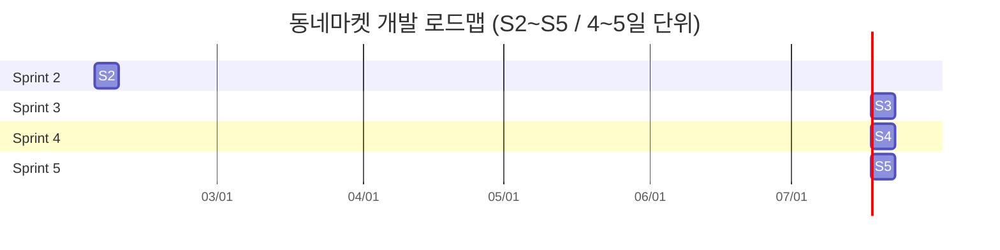

# 동네마켓 제품 백로그 v4.1 - 작업 분배 계획서

| 항목 | 내용 |
|------|------|
| **문서 버전** | v4.1 |
| **작성일** | 2026-01-30 |
| **기반 문서** | 동네마켓_backlog_v4.0, API_명세서_v4.0, ERD_v4.1, PRD_v4.0 |
| **팀 규모** | 7명 (백엔드) |
| **스프린트 단위** | 4~5일 |
| **총 스프린트** | 4 스프린트 (S2~S5, 16~20일) |

---

## 1. 문서 개요

### 1.1 목적
본 문서는 동네마켓 프로젝트의 제품 백로그를 **우선순위별로 분류**하고, 각 유저 스토리의 **작업 난이도를 평가**하여 **7명의 개발팀에 최적 분배**한 작업 계획서입니다.

### 1.2 난이도 평가 기준

| 등급 | Story Point | API 수 | 테이블 수 | 기준 |
|------|------------|--------|----------|------|
| **S** | 3 SP | 1~2개 | 1~2개 | 단순 CRUD, 기술 난점 없음 |
| **M** | 5 SP | 2~3개 | 2~4개 | 중간 복잡도, 비즈니스 로직 존재 |
| **L** | 8 SP | 3~5개 | 3~6개 | 높은 복잡도, 기술 난점 포함 |
| **XL** | 13 SP | 5+개 | 5+개 | 외부 연동, 실시간 처리, 복잡 트랜잭션 |

### 1.3 우선순위 정의

| 우선순위 | 정의 | US 수 | 총 SP |
|---------|------|-------|-------|
| **P1 (최우선)** | MVP 핵심 기능, 서비스 출시 필수 | 20개 | 108 SP |
| **P2 (우선)** | 서비스 안정화, 기본 UX 완성 | 10개 | 50 SP |
| **P3 (보통)** | 부가 가치, 확장 기능 | 13개 | 52 SP |
| **P4 (나중)** | 고도화, 추후 개발 | 8개 | 31 SP |
| **합계** | | **51개** | **241 SP** |

---

## 2. 팀 구성 및 역할

| 팀원 | 역할 | 주요 담당 모듈 | 핵심 기술 스택 |
|------|------|--------------|--------------|
| **Dev1** | 백엔드 리드 | Auth, Users, 공통 인프라 | Spring Security, JWT, OAuth2 |
| **Dev2** | 주문/결제 담당 | Orders, Payments, Cart | PG 연동(토스페이먼츠), 트랜잭션 관리 |
| **Dev3** | 마트 운영 담당 | Stores, Products, Store Ops | JPA, 파일 업로드(S3), 통계 쿼리 |
| **Dev4** | 배달 시스템 담당 | Deliveries, Rider, 실시간 | WebSocket/STOMP, PostGIS, Redis |
| **Dev5** | 구독/정산 담당 | Subscriptions, Settlements | 스케줄러(Spring Batch), 정산 로직 |
| **Dev6** | 관리자 담당 | Admin, Approvals, Reports | 어드민 CRUD, 승인 워크플로우 |
| **Dev7** | 리뷰/알림/기타 | Reviews, Notifications, Support, Misc | JPA, 알림 시스템, 콘텐츠 관리 |

---

## 3. 우선순위별 백로그 상세

### 3.1 P1 - 최우선 (MVP 핵심) | 20개 | 108 SP

> 서비스 출시에 필수적인 핵심 기능. Sprint 2~3에서 완료 (일부 S4 이월).

#### 3.1.1 고객 (Customer) - P1

| ID | UC | 제목 | 사용자 스토리 | 중요도 | 난이도 | SP | 관련 API | 관련 테이블 | 기술 난점 | 담당 | Sprint |
|---|---|---|---|---|---|---|---|---|---|---|---|
| US-C01 | UC-C01 | **회원가입** | 신규 고객은 서비스를 이용하기 위해 이메일과 휴대폰 인증을 통해 가입해야 한다. | High | **M** | 5 | AUTH-001~003 (3개) | users, user_roles, phone_verifications, social_logins | SMS 인증 외부 연동, JWT 토큰 발급 | Dev1 | S2 |
| US-C02 | UC-C02 | **로그인** | 고객은 개인화 서비스를 위해 이메일/비밀번호 또는 소셜 계정으로 로그인해야 한다. | High | **M** | 5 | AUTH-004~005, AUTH-007 (3개) | users, user_roles, social_logins, refresh_tokens | OAuth2 소셜 로그인, JWT Refresh Token | Dev1 | S2 |
| US-C03 | UC-C03 | **주변 마트 검색** | 고객은 내 위치(배송지) 기준 3km 반경 내의 배달 가능 마트를 조회할 수 있어야 한다. | High | **L** | 8 | STO-001 (1개) | stores, store_business_hours, addresses | **PostGIS ST_DWithin 3km 반경 쿼리**, GEOGRAPHY(POINT, 4326) | Dev1 | S3 |
| US-C04 | UC-C04 | **상품 검색** | 고객은 키워드로 배달 가능한 마트의 상품을 검색할 수 있어야 한다. | High | **S** | 3 | PRD-001 (1개) | products, categories | pg_trgm + GIN 인덱스 풀텍스트 검색 | Dev5 | S3 |
| US-C05 | UC-C05 | **장바구니** | 고객은 구매할 상품을 장바구니에 담고 수량을 조절하거나 삭제할 수 있어야 한다. | High | **S** | 3 | CRT-001~004 (4개) | carts, cart_products, products | 멀티스토어 장바구니, 재고 실시간 검증 | Dev2 | S2 |
| US-C06 | UC-C06 | **주문 및 결제** | 고객은 장바구니 상품을 주문서 작성 후 결제하여 주문을 완료할 수 있어야 한다. | High | **XL** | 13 | ORD-001, PAY-001~002 (3개) | orders, store_orders, order_products, payments, payment_methods, addresses, coupons | **PG 결제 연동(토스페이먼츠)**, 멀티스토어 분할 주문, 트랜잭션 원자성 | Dev2 | S3 |
| US-C08 | UC-C08 | **배달 추적** | 고객은 주문 접수부터 배달 완료까지의 상태를 보고, 배송 중엔 라이더 위치를 지도에서 봐야 한다. | High | **L** | 8 | ORD-005, WS-001~002 (3개) | orders, store_orders, deliveries, rider_locations | **WebSocket/SSE 실시간 추적**, GPS 위치 스트리밍 | Dev6 | S4 |

#### 3.1.2 마트 사장님 (Store Owner) - P1

| ID | UC | 제목 | 사용자 스토리 | 중요도 | 난이도 | SP | 관련 API | 관련 테이블 | 기술 난점 | 담당 | Sprint |
|---|---|---|---|---|---|---|---|---|---|---|---|
| US-S01 | UC-S01 | **입점 신청** | 사장님은 사업자 정보와 증빙 서류를 제출하여 입점 신청을 해야 한다. | High | **M** | 5 | STO-006 (1개) | stores, approvals, approval_documents | S3 파일 업로드, 사업자등록증 검증 | Dev3 | S2 |
| US-S02 | UC-S02 | **상품 관리** | 사장님은 판매할 상품을 등록/수정/삭제(판매중지) 할 수 있어야 한다. | High | **M** | 5 | SOP-001~005 (5개) | products, categories, stores | 상품 이미지 S3 업로드, 카테고리 매핑 | Dev3 | S2 |
| US-S03 | UC-S03 | **재고 관리** | 사장님은 입고 처리를 통해 재고를 늘리고, 품절 시 주문을 막아야 한다. | High | **S** | 3 | SOP-003 (1개) | products | 재고 동기화, 동시성 제어 (낙관적 잠금) | Dev3 | S3 |
| US-S04 | UC-S04 | **주문 접수** | 사장님은 신규 주문 알림을 받고 준비 시간을 입력하여 접수(배차 요청)해야 한다. | High | **L** | 8 | SOP-006~007 (2개), WS-003 | store_orders, deliveries, notifications | **WebSocket 실시간 알림**, 자동 배차 요청, 주문 상태 머신 | Dev3 | S3 |

#### 3.1.3 배달원 (Rider) - P1

| ID | UC | 제목 | 사용자 스토리 | 중요도 | 난이도 | SP | 관련 API | 관련 테이블 | 기술 난점 | 담당 | Sprint |
|---|---|---|---|---|---|---|---|---|---|---|---|
| US-R01 | UC-R01 | **파트너 신청** | 배달원은 신분증과 계좌 정보를 제출하여 배달 파트너 등록을 신청해야 한다. | High | **M** | 5 | DEL-006 관련 (1개) | riders, approvals, approval_documents | KYC 서류 업로드, 본인 인증 | Dev4 | S2 |
| US-R02 | UC-R02 | **운행 상태 변경** | 배달원은 업무 시작/종료를 위해 운행 중/운행 불가 상태를 변경할 수 있어야 한다. | High | **S** | 3 | DEL-007 (1개) | riders | 상태 머신 (ONLINE/OFFLINE/DELIVERING) | Dev4 | S2 |
| US-R03 | UC-R03 | **배달 수락** | 배달원은 배정 요청이 온 주문을 확인하고 수락해야 한다. (동시 3건 제한) | High | **M** | 5 | DEL-001~002 (2개) | deliveries, store_orders, riders | 동시 배달 3건 제한 비즈니스 규칙, WebSocket 알림 | Dev4 | S3 |
| US-R04 | UC-R04 | **픽업 완료** | 배달원은 마트에서 물건을 수령한 후 픽업 완료 상태로 변경해야 한다. | High | **S** | 3 | DEL-003 (1개) | deliveries, store_orders | 상태 변경 + 고객 알림 트리거 | Dev4 | S3 |
| US-R05 | UC-R05 | **배송 시작** | 배달원은 배송지로 출발하며 배송 시작 버튼을 눌러 위치 전송을 시작해야 한다. | High | **S** | 3 | DEL-003 (1개) | deliveries, rider_locations | GPS 위치 전송 시작 트리거 | Dev4 | S3 |
| US-R06 | UC-R06 | **위치 전송** | 시스템은 배송 중인 배달원의 GPS 위치를 실시간으로 서버에 전송해야 한다. | High | **L** | 8 | DEL-005, WS-002 (2개) | rider_locations, deliveries | **WebSocket 고빈도 GPS 전송**, Redis 캐싱, PostGIS GEOGRAPHY | Dev4 | S4 |
| US-R07 | UC-R07 | **배송 완료** | 배달원은 고객에게 전달 후 인증 사진을 찍고 배송 완료 처리를 해야 한다. | High | **M** | 5 | DEL-004 (1개) | deliveries, delivery_photos, store_orders | 사진 업로드 (S3), 배송 증빙 | Dev7 | S3 |

#### 3.1.4 관리자 (Admin) - P1

| ID | UC | 제목 | 사용자 스토리 | 중요도 | 난이도 | SP | 관련 API | 관련 테이블 | 기술 난점 | 담당 | Sprint |
|---|---|---|---|---|---|---|---|---|---|---|---|
| US-A01 | UC-A01 | **마트 승인** | 관리자는 마트의 입점 서류를 검토하고 승인/거절/보류 처리해야 한다. | High | **M** | 5 | ADM-005~006 (2개) | approvals, approval_documents, stores | 승인 워크플로우 (PENDING→APPROVED/REJECTED/ON_HOLD) | Dev6 | S2 |
| US-A02 | UC-A02 | **배달원 승인** | 관리자는 배달원의 자격을 검토하고 승인/거절/보류 처리해야 한다. | High | **M** | 5 | ADM-005~006 (2개) | approvals, approval_documents, riders | 승인 워크플로우, KYC 검증 | Dev7 | S2 |

**P1 소계: 20개 US / 108 SP** (S2: 41 SP / S3~S4: 67 SP)

---

### 3.2 P2 - 우선 (안정화) | 10개 | 50 SP

> 서비스 안정화 및 기본 사용자 경험 완성. Sprint 4~5에서 완료.

| ID | UC | 제목 | 사용자 스토리 | 중요도 | 난이도 | SP | 관련 API | 관련 테이블 | 기술 난점 | 담당 | Sprint |
|---|---|---|---|---|---|---|---|---|---|---|---|
| US-C07 | UC-C07 | **주문 취소** | 고객은 마트가 접수하기 전 단계에서 주문을 즉시 취소하고 환불받을 수 있어야 한다. | Medium | **M** | 5 | ORD-004 (1개) | orders, store_orders, payments, payment_refunds | 조건부 취소 (상태 검증), PG 환불 연동 | Dev2 | S4 |
| US-C12 | UC-C12 | **배송지 관리** | 고객은 주문 시 사용할 배송지를 등록/수정/삭제하고 기본 배송지를 설정할 수 있어야 한다. | Medium | **S** | 3 | USR-004~007 (4개) | addresses | 기본 배송지 설정, 주소 유효성 검증 | Dev1 | S4 |
| US-C13 | UC-C13 | **결제 수단 관리** | 고객은 간편 결제를 위해 카드/계좌를 등록/삭제하고 관리할 수 있어야 한다. | Medium | **M** | 5 | USR-008~010 (3개) | payment_methods | PG사 카드 토큰화, PCI-DSS 준수 | Dev1 | S4 |
| US-S05 | UC-S05 | **주문 거절** | 사장님은 재고 부족 등의 사유로 주문을 거절하고 환불 처리할 수 있어야 한다. | Medium | **M** | 5 | SOP-008 (1개) | store_orders, payments, payment_refunds | 자동 환불 처리, 거절 사유 기록 | Dev3 | S4 |
| US-S08 | UC-S09 | **정산 확인** | 사장님은 월별 정산 내역(매출, 수수료, 지급액)을 상세히 조회할 수 있어야 한다. | Medium | **M** | 5 | SOP-014 (1개) | settlements, settlement_details, store_orders, stores | 정산 집계 쿼리, 수수료 계산 | Dev7 | S4 |
| US-S09 | UC-S09 | **영업 시간 설정** | 사장님은 가게의 요일별 영업 시간과 휴무일을 설정하고, 임시 운영 정지를 할 수 있어야 한다. | Medium | **S** | 3 | SOP-009 (1개) | store_business_hours, stores | 요일별 스케줄 (7일), 임시 휴무 처리 | Dev3 | S4 |
| US-R09 | UC-R09 | **정산 확인** | 배달원은 주 단위 정산 예정 금액과 지급 내역을 확인할 수 있어야 한다. | Medium | **M** | 5 | ROP-004 (1개) | settlements, settlement_details, deliveries | 주간 정산 집계, 수익 계산 | Dev5 | S4 |
| US-A03 | UC-A03 | **회원 관리** | 관리자는 회원 목록을 조회하고, 필요시 계정 정지(활성/비활성) 처리를 해야 한다. | Medium | **S** | 3 | ADM-001~002 (2개) | users, user_roles | 회원 상태 관리 (ACTIVE/SUSPENDED/DEACTIVATED) | Dev6 | S4 |
| US-A05 | UC-A05 | **마트 정산** | 관리자는 마트의 월별 매출을 집계하여 정산 데이터를 생성하고 지급해야 한다. | High | **L** | 8 | ADM-011~012 (2개) | settlements, settlement_details, store_orders, stores | **배치 처리 (Spring Batch)**, 월별 매출 집계, 수수료 공제 | Dev5 | S5 |
| US-A06 | UC-A06 | **배달원 정산** | 관리자는 배달원의 주별 수익을 집계하여 정산 데이터를 생성하고 지급해야 한다. | High | **L** | 8 | ADM-011~012 (2개) | settlements, settlement_details, deliveries, riders | **배치 처리 (Spring Batch)**, 주간 수익 집계, 인센티브 계산 | Dev5 | S5 |

**P2 소계: 10개 US / 50 SP** (S4: 34 SP / S5: 16 SP)

---

### 3.3 P3 - 보통 (확장) | 13개 | 52 SP

> 부가 가치를 제공하는 확장 기능. Sprint 2~5에서 완료.

#### 3.3.1 고객 (Customer) - P3

| ID | UC | 제목 | 사용자 스토리 | 중요도 | 난이도 | SP | 관련 API | 관련 테이블 | 기술 난점 | 담당 | Sprint |
|---|---|---|---|---|---|---|---|---|---|---|---|
| US-C09 | UC-C09 | **리뷰 작성** | 고객은 배송 완료된 주문에 대해 별점과 내용을 담은 리뷰를 작성할 수 있어야 한다. | Medium | **S** | 3 | REV-001~002 (2개) | reviews, store_orders | 별점 집계, 리뷰 이미지 업로드 | Dev2 | S5 |
| US-C10 | UC-C10 | **구독 관리** | 고객은 구독 중인 상품의 상태를 조회하고 해지(다음 결제일 반영)할 수 있어야 한다. | Medium | **L** | 8 | SUB-001~005 (5개) | subscriptions, subscription_products, subscription_day_of_week, subscription_history, payment_methods, addresses | 구독 라이프사이클 (ACTIVE→PAUSED→CANCELLED), 정기 결제 연동 | Dev7 | S5 |
| US-C16 | UC-C16 | **프로필 조회** | 고객은 본인의 기본 정보(이름, 연락처 등)를 조회할 수 있어야 한다. | Low | **S** | 3 | USR-001 (1개) | users | 단순 프로필 조회 | Dev1 | S5 |

#### 3.3.2 마트 사장님 (Store Owner) - P3

| ID | UC | 제목 | 사용자 스토리 | 중요도 | 난이도 | SP | 관련 API | 관련 테이블 | 기술 난점 | 담당 | Sprint |
|---|---|---|---|---|---|---|---|---|---|---|---|
| US-S06 | UC-S06 | **매출 조회** | 사장님은 기간별 매출 통계와 인기 상품 데이터를 대시보드에서 확인해야 한다. | Medium | **M** | 5 | SOP-013 (1개) | store_orders, order_products, stores | 기간별 매출 집계, 인기상품 랭킹 쿼리 | Dev3 | S5 |
| US-S10 | UC-S10 | **구독 등록** | 사장님은 정기 배송할 구독 상품(구성, 주기, 가격)을 등록할 수 있어야 한다. | Low | **M** | 5 | SOP-010~010A (2개) | subscription_products, subscription_product_items, products | 구독 상품 구성, 배송 주기 설정 | Dev3 | S5 |
| US-S12 | UC-S12 | **구독 배송 관리** | 사장님은 구독 주문에 대해 자동 배차된 내역을 확인하고 상품을 준비해야 한다. | Low | **M** | 5 | SOP-010B~010C (2개) | subscriptions, subscription_history, deliveries | 자동 배차 스케줄 확인, 구독 이행 추적 | Dev3 | S5 |

#### 3.3.3 배달원 (Rider) - P3

| ID | UC | 제목 | 사용자 스토리 | 중요도 | 난이도 | SP | 관련 API | 관련 테이블 | 기술 난점 | 담당 | Sprint |
|---|---|---|---|---|---|---|---|---|---|---|---|
| US-R08 | UC-R08 | **운행 내역** | 배달원은 기간별 배달 수행 내역과 수익을 조회할 수 있어야 한다. | Medium | **S** | 3 | ROP-002 (1개) | deliveries, riders | 기간 필터링, 수익 합산 | Dev4 | S5 |

#### 3.3.4 관리자 (Admin) - P3

| ID | UC | 제목 | 사용자 스토리 | 중요도 | 난이도 | SP | 관련 API | 관련 테이블 | 기술 난점 | 담당 | Sprint |
|---|---|---|---|---|---|---|---|---|---|---|---|
| US-A04 | UC-A04 | **신고 처리** | 관리자는 접수된(리뷰, 사용자 등) 신고 내용을 검토하고 조치(해결)해야 한다. | Medium | **M** | 5 | ADM-007~008 (2개) | reports, reviews, users | 신고 유형별 처리, 조치 이력 추적 | Dev6 | S5 |
| US-A08 | UC-A08 | **공지사항** | 관리자는 서비스 공지사항을 작성, 수정, 게시할 수 있어야 한다. | Low | **S** | 3 | ADM-013~016 (4개) | notices | CRUD, 게시 상태 관리 | Dev5 | S2 |
| US-A09 | UC-A09 | **마트 관리** | 관리자는 등록된 마트 목록을 조회하고 운영 상태를 관리할 수 있어야 한다. | Low | **S** | 3 | ADM-003~004 (2개) | stores | 마트 목록 필터링, 상태 변경 | Dev6 | S3 |
| US-A10 | UC-A10 | **배달원 관리** | 관리자는 등록된 배달원 목록을 조회하고 활동 상태를 관리할 수 있어야 한다. | Low | **S** | 3 | ADM-009~010 (2개) | riders | 배달원 목록, 활동 상태 관리 | Dev6 | S3 |
| US-A11 | UC-A11 | **FAQ 관리** | 관리자는 자주 묻는 질문(FAQ)을 등록 및 관리할 수 있어야 한다. | Low | **S** | 3 | ETC-007~009 (3개) | faqs | FAQ CRUD, 카테고리 분류 | Dev5 | S2 |
| US-A13 | UC-A13 | **1:1 문의 답변** | 관리자는 고객의 1:1 문의를 확인하고 답변을 등록해야 한다. | Medium | **S** | 3 | ETC-005~006 (2개) | inquiries | 문의 스레딩, 답변 등록 | Dev1 | S3 |

**P3 소계: 13개 US / 52 SP** (S2: 6 SP / S3: 9 SP / S5: 37 SP)

> S11(구독 삭제)은 P4에 분류되나, Dev3의 구독 연속 작업으로 S5에 배치.

---

### 3.4 P4 - 나중 (고도화) | 8개 | 31 SP

> 추후 고도화 단계에서 개발. Sprint 2~5에 분산 배치.

| ID | UC | 제목 | 사용자 스토리 | 중요도 | 난이도 | SP | 관련 API | 관련 테이블 | 기술 난점 | 담당 | Sprint |
|---|---|---|---|---|---|---|---|---|---|---|---|
| US-C11 | UC-C11 | **회원 탈퇴** | 고객은 원할 경우 서비스를 탈퇴하고 개인정보를 파기할 수 있어야 한다. | Low | **S** | 3 | USR-003 (1개) | users | 소프트 삭제, 개인정보 마스킹, 30일 유예 | Dev1 | S4 |
| US-C14 | UC-C14 | **쿠폰 조회** | 고객은 보유한 할인 쿠폰 목록과 유효기간을 조회할 수 있어야 한다. | Low | **S** | 3 | ETC-010 (1개) | coupons, user_coupons | 쿠폰 유효성 검증, 만료일 체크 | Dev2 | S2 |
| US-C15 | UC-C15 | **1:1 문의** | 고객은 서비스 이용 불편 사항을 1:1 문의로 접수하고 답변을 확인할 수 있어야 한다. | Low | **S** | 3 | ETC-005~006 (2개) | inquiries | 문의 접수, 답변 확인 | Dev2 | S2 |
| US-A07 | UC-A07 | **통계 조회** | 관리자는 주문 거래액, 가입자 수 등 주요 플랫폼 지표를 확인해야 한다. | Low | **L** | 8 | ADM-017 (1개) | orders, store_orders, users, stores, riders, deliveries | **복합 집계 쿼리**, 시계열 분석, Redis 캐싱 | Dev5 | S4 |
| US-A12 | UC-A12 | **알림 발송** | 관리자는 특정 대상(전체, 마트, 라이더 등)에게 푸시 알림을 발송할 수 있어야 한다. | Low | **M** | 5 | ADM-018 (1개) | notifications, notification_broadcasts | 대상 세그먼트, FCM/APNs 푸시 연동 | Dev6 | S5 |
| US-A14 | UC-A14 | **배너 관리** | 관리자는 홈 화면에 노출될 이벤트 배너를 등록 및 관리할 수 있어야 한다. | Low | **S** | 3 | ETC-011 (1개) | banners | 배너 이미지 업로드, 노출 기간 설정 | Dev7 | S2 |
| US-A15 | UC-A15 | **쿠폰 발행** | 관리자는 프로모션용 쿠폰을 생성하고 회원에게 발급할 수 있어야 한다. | Low | **S** | 3 | ETC-010 (1개) | coupons, user_coupons, promotions | 쿠폰 일괄 생성, 대상 지정 발급 | Dev6 | S2 |
| US-S11 | UC-S11 | **구독 삭제** | 사장님은 운영 중인 구독 상품을 삭제(기존 구독자 만료 후 폐지)할 수 있어야 한다. | Low | **S** | 3 | SOP-005 (1개) | subscription_products, subscriptions | 기존 구독자 유지, 만료 후 자동 폐지 | Dev3 | S5 |

**P4 소계: 8개 US / 31 SP** (S2: 12 SP / S4: 11 SP / S5: 8 SP)

---

## 4. 스프린트 계획

### 4.1 스프린트 로드맵



### 4.2 스프린트별 상세 계획

#### Sprint 2 (4~5일) - 기반 구축 + 인증 + 입점/등록 + 단순 CRUD | 59 SP

> 기존 P1 기반 기능 + S6에서 흡수한 단순 CRUD 6개 (C14, C15, A08, A11, A14, A15)

| 담당 | 배정 US | SP | 비고 |
|------|---------|---|------|
| **Dev1** | US-C01(5), US-C02(5) | **10** | JWT 인증, 소셜 로그인, Spring Security 설정 |
| **Dev2** | US-C05(3), US-C14(3), US-C15(3) | **9** | 장바구니 CRUD + 쿠폰 조회 + 1:1 문의 |
| **Dev3** | US-S01(5), US-S02(5) | **10** | 마트 입점 + 상품 관리 CRUD |
| **Dev4** | US-R01(5), US-R02(3) | **8** | 라이더 등록 + 상태 변경 |
| **Dev5** | US-A08(3), US-A11(3) + 인프라 | **6** | 공지사항 + FAQ CRUD + DB 스키마 생성 (ERD Layer 0~2), Redis/PostGIS 설정 |
| **Dev6** | US-A01(5), US-A15(3) | **8** | 마트 승인 워크플로우 + 쿠폰 발행 |
| **Dev7** | US-A02(5), US-A14(3) | **8** | 배달원 승인 워크플로우 + 배너 관리 |
| | **소계** | **59** | |

> 추가된 항목: C14, C15, A08, A11, A14, A15 (모두 단순 CRUD, L0/L6 테이블만 사용하여 의존성 없음)

---

#### Sprint 3 (4~5일) - 핵심 주문/배달 플로우 + 관리 CRUD | 60 SP

> 핵심 주문-결제-배달 파이프라인 구축 + S6에서 흡수한 관리 CRUD 3개 (A09, A10, A13)
> US-C08, US-R06은 S4로 이월.

| 담당 | 배정 US | SP | 비고 |
|------|---------|---|------|
| **Dev1** | US-C03(8), US-A13(3) | **11** | PostGIS 지역 검색 + 1:1 문의 답변 |
| **Dev2** | US-C06(13) | **13** | PG 결제 연동, 멀티스토어 주문 |
| **Dev3** | US-S03(3), US-S04(8) | **11** | 재고 관리 + 주문 접수/배차 |
| **Dev4** | US-R03(5), US-R04(3), US-R05(3) | **11** | 배달 수락 → 픽업 → 배송 시작 |
| **Dev5** | US-C04(3) | **3** | 상품 검색 (pg_trgm) + 구독 인프라 세팅 |
| **Dev6** | US-A09(3), US-A10(3) | **6** | 마트 관리 + 배달원 관리 |
| **Dev7** | US-R07(5) | **5** | 배송 완료 (사진 업로드, S3) |
| | **소계** | **60** | |

> ⚠️ Dev2(13SP)는 결제 핵심 기능 집중. Dev6이 마트/배달원 관리 CRUD + 결제/WebSocket 연동 테스트 지원.

---

#### Sprint 4 (4~5일) - P1 마무리 + P2 안정화 + 통계 | 61 SP

> S3 이월분(C08, R06) 완료 + P2 서비스 안정화 + S6에서 흡수한 C11(3), A07(8)

| 담당 | 배정 US | SP | 비고 |
|------|---------|---|------|
| **Dev1** | US-C12(3), US-C13(5), US-C11(3) | **11** | 배송지 CRUD + 결제수단 관리 + 회원 탈퇴 |
| **Dev2** | US-C07(5) | **5** | 주문 취소 + PG 환불 연동 |
| **Dev3** | US-S05(5), US-S09(3) | **8** | 주문 거절/환불 + 영업시간 설정 |
| **Dev4** | US-R06(8) | **8** | WebSocket GPS 위치 전송 (Redis 캐싱) |
| **Dev5** | US-R09(5), US-A07(8) | **13** | 라이더 정산 확인 + 통계 대시보드 (복합 집계) |
| **Dev6** | US-C08(8), US-A03(3) | **11** | 배달 추적 (WebSocket 클라이언트) + 회원 관리 |
| **Dev7** | US-S08(5) | **5** | 마트 정산 확인 조회 |
| | **소계** | **61** | |

> ⚠️ Dev5(13SP): R09(정산 조회) + A07(통계)은 모두 집계 쿼리 기반으로 기술 스택 유사.
> C11(회원 탈퇴)은 Dev1이 Auth 모듈 담당이므로 자연스러운 배치.

---

#### Sprint 5 (4~5일) - P2 마무리 + P3 확장 + P4 잔여 | 61 SP

> P2 이월분(A05, A06) 정산 배치 완료 + P3 확장 + S6에서 흡수한 S11(3), S12(5), A12(5)

| 담당 | 배정 US | SP | 비고 |
|------|---------|---|------|
| **Dev1** | US-C16(3) | **3** | 프로필 조회 + 코드 리뷰/리팩토링 |
| **Dev2** | US-C09(3) | **3** | 리뷰 작성 |
| **Dev3** | US-S06(5), US-S10(5), US-S11(3), US-S12(5) | **18** | 매출 조회 + 구독 등록/삭제/배송 관리 |
| **Dev4** | US-R08(3) | **3** | 운행 내역 + QA 지원 |
| **Dev5** | US-A05(8), US-A06(8) | **16** | 마트/배달원 정산 배치 (Spring Batch) |
| **Dev6** | US-A04(5), US-A12(5) | **10** | 신고 처리 + 알림 발송 (FCM) |
| **Dev7** | US-C10(8) | **8** | 구독 관리 (라이프사이클) |
| | **소계** | **61** | |

> ⚠️ Dev3(18SP): S11/S12는 구독 관련으로 S10과 연속 작업, 실질 부담 적절.
> Dev5(16SP): A05/A06이 동일한 Spring Batch 템플릿 기반으로 재사용 가능. 실질 공수 ~10SP 수준.
> Dev1/Dev2/Dev4는 여유분으로 통합 테스트 및 코드 리뷰 병행.

---

## 5. 팀원별 총 SP 밸런스

| 팀원 | S2 | S3 | S4 | S5 | **총 SP** | 평균/Sprint |
|------|---|---|---|---|---------|-----------|
| **Dev1** | 10 | 11 | 11 | 3 | **35** | 8.8 |
| **Dev2** | 9 | 13 | 5 | 3 | **30** | 7.5 |
| **Dev3** | 10 | 11 | 8 | 18 | **47** | 11.8 |
| **Dev4** | 8 | 11 | 8 | 3 | **30** | 7.5 |
| **Dev5** | 6 | 3 | 13 | 16 | **38** | 9.5 |
| **Dev6** | 8 | 6 | 11 | 10 | **35** | 8.8 |
| **Dev7** | 8 | 5 | 5 | 8 | **26** | 6.5 |
| **합계** | **59** | **60** | **61** | **61** | **241** | |

> **팀원별 총 SP 범위**: 26~47 (평균 34.4 SP)
> - Dev3(47SP)이 마트/상품/구독 핵심 모듈로 최고 부하 (S5 구독 연속 작업으로 효율적)
> - Dev5(S2: 인프라+CRUD, S4~S5: 집중)는 정산/통계 특화로 전반부 여유, 후반부 집중
> - Dev6(S3: 6SP)는 관리 CRUD + 결제/WebSocket 연동 지원 역할로 실질 작업 존재
> - 스프린트별 합계 범위: 59~61 SP (매우 균등)

---

## 6. ERD 의존성 기반 개발 순서

### 6.1 테이블 의존성 레이어

| Layer | 테이블 | Sprint 매핑 |
|-------|-------|-----------|
| **L0 (기반)** | roles, categories, settlements, banners, promotions, notification_broadcasts | S2 (인프라) |
| **L1A (사용자)** | users, user_roles, addresses, social_logins | S2 |
| **L1B (마트)** | stores, store_business_hours | S2 |
| **L1C (상품)** | products | S2 |
| **L2 (결제수단)** | payment_methods | S2~S4 |
| **L3 (주문)** | orders, store_orders, order_products, payments, payment_refunds, carts, cart_products, reviews | S2~S3 |
| **L4 (배달)** | riders, deliveries, rider_locations, delivery_photos | S2~S4 |
| **L5 (구독)** | subscription_products, subscriptions, subscription_day_of_week, subscription_product_items, subscription_history | S5 |
| **L6 (관리)** | approvals, approval_documents, reports, inquiries, notices, faqs | S2~S5 |
| **L7 (정산)** | settlement_details | S4~S5 |
| **L8 (알림)** | notifications | S5 |
| **L9 (프로모션)** | promotion_products, coupons, user_coupons | S2 |

### 6.2 Critical Path (크리티컬 패스)

```
users → stores → products → orders → store_orders → deliveries
                                   → payments
                                   → reviews
                           → subscriptions
```

> **주의**: `store_orders` 테이블은 8개 테이블이 의존하는 **CRITICAL HUB**. Sprint 3 초반에 반드시 완성 필요.

---

## 7. 기술 리스크 및 대응 방안

| 리스크 | 관련 US | 영향도 | 대응 방안 |
|--------|--------|--------|----------|
| PG 결제 연동 지연 | US-C06 | **높음** | 토스페이먼츠 Sandbox 사전 세팅, Mock PG 우선 개발 |
| WebSocket 안정성 | US-R06, US-C08, US-S04 | **높음** | STOMP + SockJS fallback, Redis Pub/Sub 백프레셔 |
| PostGIS 쿼리 성능 | US-C03 | **중간** | GIST 인덱스, 쿼리 캐싱 (Redis), 반경 3km 제한 |
| 정산 배치 처리 | US-A05, US-A06 | **중간** | Spring Batch 청크 처리, 스케줄러 장애 복구 |
| 구독 정기결제 | US-C10 | **중간** | PG 정기결제 API, 결제 실패 재시도 정책 |
| S3 파일 업로드 | US-S01, US-R01, US-R07 | **낮음** | Presigned URL 방식, 파일 크기 제한 (10MB) |

---

## 8. 검증 테이블

### 8.1 US × Sprint 매핑 검증

| Sprint | P1 | P2 | P3 | P4 | 합계 |
|--------|---|---|---|---|------|
| **S2** | 9개 | - | 2개 | 4개 | 15개 |
| **S3** | 9개 | - | 3개 | - | 12개 |
| **S4** | 2개 | 8개 | - | 2개 | 12개 |
| **S5** | - | 2개 | 8개 | 2개 | 12개 |
| **합계** | **20** | **10** | **13** | **8** | **51** |

> S2의 P1 9개: C01, C02, C05, S01, S02, R01, R02, A01, A02
> S4의 P1 2개: C08, R06 (S3에서 이월)
> S2의 P4 4개: C14, C15, A14, A15 (단순 CRUD, 의존성 없어 조기 배치)

### 8.2 팀원별 모듈 커버리지

| 모듈 | Dev1 | Dev2 | Dev3 | Dev4 | Dev5 | Dev6 | Dev7 |
|------|------|------|------|------|------|------|------|
| Auth | ● | | | | | | |
| Users | ● | | | | | | |
| Stores | | | ● | | | | |
| Products | | | ● | | | | |
| Cart | | ● | | | | | |
| Orders | | ● | | | | | |
| Payments | | ● | | | | | |
| Deliveries | | | | ● | | | |
| Subscriptions | | | | | ● | | ● |
| Reviews | | ● | | | | | |
| Store Ops | | | ● | | | ● | ● |
| Rider Ops | | | | ● | ● | | |
| Admin | | | | | ● | ● | ● |
| Misc | ● | ● | ● | | ● | ● | ● |

---

*본 문서는 PRD v4.0, ERD v4.1, API 명세서 v4.0, 유즈케이스 v4.1을 기반으로 작성되었습니다.*
